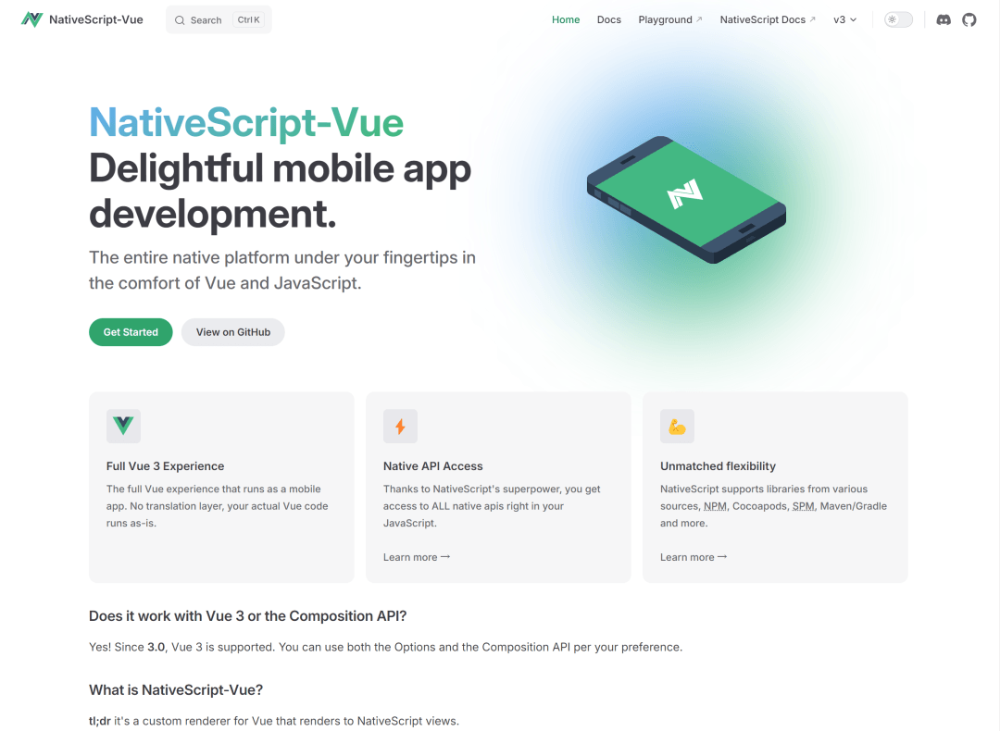
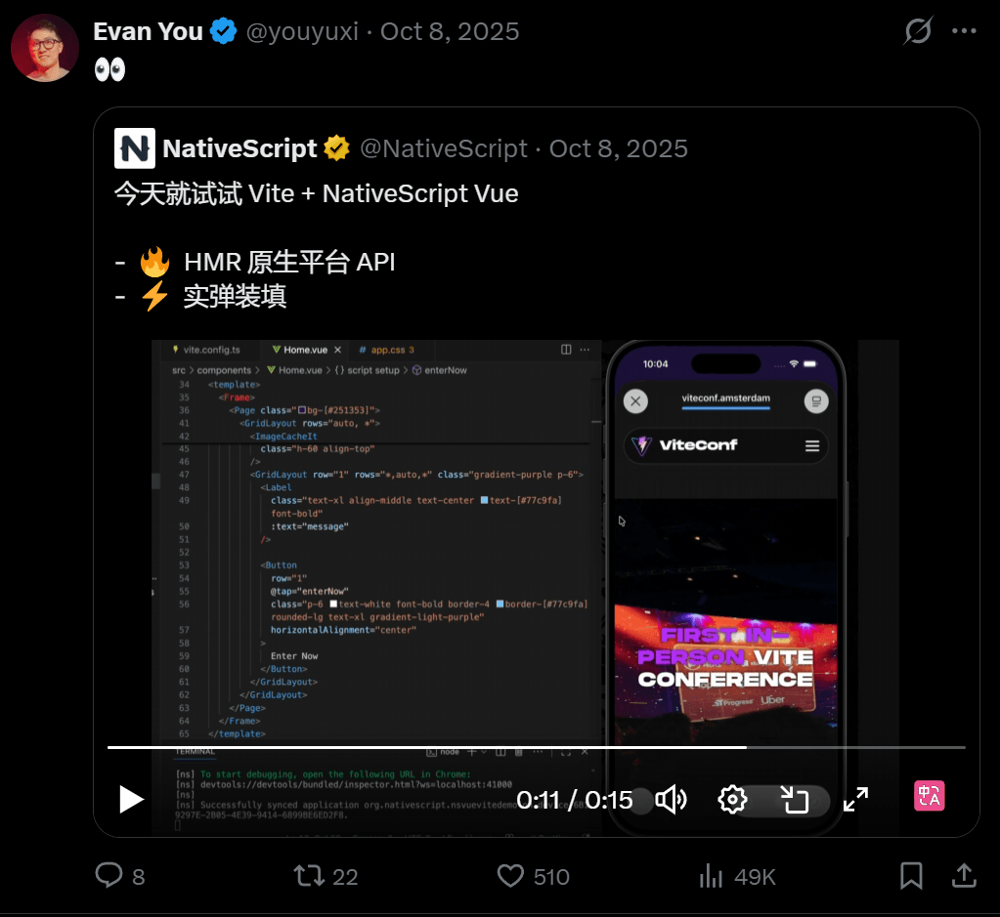
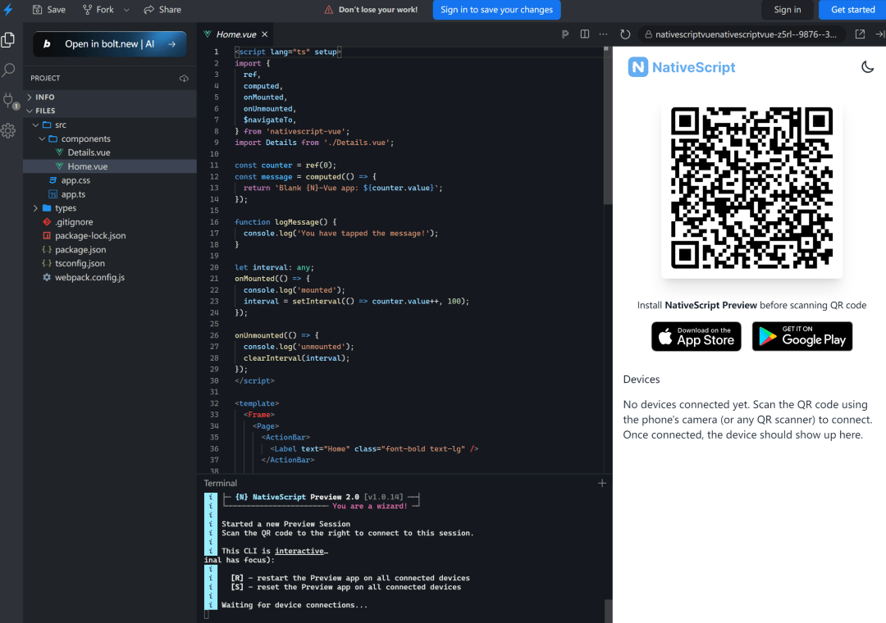

# uni-app淘汰！Vue3 原生开发最佳方案

Vue 3原生App开发曾存短板，uni-app多端部署虽便捷，但性能、原生能力及生态锁定问题突出。**NativeScript-Vue 3**的出现，**填补了Vue生态与React Native抗衡的纯原生跨平台空白**，获尤雨溪认可。



## 为何弃用uni-app？

  

uni-app 表现

核心痛点

WebView/弱原生混合渲染

启动卡顿、掉帧、长列表不畅

自定义SDK需大量桥接代码

维护成本高，迭代易兼容断层

绑定DCloud生态

工程化适配慢，新特性滞后

Vue 3/Composition API支持不足

类型推断异常，插件易踩坑

NativeScript-Vue精准匹配需求：**Vue语法+原生渲染+插件即用**。

  

## 尤雨溪推荐



尤雨溪转发推荐**Vite + NativeScript-Vue**，TS Demo印证三大优势：

- 兼容Vue 3及Composition API
- **Vite毫秒级热重载**
- **直调iOS/Android原生接口**

## 核心优势



- **无WebView**，JS基于V8/JavaScriptCore运行
- **模板直编为原生组件**（UILabel/TextView）
- 兼容全量原生依赖（NPM/CocoaPods等）
- **性能比肩React Native**，保留Vue习惯

## 5分钟上手

### 1\. 环境准备

```
# Node ≥ 18
npm i -g nativescript
ns doctor # 全绿即完成
```
### 2\. 初始化项目

```
ns create myApp --template @nativescript-vue/template-blank-vue3@latest
cd myApp
```
预置**Vite/Vue3/TS/ESLint**，零配置开发。

### 3\. 运行调试

```
ns run ios # 真机/模拟器
ns run android
```
**毫秒级热重载**，日志直出终端。

### 4\. 目录结构

```
myApp/
├─ app/（组件/入口/Pinia）
├─ App_Resources/（原生资源）
└─ vite.config.ts（预置插件）
```
### 5\. 打包发布

```
ns build android --release # 生成.aab/.apk
ns build ios --release     # 生成.ipa
```
遵循原生流程，适配CI部署。

- 脱离WebView运行，JS代码基于V8或JavaScriptCore引擎执行

### 1\. 环境准备

- 完美兼容NPM、CocoaPods、Maven等各类原生依赖包
- 模板标签直接编译为对应平台原生组件（iOS的UILabel/Android的TextView）
- 性能与React Native处于同一梯队，同时保留Vue开发习惯

### 2\. 初始化项目

```
# Node ≥ 18
npm i -g nativescript
ns doctor # 全绿即完成
```
```
ns create myApp --template @nativescript-vue/template-blank-vue3@latest
cd myApp
```
预置Vite/Vue3/TS/ESLint，零配置开发。

### 3\. 运行调试

```
ns run ios # 真机/模拟器
ns run android
```
毫秒级热重载，日志直出终端。

### 4\. 目录结构

### 

```
myApp/
├─ app/（组件/入口/Pinia）
├─ App_Resources/（原生资源）
└─ vite.config.ts（预置插件）
```
### 5\. 打包发布  

```
ns build android --release # 生成.aab/.apk
ns build ios --release     # 生成.ipa
```
遵循原生流程，适配CI部署。

## 插件适配情况

适配检测技巧：

插件

状态

说明

Pinia

✅ 可用

零改动接入

VueUse

⚠️ 部分可用

无DOM依赖可用

vue-i18n 9.x

✅ 可用

功能正常

Vue Router

❌ 不可用

用原生导航

Vuetify等UI库

❌ 不可用

依赖DOM/CSS

```
npm i xxx
grep -r "document\|window" node_modules/xxx || echo "大概率安全"
```
## Vue DevTools调试

官方插件支持**实时查看组件/状态**，沿用桌面调试习惯。

配置：https://nativescript-vue.org/docs/essentials/vue-devtools

## 生态与原生能力

- **700+官方插件**：`ns plugin add @nativescript/camera...`
- **直引原生SDK**：`import { CBCentralManager } from '@nativescript/core'`

### 🔖 核心资源

- 官网：https://nativescript-vue.org
- 插件清单：https://nativescript-vue.org/docs/essentials/vue-plugins
- 安装教程：https://docs.nativescript.org/setup/

## 结语

我是林三心，一个待过**小型toG型外包公司、大型外包公司、小公司、潜力型创业公司、大公司**的作死型前端选手

我建了一些**前端学习群**，如果大家想进群交流前端知识，可以关注我，回复**加群**


