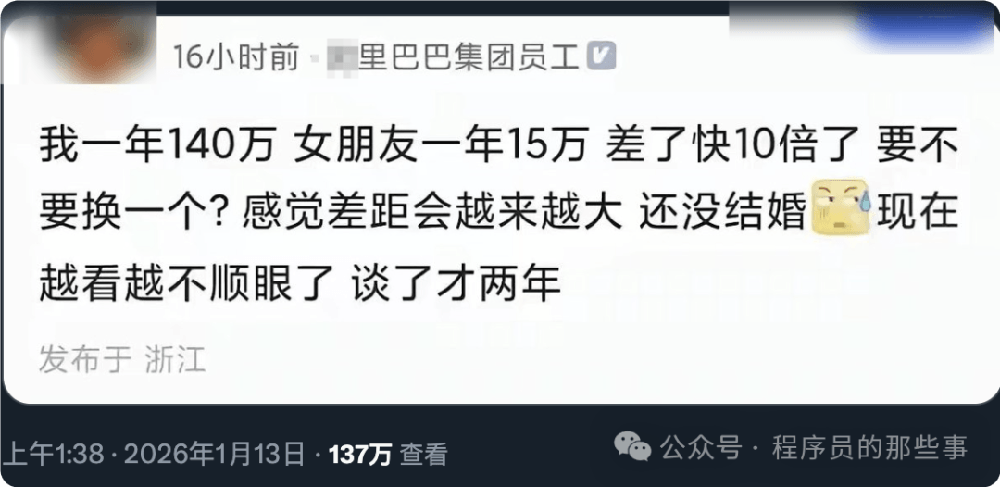

# 某里员工自曝：我一年 140 万，女友一年 15万，差了快 10 倍，感觉差距越来越大，要不要换一个？

前些天在推上刷到一个帖子：“我一年 140 万，女朋友一年 15 万，差了快 10 倍了，要不要换一个？感觉差距会越来越大，还没结婚，现在越看越不顺眼了，谈了才两年。”

哥们，你是一毕业就 140 万么？当初和女朋友谈的时候，又是多少？**你这妥妥的“上岸第一剑就斩意中人”，太典了**。

建议立刻马上换，最好找个年薪 1400 万的，这样你就可以天天仰着脖子看她，好好体验一把被收入按在地上碾压的滋味。到时候人家说东你不敢往西，人家买奢侈品你只能默默算账单，人家谈资源人脉你插不上半句话，你再品品这种 **“门当户对”的滋味爽不爽**？

哦对了，等你哪天行情不好，年薪跌回 40 万甚至更低的时候，记得主动提分手，赶紧催着人家把你踹了，别磨磨蹭蹭耽误人家找更高配的。毕竟按照你这个 **“收入匹配论”**，到时候你就是那个拖后腿的，可别指望人家念旧情。

当初你拿几十万工资的时候，怎么没觉得人家 15 万的年薪拿不出手？怎么没嫌弃人家配不上你？

现在赚得多了，尾巴翘到天上去了，就把感情当成了可以量化的交易。**真要换就痛快点，别拿“差距大”当遮羞布**，说白了就是你飘了。

**赶紧的，别耽误人家姑娘找个真心疼她的人！**
