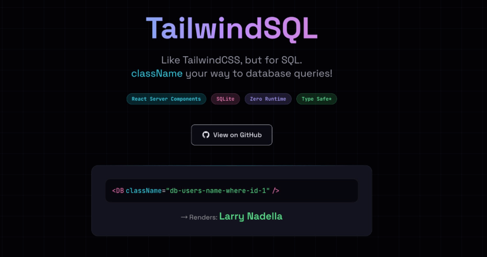
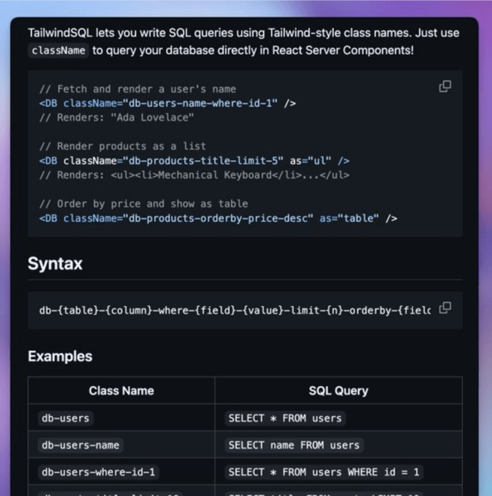

# 全栈神器！前端可以在CSS里写SQL语句啦！以后不需要后端了？

这个东西最近爆火！！！🔥🔥🔥



# TailwindSQL 🎨

类TailwindCSS的SQL查询工具，专为React服务端组件打造



### 这是个啥？

TailwindSQL能让你用Tailwind风格的类名编写SQL查询语句，直接在React服务端组件中通过`className`属性就能直连数据库执行查询！

```
// 查询并渲染用户名称
<DB className="db-users-name-where-id-1" />
// 渲染结果："艾达·洛夫莱斯"

// 把商品列表渲染出来
<DB className="db-products-title-limit-5" as="ul" />
// 渲染结果：<ul><li>机械键盘</li>...</ul>

// 按价格倒序排列并以表格形式展示
<DB className="db-products-orderby-price-desc" as="table" />
```
### 核心特性

🎨 **Tailwind风格语法** —— 用前端熟悉的类名就能编写SQL查询语句 ⚡ **适配React服务端组件** —— 查询逻辑全程零客户端JavaScript代码 🔒 **基于SQLite构建** —— 底层采用better-sqlite3，实现本地数据库的高速访问 🎯 **零运行时开销** —— 查询语句在构建/渲染阶段就完成解析和执行 🎭 **多渲染模式支持** —— 可将查询结果渲染为文本、列表、表格或JSON格式

### 语法规则

统一语法：`db-{数据表}-{字段}-where-{条件字段}-{条件值}-limit-{条数}-orderby-{排序字段}-{升序|降序}`

### 语法示例

类名

对应的SQL查询语句

db-users

SELECT \* FROM users

db-users-name

SELECT name FROM users

db-users-where-id-1

SELECT \* FROM users WHERE id = 1

db-posts-title-limit-10

SELECT title FROM posts LIMIT 10

db-products-orderby-price-desc

SELECT \* FROM products ORDER BY price DESC

### 快速上手

#### 环境要求

Node.js 18及以上版本 npm / yarn 包管理工具

#### 安装步骤

```
# 克隆仓库
git clone https://github.com/mmarinovic/tailwindsql.git
cd tailwindsql

# 安装项目依赖
npm install

# 向数据库写入演示测试数据
npm run seed

# 启动开发服务器
npm run dev
```
打开 http://localhost:3000 就能看到示例演示和交互式试玩区啦！

### 实现原理

1. **解析器**（src/lib/parser.ts）—— 把类名字符串解析为结构化的查询配置项
2. **查询构建器**（src/lib/query-builder.ts）—— 将查询配置项转换为安全的SQL查询语句
3. **DB组件**（src/components/DB.tsx）—— 执行SQL查询并渲染结果的核心React服务端组件

### 渲染模式

可通过`as`属性控制查询结果的渲染形式，不同属性值对应效果如下：

属性值

说明

span

行内文本（默认值）

div

块级元素

ul

无序列表

ol

有序列表

table

HTML表格

json

JSON代码块

### 项目结构

```
tailwindsql/
├── src/
│   ├── app/              # Next.js 应用目录（App Router）
│   │   ├── page.tsx      # 项目首页
│   │   └── api/          # 接口路由目录
│   ├── components/       # React 组件目录
│   │   ├── DB.tsx        # 核心DB组件
│   │   ├── Example.tsx   # 示例演示组件
│   │   └── Playground.tsx # 交互式试玩区组件
│   └── lib/              # 项目核心逻辑层
│       ├── parser.ts     # 类名解析器
│       ├── query-builder.ts # SQL查询语句构建器
│       └── db.ts         # 数据库连接配置
└── README.md             # 项目说明文档
```
> TailwindSQL 官网：https://tailwindsql.com/

## 结语

我是林三心，一个待过**小型toG型外包公司、大型外包公司、小公司、潜力型创业公司、大公司**的作死型前端选手

我建了一些**前端学习群**，如果大家想进群交流前端知识，可以关注我，回复**加群**

****
