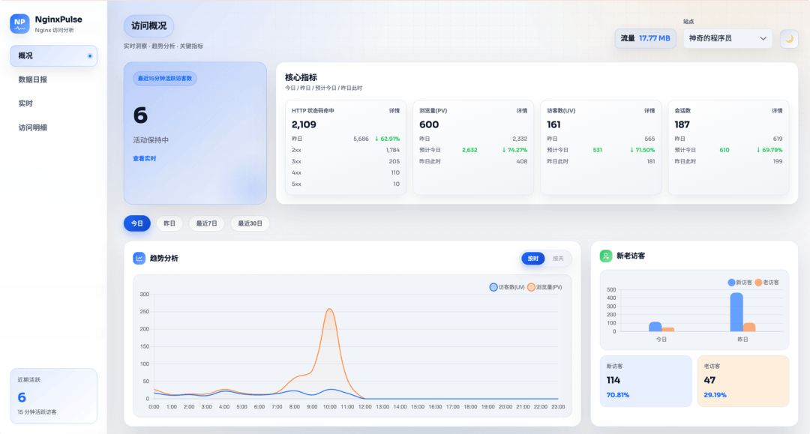
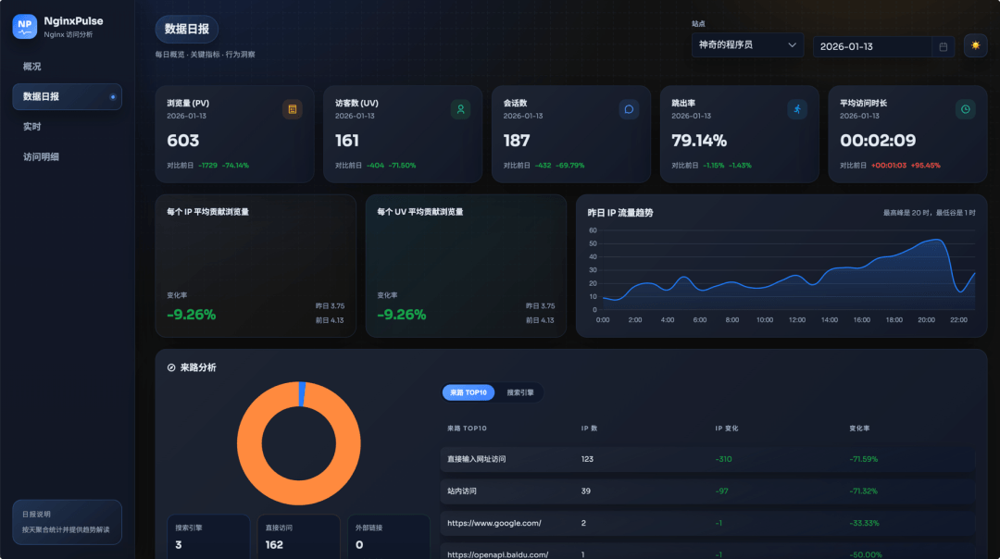

# 短短一周收获 1400 stars！前端的全栈神器！

前端程序员日常排障的痛谁懂啊！遇到页面加载慢、接口 404、跨域报错，大概率要查 Nginx 日志，但原生日志是密密麻麻的纯文本，`cat` `grep` `awk` 轮番上阵，筛选 PV、定位 IP 归属、区分内外网访问，简直是折磨。尤其是非运维岗的前端，对着一堆参数头都大了——**NginxPulse 就是来拯救你的！**





短短发布一周就收获了 **1400 stars**


它是一款轻量级 Nginx 访问日志分析与可视化面板，专为前端/非运维同学设计，不用啃复杂命令行，就能轻松搞定日志统计、IP 解析、PV 过滤等核心需求。

## ✨ 核心亮点（直击前端痛点）

1. **可视化面板，数据一目了然** 基于 ECharts/Chart.js 实现 PV/UV 趋势、IP 地域分布、客户端设备占比等多维度图表，不用再逐行翻日志，排查问题效率翻倍。
2. **部署零门槛，Docker 一键启动** 内置 PostgreSQL 数据库，无需额外配置环境，一条命令就能跑起来，前端同学也能轻松驾驭。
3. **日志适配超灵活，不用改代码**
- 支持本地日志、`.gz` 压缩日志、多站点日志挂载；
- 兼容 Nginx 原生/自定义日志格式、Caddy JSON 日志；
- 还能对接远程日志源（HTTP/SFTP/S3）或通过 Agent 实时推送，内网/边缘节点场景也能覆盖。
5. **高性能解析，大日志不卡顿** 日志解析和 IP 归属地查询解耦，异步回填数据，支持 10G+ 大日志高效处理，不会因为日志太大卡死。
6. **实用小功能，前端直呼贴心**
- 支持内网 IP 统计开关（默认排除内网，按需开启）；
- 可配置 PV 过滤规则，精准统计有效访问；
- 访问密钥控制，避免面板被随意访问。

## 🛠️ 前端友好技术栈

面板前端基于 **Vue 3 + Vite + TypeScript + PrimeVue + Scss** 开发，都是前端同学熟悉的技术栈，就算想二次开发自定义功能，也能快速上手。

## ⚡ 快速上手（前端也能秒会）

### Docker 一键启动（推荐）

```
docker run -d --name nginxpulse \
  -p 8088:8088 -p 8089:8089 \
  -e WEBSITES='[{"name":"你的项目","logPath":"/share/log/nginx/access.log","domains":["你的域名"]}]' \
  -v 本地Nginx日志路径:/share/log/nginx/access.log:ro \
  -v /etc/localtime:/etc/localtime:ro \
  -v "$(pwd)/var/nginxpulse_data:/app/var/nginxpulse_data" \
  -v "$(pwd)/var/pgdata:/app/var/pgdata" \
  magiccoders/nginxpulse:latest
```
### 立即访问

- 可视化面板：`http://localhost:8088`（直接看图表，不用碰命令）
- 后端接口（调试用）：`http://localhost:8089`

## ⚠️ 必看注意点

1. **时区同步是关键**：务必挂载 `/etc/localtime`，否则日志时间统计会错乱；
2. **内网 IP 统计开关**：想统计内网访问，需将 `PV_EXCLUDE_IPS` 设为空数组；
3. **密钥访问控制**：配置 `ACCESS_KEYS` 后，前端访问会弹窗验证，API 请求需带 `X-NginxPulse-Key` 请求头。

> 地址：https://github.com/likaia/nginxpulse/

> 文档：https://github.com/likaia/nginxpulse/wiki

## 🎯 总结

对前端程序员来说，NginxPulse 最大的价值就是 **「把复杂的 Nginx 日志分析，变成可视化的傻瓜式操作」**。不用再跟命令行死磕，一键部署就能掌握项目访问情况，排查问题效率直接拉满！

## 结语

我是林三心，一个待过**小型toG型外包公司、大型外包公司、小公司、潜力型创业公司、大公司**的作死型前端选手
