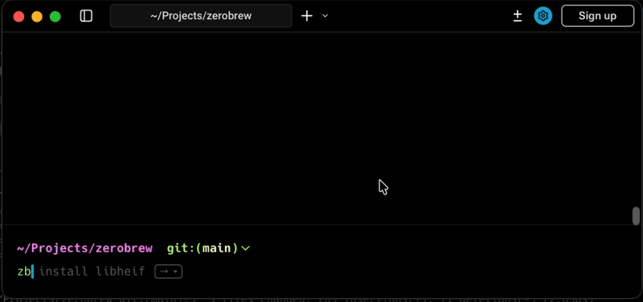
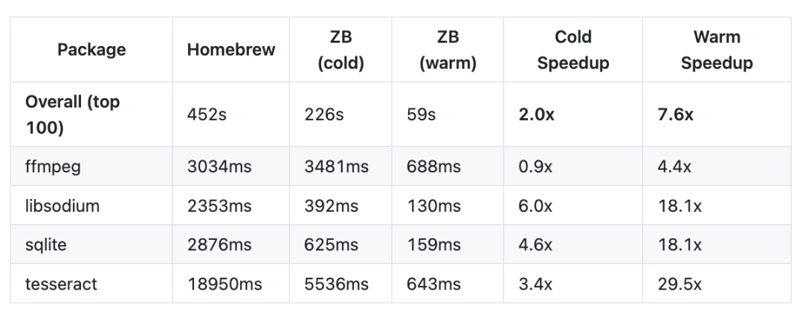

# 前端苦它久已，终于重写，速度 ×20

只要你在 Mac 电脑上做过开发，基本绕不开一个工具：**Homebrew**。

装 Node、装 Git、装各种 CLI，第一步几乎都是：

```
brew install xxx
```
久而久之，它已经不只是一个包管理器了，更像是 macOS 开发环境里默认存在的一部分。

一开始你可能没什么感觉，直到有一天你只是想装个小工具，却发现 `brew update` 先跑了几分钟。

你很难说它不能用，但你也很难说它用得爽。

**慢，几乎成了 Homebrew 绕不开的标签。**

## 那 Homebrew 到底慢在哪？

核心原因其实很简单：**它的底子有点老了**。

Homebrew 主要是用 **Ruby 加 Shell 脚本**实现的。

这在当年是非常合理的选择，但放到今天，就开始显得不太跟得上节奏了。

每次执行 `brew`，都要先启动一整套 Ruby 运行时，哪怕只是装个很小的工具，流程也一样重。

再加上很多步骤还是偏串行，在多核 CPU、SSD 已经成标配的情况下，自然就慢了下来。

还有一个现实问题是：**它已经太大了**。生态庞大、兼容性要求高，很多地方只能“能跑就别动”，想大幅优化，并不容易。

这些问题叠在一起，就变成了大家熟悉的体验：

> 明明只是装个工具，却总要等很久。

## Zerobrew：有人终于选择重写一遍

直到前两天，一个项目突然把这件事点破了。

它叫 **Zerobrew**，开源仅两天，就在 GitHub 上拿下了 **2K Star**。某种程度上，这个数字本身就说明了一切：**大家真的被 Homebrew 折磨太久了。**



Zerobrew 做的事情也很直接：**用 Rust 重写一个 Homebrew 级别的 macOS 包管理器，只为一件事：更快。**

> https://github.com/lucasgelfond/zerobrew

它不是 Homebrew 的插件，也不是加速脚本，而是直接从核心逻辑重新实现。

官方给出的 benchmark 显示：在一些常见场景下，**速度可以达到 Homebrew 的 5～20 倍**。



## 它为什么能快这么多？

Zerobrew 并没有搞什么黑魔法，思路反而很简单。

**就是用更现代的方式，把这件事重新做了一遍。**

具体来说主要三点：

### 第一，语言换了。

Zerobrew 是纯 Rust 实现，启动快、并发强。

这点前端其实并不陌生，这两年很多前端工具都在用 Rust 重构。

### 第二，并行是默认策略。

下载、解压、安装，能同时做的事情，绝不排队。

### 第三，吃透了 macOS 的文件系统能力。

大量利用 APFS 的 clone 特性，文件“安装”几乎不需要真正复制。

还有一个很关键的点是：**它并没有重建生态。**

Zerobrew 直接使用 Homebrew 的官方 bottles 和 CDN，换的只是执行方式。

## 这不是 Zerobrew 一个项目的事

如果你这两年关注前端工具链，会发现一个明显趋势：

越来越多的基础工具，开始用 **Rust 重写**。

不是因为旧的不能用，而是因为在今天的使用场景下，它们已经不够好了。

Zerobrew，只是把这股风，吹到了包管理器这一层。

而前端，也恰恰是被这些工具性能折磨最久的人之一。

## 写在最后

很多时候，我们不是不想优化，而是默认“基础设施就这样”。

Zerobrew 的出现，其实是在提醒所有人：

> 如果今天重新设计这些工具，很多痛苦，本来是可以不存在的。

前端苦它久已，这一次，终于有人动手了。

  

---

  


- 我是 ssh，工作 6 年+，阿里云、字节跳动 Web infra 一线拼杀出来的资深前端工程师 + 面试官，非常熟悉大厂的面试套路，Vue、React 以及前端工程化领域深入浅出的文章帮助无数人进入了大厂。
- 欢迎`长按图片加 ssh 为好友`，我会第一时间和你分享前端行业趋势，学习途径等等。2025 陪你一起度过！
- 
- 关注公众号，发送消息：
  
  指南，获取高级前端、算法**学习路线**，是我自己一路走来的实践。
  
  简历，获取大厂**简历编写指南**，是我看了上百份简历后总结的心血。
  
  面经，获取大厂**面试题**，集结社区优质面经，助你攀登高峰

因为微信公众号修改规则，如果不标星或点在看，你可能会收不到我公众号文章的推送，请大家将本**公众号星标**，看完文章后记得**点下赞**或者**在看**，谢谢各位！
