# 从失败中重生：一个 AI Agent 前端落地的真实复盘

今天在 FEDay 上分享了一个 Agent 前端落地案例，核心内容是讲述了我参与的一个团队如何从"技术成功"走向"产品失败"，又如何在复盘中获得认知升级。  
  
这个故事的价值不在于成功的方法论，而在于那些踩过的坑和思维转变的过程。

2025 年被称为 Agent 元年。Deep Research、Manus、Claude Code 相继发布，技术圈一片沸腾。很多团队都在问同一个问题：我们要不要做 Agent？

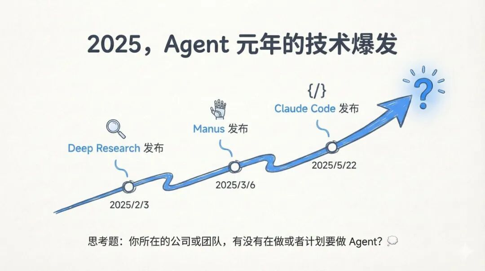

在开始之前，我还是想讲一下我对 AI Agent 的定义：  
AI Agent（AI 智能体），是为了实现某个目标，循环调用工具的大语言模型。  
  
\- 工具循环（tools in a loop）：模型调用工具 → 获取结果 → 继续推理  
\- 有明确终点：为了达成目标，而不是无限循环  
\- 目标来源灵活：可以来自用户，也可以来自另一个 LLM  
\- 基础记忆能力：通过对话历史保存上下文信息

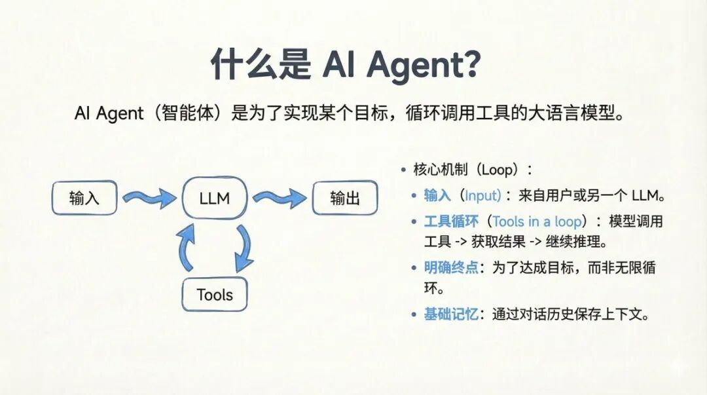

朋友负责的团队面临的是一个真实的企业痛点：公司有完整的内部设计系统（Design System）和私有前端框架，但这些代码从未被 AI 训练过，通用模型根本无法直接生成符合规范的代码。  
  
目标看起来很清晰——做一个类似 Lovable 的工具，但用的是自己的 Design System。用户上传 Figma 设计稿或截图，Agent 自动生成符合内部规范的前端代码。

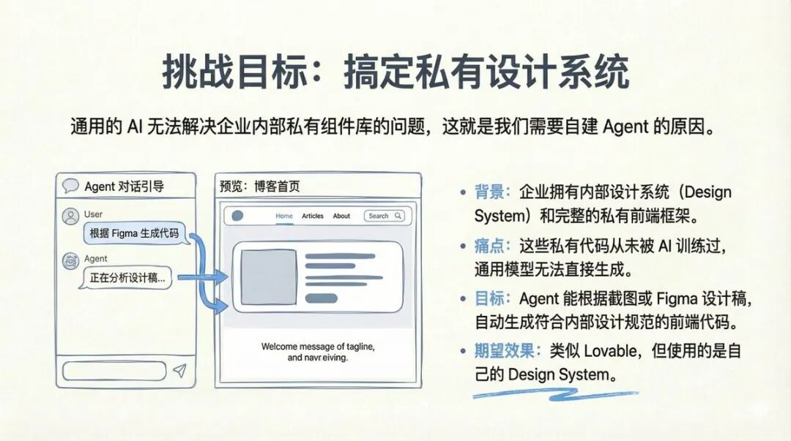

听起来很美好，对吧？  
  
但挑战也很现实：  
\- 要完整搭建一个 Agent 系统没想的那么容易，不仅要和模型交互，还要处理好用户交互，还有上下文工程  
\- 要让模型理解和使用从未训练过的私有组件  
\- 要在浏览器中实时预览生成结果  
\- 出错了希望能自动修复  
  
由于团队之前没有开发过 Agent 相关产品，所以请我参与其中，提供技术咨询和方案建议。

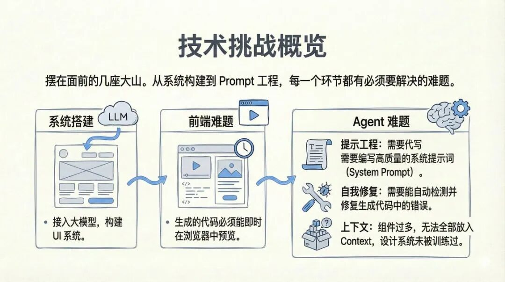

我第一个建议很现实：先跑通再优化  
—— 构建 Agent 最难的不是技术，而是完整跑通流程。

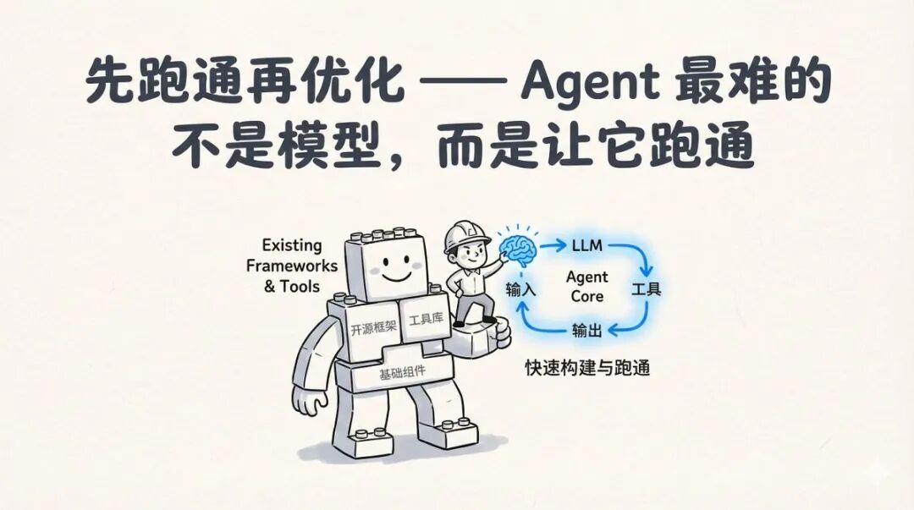

我推荐他们基于 Claude Agent SDK 进行二次开发，而不是从零造轮子。一些关键理由包括：  
1\. Claude Code 已经验证了它是可行的  
2\. 开箱即用，内置工具足够满足绝大数场景  
3\. 可以自定义工具、接入 MCP、自定义 Skill  
4\. 可以接入国产兼容模型  
  
还帮着基于 Claude Agent SDK 快速搭建了一个原型系统。一些关键代码还开源在这里：https://github.com/JimLiu/claude-agent-kit  
  
这样很快有了个基本可用的 Agent。

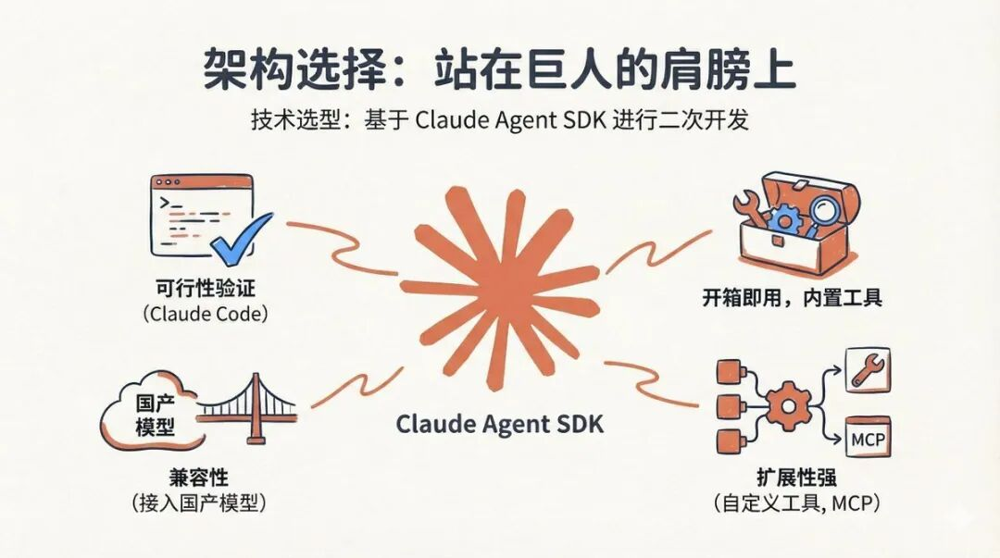

接下来就是解决代码的浏览器预览问题。  
  
一开始我们尝试用 Sandpack（浏览器端沙盒）做代码预览，结果发现复杂组件根本跑不起来，而且无法发挥 Agent 读写文件的能力。  
  
转向方案是给 Agent 一个本地文件系统——每个会话一个独立环境（虚拟机或目录），Agent 可以自由读取、修改、编译代码。这个决策让 Agent 的能力得到了最大化发挥。  
  
给 Agent 一个本地文件系统才能最大化的发挥 Agent 能力

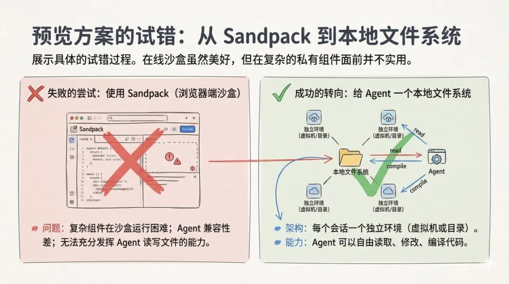

给 Agent 一个本地文件系统才能最大化的发挥 Agent 能力

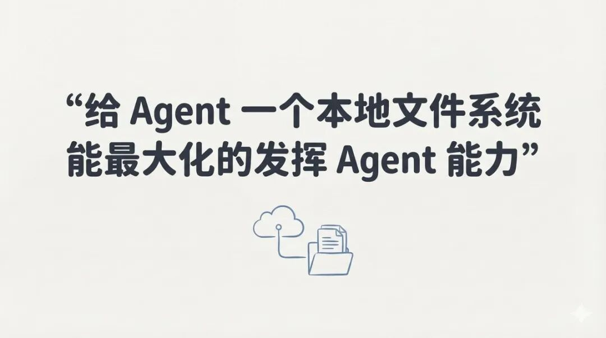

另一个难题就是如何让 AI 学会使用从未训练过的私有组件？  
  
其实就是把 Agent 当作新员工，用高质量文档和参考代码来教会它。  
  
我们把设计系统说明、组件列表、API 文档全部 Markdown 化，让 Agent 按需检索。高质量的参考代码本身就是最好的教材。  
  
而且完全不需要复杂的 RAG 系统，直接让 Agent 去基于文件检索搜索本地文档和代码就足够了。

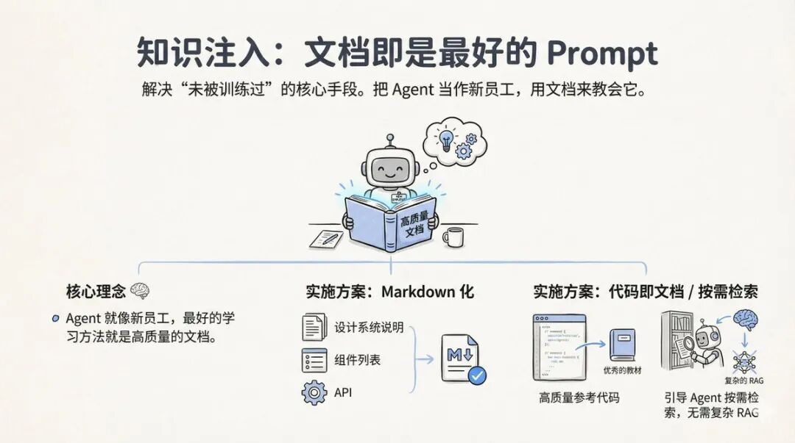

还有一个难题就是如何保证生成代码的质量，让代码能跑起来？  
  
为了保证代码质量，为 Agent 建立了一套"生成 → 验证 → 修复"的自动化闭环：Lint 静态检查、编译验证、视觉比对（借助 Chrome DevTool MCP 做截图对比）。  
  
一个节约主 Agent 上下文的技巧：把验证工具放入 Skill 或 SubAgent，避免污染主 Agent 的上下文。  
  
把这些问题都解决后，Agent 终于上线了。

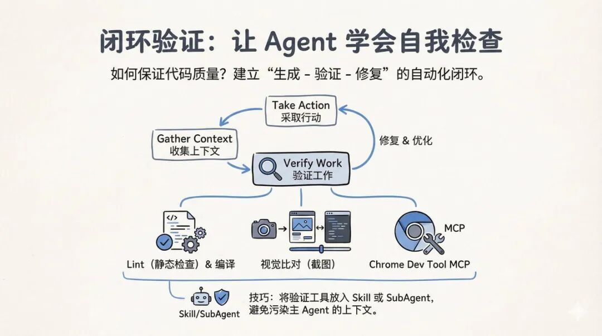

系统跑通了，Demo 很惊艳，但……  
  
很快就没什么人用。  
  
初期大家觉得新鲜，但很快就弃用了。开始和他们一起深度复盘，发现问题根本不在技术，而在产品逻辑与用户习惯的错位。

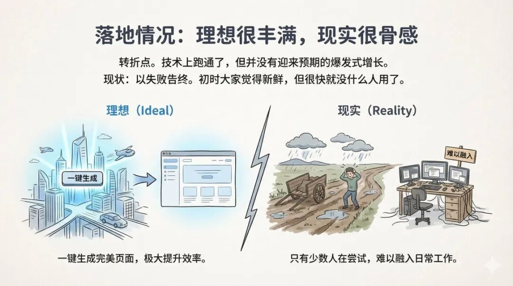

通过对内部员工的调查访谈，很快就找到了原因：  
  
习惯阻力：设计师和产品经理更习惯在 Figma 里工作，而不是对着一个对话框。从舒适区（Figma）跳到陌生区（Agent 对话），这个门槛比想象中高得多。大部分甚至不知道该在聊天窗口写啥。  
  
80/20 瓶颈：Agent 能实现 80% 的效果，但剩下 20% 的修改成本极高。而往往就是那 20% 决定了能不能用。  
  
流程割裂：生成环境和开发环境是脱节的，无法利用现有代码，需要手动把生成的代码复制回项目，操作繁琐。

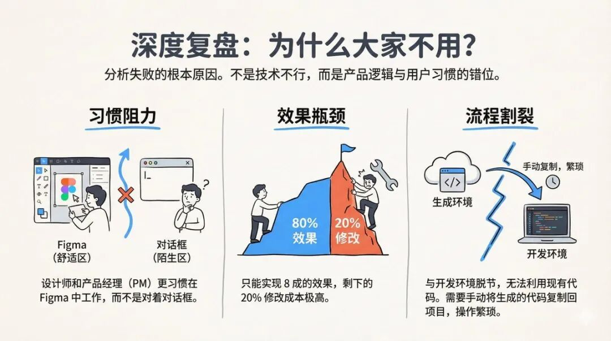

团队意识到，他们最初问的问题是："如何构建一个设计系统 AI Agent？"  
  
这种提问方式让 Agent 变成了目的本身，为了技术而忽略了本质。  
  
正确的问题应该是："我们设计系统的最终目的是什么？"  
  
答案其实只有两点：在整个企业内实现设计规范的统一；实现开发效率的提升。  
  
设计系统只是手段，而非目的。

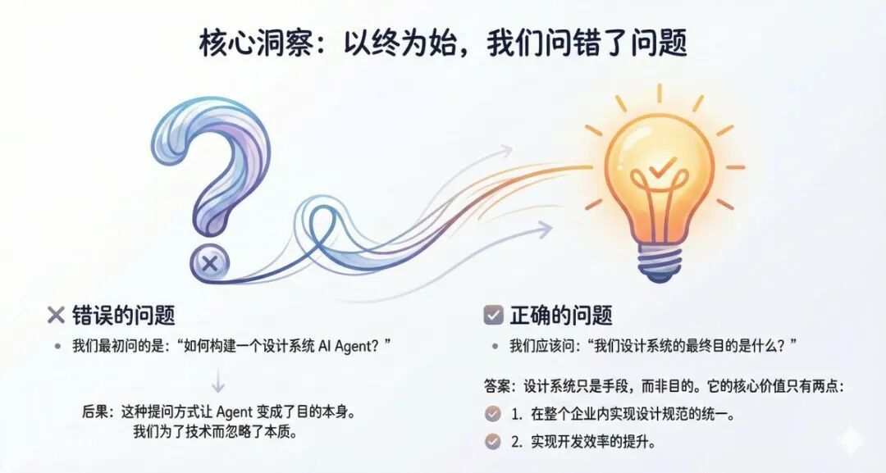

思维转换：以 AI 为中心重新设计  
  
现有的流程是为人设计的：手动沟通、反复修改、人工确认，步骤繁杂，效率低下。  
  
未来的流程应该为 AI 设计：Input → AI Agent → Output，路径直接，效率高。  
  
这带来了两个新的设计原则：  
  
AI 友好：选择 AI 容易理解和操作的技术栈。  
  
轻量化：只保留 Design Tokens，基于 AI 友好的开源系统（如 shadcn/ui）进行扩展，而不是维护一套庞大的私有组件库。

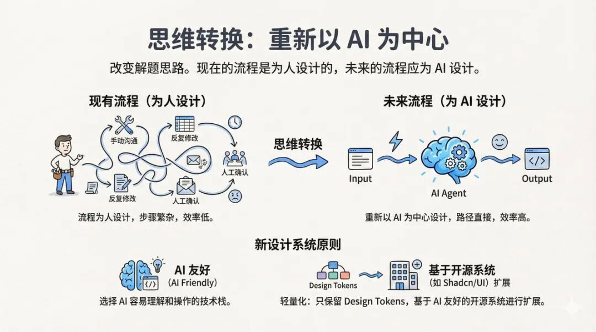

破局之道：从 Agent 到 Skill  
  
最关键的转变是：不要做一个独立的 Agent 平台，而是将能力嵌入现有的 AI 开发环境。  
  
旧模式是"独立 Agent 孤岛"——Agent 和开发者之间存在割裂，效率低下。  
  
新模式是"融入开发工作流"——把设计系统变成一种 Skill（技能），可以被通用的 Agent（如 Claude Code、Cursor）调用。  
  
Skill 的具体形态很简单：Markdown 文档（供 AI 查阅组件用法）+ 自动化脚本（用于初始化项目、自动安装和应用设计系统）。  
  
开发者在自己熟悉的 AI 开发环境里工作，当需要用到设计系统时，Agent 自动调用这个 Skill，生成的代码直接进入项目代码库。

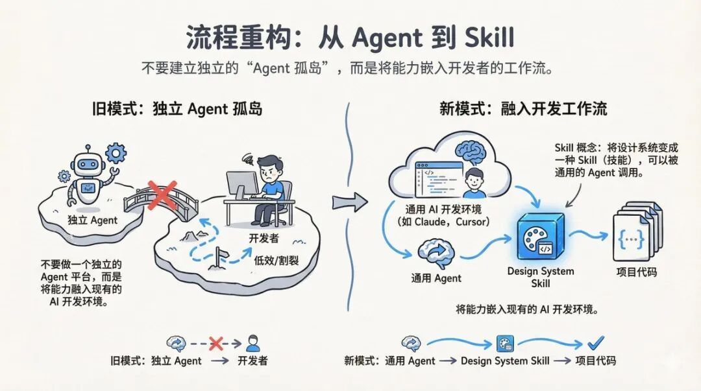

Skill 的具体形态很简单：Markdown 文档（供 AI 查阅组件用法）+ 自动化脚本（用于初始化项目、自动安装和应用设计系统）。  
  
开发者在自己熟悉的 AI 开发环境里工作，当需要用到设计系统时，Agent 自动调用这个 Skill，生成的代码直接进入项目代码库。  
  
可以参考：  
https://github.com/anthropics/skills/tree/main/skills/web-artifacts-builder

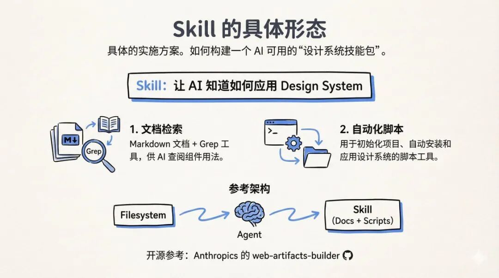

这个案例让我想到几个更深层的问题：  
  
1\. 技术成功 ≠ 产品成功  
  
很多技术人（包括我自己）容易陷入"技术可行就是成功"的思维定式。但用户不会因为你的技术牛就买单，他们只关心能不能解决自己的问题、能不能无缝融入自己的工作流。  
  
2\. 做 AI 产品要"以 AI 为中心"思考  
  
我们常说"以用户为中心"，但在 AI 时代，可能需要增加一层：以 AI 为中心设计工作流，再让用户享受这个高效流程的成果。不是让 AI 模仿人的工作方式，而是重新设计工作方式让 AI 更高效。  
  
3\. Skill > Agent  
  
独立的 Agent 平台有天然的adoption障碍。把能力封装成 Skill，嵌入已有的通用 Agent 生态，可能是更务实的落地路径。这也是为什么 Anthropic 推出 web-artifacts-builder 这样的开源项目——它就是一个 Skill 的范例。  
  
4\. 行动本身就是价值  
  
即使这个项目"失败"了，团队获得的认知升级是无价的。从模仿人类工作流到为 AI 重塑工作流，这种思维转变只有在实践中才能获得。

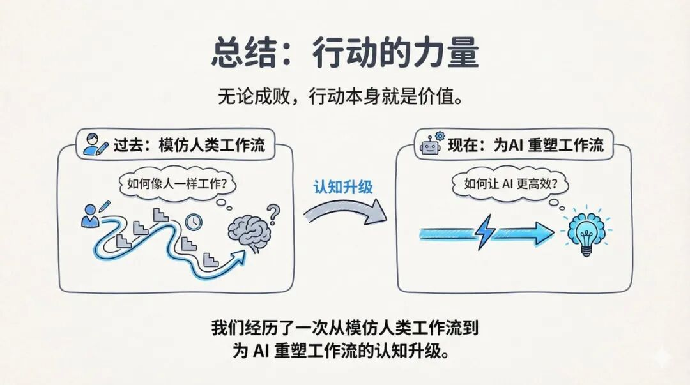

最后我想说的是："去构建（Build）"。  
  
AI 时代，失败没什么，好过什么都没做。

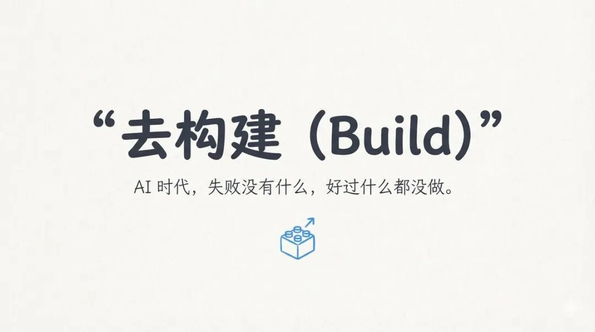
