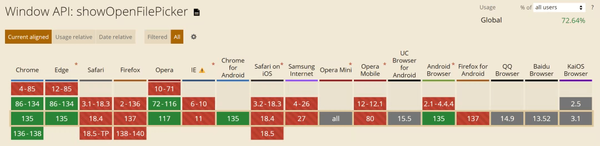

# Chrome 新 API：仅 5 行代码！直接读写本地文件！

**File System Access API** 是一项能让 Web 应用安全地与用户本地文件系统交互的浏览器 API。相较于传统的 `<input type="file">` 方式，它能为开发者提供更精细化的文件操作控制能力。

### 核心特性

- **持久化访问能力**：借助文件句柄（File Handle），可长期保留对文件/目录的访问权限，无需用户重复授权。
- **目录级操作支持**：能够直接读取、写入本地目录结构，而非仅局限于单个文件的操作。
- **沙箱化安全机制**：所有文件系统操作均需经过用户明确授权，从根源上保障本地文件的安全。

### 兼容性检测

在使用该 API 前，建议先检测浏览器是否支持，若不支持则降级到传统文件输入方式：

```
if ('showOpenFilePicker' in window) {
  // 当前环境支持 File System Access API
} else {
  // 降级使用 <input type="file"> 实现基础文件操作
}
```
### 基础使用示例

#### 1\. 读取文本文件

以下函数可实现弹出文件选择器、获取用户选定的文本文件，并读取其内容：

```
/**
 * 打开本地文本文件并读取其内容
 * @returns {Promise<string|null>} 读取到的文件内容，操作失败则返回 null
 */
asyncfunction readTextFileContent() {
try {
    // 1. 唤起文件选择器，限定仅可选择 txt 文本文件
    const [fileHandle] = awaitwindow.showOpenFilePicker({
      types: [{
        description: '纯文本文件',
        accept: {'text/plain': ['.txt']}
      }]
    });

    // 2. 通过文件句柄获取文件对象
    const file = await fileHandle.getFile();

    // 3. 以文本形式读取文件内容并返回
    return await file.text();

  } catch (error) {
    // 捕获用户取消选择、权限拒绝等异常
    console.warn('文件读取操作失败:', error);
    returnnull;
  }
}
```
#### 2\. 写入内容到文件

该函数可弹出文件保存对话框，将指定内容写入用户选定的新文件中：

```
/**
 * 将指定内容保存到本地文件
 * @param {string} content - 需要写入文件的文本内容
 */
asyncfunction writeContentToFile(content) {
try {
    // 1. 唤起文件保存对话框，建议默认文件名
    const fileHandle = awaitwindow.showSaveFilePicker({
      suggestedName: 'untitled.txt',
      types: [{
        description: '纯文本文件',
        accept: {'text/plain': ['.txt']}
      }]
    });

    // 2. 创建可写数据流
    const writableStream = await fileHandle.createWritable();

    // 3. 将内容写入数据流
    await writableStream.write(content);

    // 4. 关闭数据流，完成写入操作
    await writableStream.close();

    console.log('文件内容保存成功');

  } catch (error) {
    console.error('文件保存操作失败:', error);
  }
}
```
### 进阶使用场景

#### 1\. 目录结构操作

通过该 API 可直接读取本地目录，并递归遍历其中的所有文件和子目录：

```
/**
 * 读取本地目录内容，递归遍历所有文件
 */
asyncfunction traverseDirectory() {
// 唤起目录选择器，获取目录句柄
const dirHandle = awaitwindow.showDirectoryPicker();

// 递归遍历目录的生成器函数
asyncfunction* walkThroughDirectory(currentDirHandle) {
    // 遍历当前目录下的所有条目（文件/子目录）
    forawait (const entry of currentDirHandle.values()) {
      if (entry.kind === 'directory') {
        // 若为子目录，递归遍历其内容
        yield* walkThroughDirectory(entry);
      } else {
        // 若为文件，返回文件相关信息
        yield {
          kind: entry.kind,
          name: entry.name,
          handle: entry
        };
      }
    }
  }

// 遍历示例：输出目录下所有文件名称
forawait (const file of walkThroughDirectory(dirHandle)) {
    console.log('检测到文件:', file.name);
  }
}
```
#### 2\. 持久化保留文件访问权限

通过文件句柄的权限查询与请求机制，可长期保留对文件的访问权限，避免重复授权：

```
// 全局变量存储文件句柄，用于后续复用
let persistentFileHandle;

/**
 * 打开文件并获取持久化访问权限
 * @returns {Promise<FileSystemFileHandle>} 具备访问权限的文件句柄
 * @throws {Error} 权限获取失败时抛出异常
 */
asyncfunction openFileWithPersistentAccess() {
// 唤起文件选择器，获取文件句柄
  [persistentFileHandle] = awaitwindow.showOpenFilePicker();

// 1. 检查当前是否已获得访问权限
if (await persistentFileHandle.queryPermission() === 'granted') {
    return persistentFileHandle;
  }

// 2. 主动请求文件访问权限
if (await persistentFileHandle.requestPermission() === 'granted') {
    return persistentFileHandle;
  }

// 权限请求失败时抛出异常
thrownewError('无法获取文件访问权限，操作无法继续');
}
```
## 兼容性



## 结语

我是林三心，一个待过**小型toG型外包公司、大型外包公司、小公司、潜力型创业公司、大公司**的作死型前端选手


我建了一些**前端学习群**，如果大家想进群交流前端知识，可以关注我，回复**加群**


