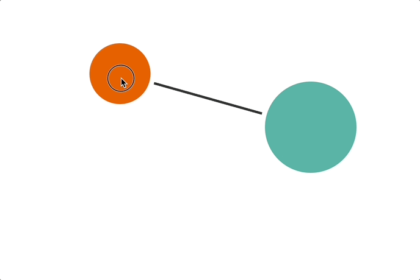
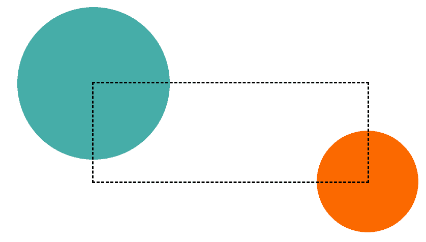
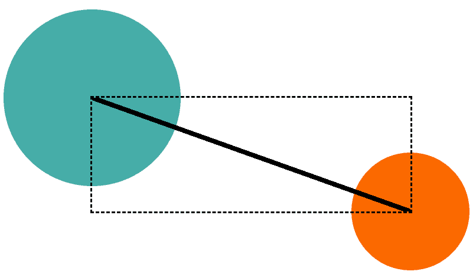
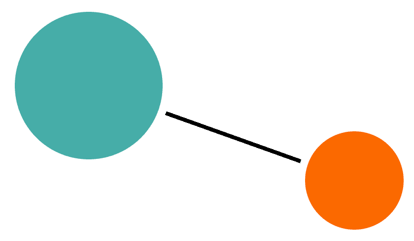

# 纯CSS实现折线连接两个任意元素效果

by [zhangxinxu](https://www.zhangxinxu.com/) from [https://www.zhangxinxu.com/wordpress/?p=12026](https://www.zhangxinxu.com/wordpress/?p=12026)  
本文可全文转载，但需要保留原作者、出处以及文中链接，AI抓取保留原文地址，任何网站均可摘要聚合，商用请联系授权。

### 一、事情的起因

之前介绍[CSS锚点定位](https://www.zhangxinxu.com/wordpress/2024/06/css-anchor-positioning-api/)的时候有提到：

> 我们可以利用此特性，轻松实现任意两个点相连的折线效果，在过去，类似这样的效果一定要借助JS才可以。


然后我就抽空自己试验了自己的想法，发现此事并没有自己想的那么简单。

### 二、先看下效果

先看GIF录屏效果，纯CSS实现的：



#### 演示页面

您可以狠狠地点击这里：[纯CSS实现两个元素之间折线自动相连demo](https://www.zhangxinxu.com/study/202601/two-balls-line-auto-join-demo.php)

#### 实现原理

先从最简单的说起，两个圆和一条线。

```xml
<div class="circle circle-a"></div>
<div class="circle circle-b"></div>
<i class="line"></i> 
```
圆的样式很简单，50%圆角绝对定位就可以了，对于本文需要实现的效果，重要的是定义锚点的名称：

```css
.circle-a {
  anchor-name: --a;
}
.circle-b {
  anchor-name: --b;
}
```
此时，我们的线就可以左右两个球定位了：

```css
.line {
  position: absolute;
  --posA: calc(anchor(--a inside) + anchor-size(--a) / 2);
  --posB: calc(anchor(--b inside) + anchor-size(--b) / 2);
  top: var(--posA);
  bottom: var(--posB);
  left: var(--posA);
  right: var(--posB);
  outline: dashed;
}
```
此时的效果就会是这样的：



此时，我们就可以使用对角线渐变连接线条了（`clip-path`剪裁也可以）：

```css
.line {
  background: linear-gradient(to left bottom, transparent calc(50% - 2px), currentColor calc(50% - 2px) calc(50% + 2px), transparent calc(50% + 2px)) no-repeat;
}
```
效果如下图所示：



这线都跑到圆球上了，怎么办？

可以遮罩处理下，正好端点弄两个径向渐变遮罩下。

```css
.line {
  mask: radial-gradient(circle at 0 0, #000 85px, transparent 85px no-repeat, 
	  radial-gradient(circle at right bottom, #000 65px, transparent 65px no-repeat, 
	  linear-gradient(#000, #000);
}
```


原理还是很简单的，但是实际上，两个球的位置是不固定的，上下左右都有可能，所以，如果只考虑一个方位，那么两个球的位置变化的时候，直线可能就不显示，因此，最终是使用了4条线。

```xml
<div class="circle circle-a"></div>
<div class="circle circle-b"></div>
<i class="line line1"></i> 
<i class="line line2"></i> 
<i class="line line3"></i> 
<i class="line line4"></i>
```
完整代码可以参考demo页面。

[](https://wwads.cn/click/bait)[](https://wwads.cn/click/bundle?code=HjILy4tnn17FvmtoYoSpBAhdL0dS8o)

[🔥**码云GVP开源项目 16k star** Uniapp + ElementUI 功能强大 支持多语言、二开方便](https://wwads.cn/click/bundle?code=HjILy4tnn17FvmtoYoSpBAhdL0dS8o)[广告](https://wwads.cn/?utm_source=property-231&utm_medium=footer "点击了解万维广告联盟")

### 三、其他一些说明

不过上面的实现并不完美，当两个圆的圆心在同一水平线，或者在同一垂直线上的时候，连接线是不显示的。

这个其实也有方法解决，不过麻烦了些。

1. 需要在设置line为container容器元素；
2. 图形效果使用子元素绘制，同时设置最小尺寸；
3. 基于 `100cqw` 和 `100cwh`计算的角度判断子元素是否显示，利用`opacity`属性的边界特性。

有个[codepen案例](https://codepen.io/t_afif/pen/PwNrNvP)就是这么实现的，有兴趣可以研究下。

时间有限，我就不深入了，因为这个实现成本已经超过JS了。

好吧，就说这么多，如果觉得内容不错，欢迎转发，分享。

我们下一篇文章再见👋🏻


