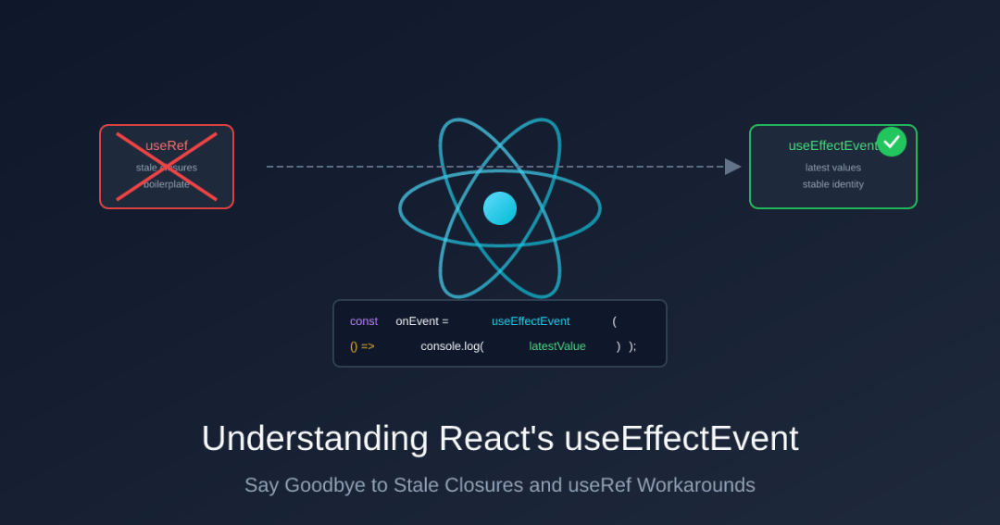
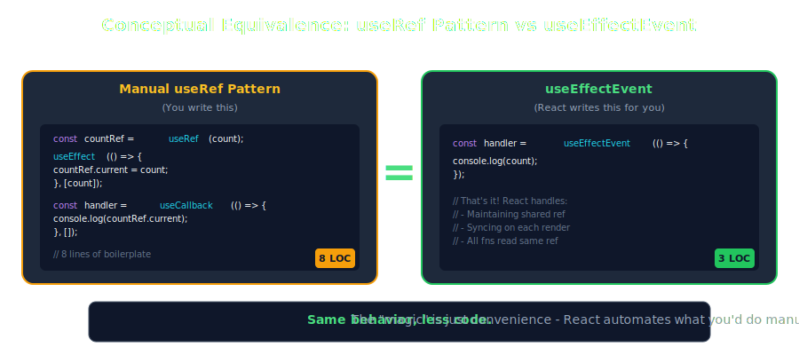

# 【第3656期】深入理解 React 的 useEffectEvent：彻底告别闭包陷阱

前言

useEffectEvent 是 React 19.2 新增的 Hook，让你在 Effect 回调中读取最新的 props/state，同时避免这些值的变化触发 Effect 重新执行，从而优雅地解决闭包陷阱问题。今日前端早读课文章由 @Peter 分享，@飘飘编译。

译文从这开始～～

#### 要点速览

`useEffectEvent` 允许你在 Effect 内部访问最新的 props 和 state，而无需将它们添加到依赖数组中。这意味着当这些值发生变化时，Effect 不会重新执行。

[【第3623期】从混乱到纯净：用 Effect System 重塑你的 JS 架构](https://mp.weixin.qq.com/s?__biz=MjM5MTA1MjAxMQ==&mid=2651278107&idx=1&sn=93a5e42214119670b46eb3168701e2d4&scene=21#wechat_redirect)



#### 核心问题

场景是这样的：你有一个 `useEffect` 负责初始化一些开销较大的操作 —— 比如 WebSocket 连接、定时器或者数据订阅。在这些操作的回调函数中，你需要读取某个 state。但问题在于，你并不希望这个 state 的变化导致连接被销毁后重建。

两难困境：

- 如果将 state 加入依赖数组 → Effect 重新执行，连接被重建（糟糕）
- 如果不将 state 加入依赖数组 → 回调函数拿到的是过时的值（同样糟糕）

`useEffectEvent` 正是为此而生。它提供了一个函数，该函数在调用时总能读取到最新的值，同时又不会被视为响应式依赖项。

#### 示例一：聊天室连接

让我们来构建一个聊天组件。当收到新消息时，我们希望播放提示音 —— 但前提是用户没有开启静音模式。

[【第3645期】如何在没有源码的情况下重建任意 React 组件](https://mp.weixin.qq.com/s?__biz=MjM5MTA1MjAxMQ==&mid=2651278496&idx=1&sn=c5f31a8bd1651c1426d76f2f4ac462eb&scene=21#wechat_redirect)

##### 问题版本（闭包陷阱）

```
 import { useEffect, useState } from "react";

 function ChatRoom({ roomId }: { roomId: string }) {
   const [isMuted, setIsMuted] = useState(false);

   useEffect(() => {
     const connection = connectToRoom(roomId);

     connection.on("message", (message: string) => {
       // BUG：这里捕获的是 isMuted 的初始值
       // 当用户切换复选框时，这个值永远不会更新！
       if (!isMuted) {
         playSound();
       }
     });

     return () => connection.disconnect();
   }, [roomId]); // ❌ 依赖数组缺少 isMuted——回调函数看到的是过时的值！

   return (
     <div>
       <h1>聊天室：{roomId}</h1>
       <label>
         <input
           type="checkbox"
           checked={isMuted}
           onChange={(e) => setIsMuted(e.target.checked)}
         />
         静音通知
       </label>
     </div>
   );
 }
```
问题出在哪里：回调函数在 Effect 首次执行时就捕获了 `isMuted` 的值。当用户切换静音状态时，回调函数依然只能看到旧值。这就是所谓的 "闭包陷阱"。

##### 看似正确却引发新问题的 "修复"

你可能会想：" 把 `isMuted` 加到依赖数组里不就行了！"

```
 useEffect(() => {
   const connection = connectToRoom(roomId);

   connection.on("message", (message: string) => {
     if (!isMuted) {
       playSound();
     }
   });

   return () => connection.disconnect();
 }, [roomId, isMuted]); // ❌ 现在 isMuted 的变化会触发重连！
```
现在回调函数确实能拿到最新值了…… 但每当 `isMuted` 变化时：

- 1、React 执行清理函数 → `connection.disconnect()`
- 2、React 重新执行 Effect → `connectToRoom(roomId)`
- 3、重新注册消息处理函数

仅仅是切换一个静音复选框，就会导致聊天连接重建！重连期间可能会丢失消息，服务器也会面临频繁的连接波动。这种做法既浪费资源，又会产生 bug。

##### 正解：useEffectEvent

```
 import { useEffect, useState, useEffectEvent } from "react";

 function ChatRoom({ roomId }: { roomId: string }) {
   const [isMuted, setIsMuted] = useState(false);

   // 创建 Effect Event——调用时读取最新的 isMuted 值
   const onMessage = useEffectEvent((message: string) => {
     if (!isMuted) {
       playSound();
     }
   });

   useEffect(() => {
     const connection = connectToRoom(roomId);
     connection.on("message", onMessage);
     return () => connection.disconnect();
   }, [roomId]); // ✅ 只有 roomId 变化才会触发重连

   return (
     <div>
       <h1>聊天室：{roomId}</h1>
       <label>
         <input
           type="checkbox"
           checked={isMuted}
           onChange={(e) => setIsMuted(e.target.checked)}
         />
         静音通知
       </label>
     </div>
   );
 }
```
现在的行为是：

- `roomId`
  
   变化 → 重新连接（正确！）
- 切换 `isMuted` → 连接不受影响
- 收到消息 → `onMessage` 读取当前的 `isMuted` 值

Effect 只关心 `roomId`。而 `onMessage` 函数在被调用时才读取 `isMuted`，获取的是那一刻的实时值。

#### 示例二：REST 轮询仪表板

这是另一个常见场景：一个每隔 10 秒轮询 API 的数据看板，请求中包含一个用户可切换的筛选选项。

##### 问题版本（定时器重置）

```
 import { useEffect, useState } from "react";

 function Dashboard({ teamId }: { teamId: string }) {
   const [includeArchived, setIncludeArchived] = useState(false);
   const [data, setData] = useState(null);

   useEffect(() => {
     const fetchData = async () => {
       const response = await fetch(
         `/api/team/${teamId}/tasks?archived=${includeArchived}`
       );
       const json = await response.json();
       setData(json);
     };

     fetchData(); // 立即请求一次
     const intervalId = setInterval(fetchData, 10000); // 然后每 10 秒请求一次

     return () => clearInterval(intervalId);
   }, [teamId, includeArchived]); // ❌ 切换复选框会重启定时器！

   return (
     <div>
       <h1>团队看板</h1>
       <label>
         <input
           type="checkbox"
           checked={includeArchived}
           onChange={(e) => setIncludeArchived(e.target.checked)}
         />
         显示已归档任务
       </label>

       <ul>
         {data?.map((task) => (
           <li key={task.id}>{task.name}</li>
         ))}
       </ul>
     </div>
   );
 }
```
问题出在哪里： 每当用户切换 "显示已归档任务" 选项时：

- 1、Effect 清理函数执行 → `clearInterval(intervalId)`
- 2、Effect 重新执行 → 从零开始创建新的定时器

如果用户在 3 秒内连续切换 5 次，定时器就会被重置 5 次，实际上根本不会触发。只有等用户停止点击后，数据才会被请求。

##### 正解：useEffectEvent

```
 import { useEffect, useState, useEffectEvent } from "react";

 function Dashboard({ teamId }: { teamId: string }) {
   const [includeArchived, setIncludeArchived] = useState(false);
   const [data, setData] = useState(null);

   // Effect Event 在调用时读取最新的 includeArchived 值
   const fetchData = useEffectEvent(async () => {
     const response = await fetch(
       `/api/team/${teamId}/tasks?archived=${includeArchived}`
     );
     const json = await response.json();
     setData(json);
   });

   useEffect(() => {
     fetchData();
     const intervalId = setInterval(fetchData, 10000);
     return () => clearInterval(intervalId);
   }, [teamId]); // ✅ 只有 teamId 变化才会重启定时器

   return (
     <div>
       <h1>团队看板</h1>
       <label>
         <input
           type="checkbox"
           checked={includeArchived}
           onChange={(e) => setIncludeArchived(e.target.checked)}
         />
         显示已归档任务
       </label>

       <ul>
         {data?.map((task) => (
           <li key={task.id}>{task.name}</li>
         ))}
       </ul>
     </div>
   );
 }
```
现在的行为是：

- `teamId`
  
   变化 → 重启定时器，请求新团队的数据（正确！）
- 切换 "显示已归档任务" → 定时器不受影响，继续运行
- 下一次请求 → 使用当前的 `includeArchived` 值

#### 传统的变通方案：useRef

在 `useEffectEvent` 出现之前，标准做法是用 `useRef` 来同步值：

```
 import { useEffect, useLayoutEffect, useState, useRef } from "react";

 function Dashboard({ teamId }: { teamId: string }) {
   const [includeArchived, setIncludeArchived] = useState(false);
   const [data, setData] = useState(null);

   // 第一步：创建 ref
   const includeArchivedRef = useRef(includeArchived);

   // 第二步：使用 useLayoutEffect 保持 ref 与 state 同步
   // 它会在 useEffect 之前同步执行，确保 ref 是最新的
   useLayoutEffect(() => {
     includeArchivedRef.current = includeArchived;
   }, [includeArchived]);

   // 第三步：在 Effect 中从 ref 读取值
   useEffect(() => {
     const fetchData = async () => {
       const response = await fetch(
         `/api/team/${teamId}/tasks?archived=${includeArchivedRef.current}`
       );
       const json = await response.json();
       setData(json);
     };

     fetchData();
     const intervalId = setInterval(fetchData, 10000);
     return () => clearInterval(intervalId);
   }, [teamId]);

   // ... JSX
 }
```
##### 为什么用 useLayoutEffect 而不是 useEffect？

你可能会想：" 我能不能按顺序使用两个 `useEffect`？第一个同步 ref，第二个读取它。"

实践中，这种方式往往能正常工作。React 通常会按声明顺序执行 effects。但问题在于：React 官方文档并没有明确保证多个 `useEffect` 之间的执行顺序。文档指出 effects 在组件提交后运行，但多个 effects 之间的精确顺序 —— 尤其是在并发渲染、Suspense 边界或未来 React 版本中 —— 并不属于 React 公开 API 的约定范畴。

而 `useLayoutEffect` 提供了明确的保证。根据 React 官方文档：

> "`useLayoutEffect` 是 `useEffect` 的一个版本，它会在浏览器重绘屏幕之前触发。"
> 
> "React 保证 `useLayoutEffect` 内部的代码及其中调度的任何状态更新都会在浏览器重绘屏幕之前处理完成。"

这意味着执行顺序是明确定义的：

- 组件渲染
- React 将变更提交到 DOM
- useLayoutEffect同步执行 → ref 完成同步
- 浏览器绘制屏幕
- useEffect

 执行 → 读取已更新的 ref

通过使用 `useLayoutEffect` 进行同步，你依赖的是文档明确保证的行为，而非 "观察到但未被规范" 的实现细节。

这种模式的缺点：

- 需要额外声明 `useRef`
- 需要额外的 `useLayoutEffect` 来保持同步
- 必须记住读取 `.current` 而非直接使用 state
- 每个需要 "逃逸" 的值都要重复这套操作
- 容易误用 `useEffect`（可能暂时能跑…… 直到某天突然不行了）

`useEffectEvent` 正是对这一模式的自动化封装，彻底消除了这些隐患。

#### 关于函数引用的说明

⚠️ 常见困惑：返回的函数是稳定的吗？

你可能会好奇：`onMessage`（`useEffectEvent` 返回的函数）是否是稳定的 —— 像 `useCallback` 那样每次渲染都保持相同的引用？

答案是否定的，但这并不重要。

React 每次渲染都会返回一个新的 `onMessage` 函数。如果你把 `onMessage` 放进依赖数组，Effect 就会在每次渲染时重新执行 —— 这恰恰说明你的用法有问题。

为什么它仍然能正常工作：每个版本的 `onMessage`（无论是第 1 次渲染还是第 2 次渲染的）都从同一个内部 ref 读取值。React 会持续更新这个 ref。所以当订阅调用第 1 次渲染时捕获的 `onMessage` 时，它依然能读取到包含最新值的当前回调。

总而言之： 不必担心函数引用的稳定性。只需遵循一条规则 —— 在 Effect 中调用它，但绝不要把它列入依赖数组。

#### 底层实现原理

这里并没有什么黑魔法。`useEffectEvent` 做的事情和你用 `useRef` 实现的完全一样，只不过 React 帮你处理了这些细节。

下面是一个概念模型（并非 React 的实际实现）：

```
 function useEffectEvent<T extends (...args: any[]) => any>(callback: T): T {
   const latestCallbackRef = useRef(callback);

   // React 实际上是在 commit 阶段而非 render 阶段更新这个 ref
   // （这里为了便于理解做了简化）
   latestCallbackRef.current = callback;

   // 每次渲染都返回一个新函数——这是故意的！
   // 所有版本都从同一个 ref 读取，因此它们都能获取最新值
   return ((...args: Parameters<T>) => {
     return latestCallbackRef.current(...args);
   }) as T;
 }
```
关键在于：所有函数实例共享同一个 ref。即使你的 Effect 捕获的是第 1 次渲染时的 "旧" 函数，调用它时读取的是 `latestCallbackRef.current`—— 而它指向的是最新的回调函数。

##### 图解闭包陷阱


##### useRef 如何解决这个问题


##### useEffectEvent 的工作原理


##### 等价关系



#### 使用规则与注意事项

`useEffectEvent` 有一些重要的使用规则。`eslint-plugin-react-hooks`（6.1.1 及以上版本）会强制执行这些规则。

##### 规则一：只能在 Effect 内部调用 Effect Event

Effect Event 的设计目的只有一个：在 Effect 内部被调用。

```
 // ✅ 正确：在 Effect 内部调用
 const onMessage = useEffectEvent((msg: string) => {
   console.log(msg, latestState);
 });

 useEffect(() => {
   socket.on("message", onMessage);
   return () => socket.off("message", onMessage);
 }, []);

 // ❌ 错误：在事件处理函数中调用
 <button onClick={() => onMessage("hello")}>点击我</button>

 // ❌ 错误：在渲染过程中调用
 return <div>{onMessage("rendered")}</div>;
```
React 会主动防范这种误用 —— 如果你在 Effect 上下文之外调用 Effect Event，它会抛出错误。

对于普通的事件处理函数（`onClick`、`onChange` 等），你不需要使用 `useEffectEvent`。这些处理函数在每次交互时都会以最新的值重新执行。

[【第3641期】AI 在编写 React 代码方面到底有多强？Addy Osmani的实战指南](https://mp.weixin.qq.com/s?__biz=MjM5MTA1MjAxMQ==&mid=2651278442&idx=1&sn=d5a2eae3672d1efbd822968c21d5df05&scene=21#wechat_redirect)

##### 规则二：不要将 Effect Event 传递给其他组件

Effect Event 应当保持在其所属组件的本地作用域内：

```
 // ❌ 错误：将 Effect Event 作为 prop 传递
 function Parent() {
   const onTick = useEffectEvent(() => {
     console.log(latestCount);
   });

   return <Timer onTick={onTick} />; // 不要这样做！
 }

 // ✅ 正确：将 Effect Event 保留在本地
 function Parent() {
   const [count, setCount] = useState(0);

   const onTick = useEffectEvent(() => {
     console.log(count);
   });

   useEffect(() => {
     const id = setInterval(() => onTick(), 1000);
     return () => clearInterval(id);
   }, []);

   return <div>计数：{count}</div>;
 }
```
##### 规则三：不要用 useEffectEvent 来消除 Linter 警告

这关乎你的真实意图。问问自己："当这个值发生变化时，Effect 是否应该重新执行？"

- 是→ 它就是依赖项，应当列入数组
- 否 → 将相关逻辑包装在 Effect Event 中

```
 // ❌ 错误：使用 useEffectEvent 来避免将 page 列为依赖项
 const fetchData = useEffectEvent(async () => {
   const data = await fetch(`/api/items?page=${page}`);
   setItems(data);
 });

 useEffect(() => {
   fetchData();
 }, []); // "这样我就不需要把 page 放进依赖数组了！" ← 这种想法是错误的！

 // ✅ 正确：page 应该是依赖项——因为你确实希望在它变化时重新获取数据
 useEffect(() => {
   async function fetchData() {
     const data = await fetch(`/api/items?page=${page}`);
     setItems(data);
   }
   fetchData();
 }, [page]);
```
#### 何时应该使用 useEffectEvent？

当 Effect 内部的回调函数满足以下条件时，就适合使用它：

- 被传递给订阅、定时器或外部库，且你不希望重复注册
- 需要在调用时读取最新的 props/state
- 这些值的变化不应触发 Effect 重新执行


| 场景 | 响应式依赖（触发 Effect） | 非响应式（使用 Effect Event） |
| --- | --- | --- |
| 聊天室连接 | roomId | isMuted、theme |
| 轮询数据看板 | teamId | includeArchived、sortOrder |
| 数据埋点上报 | pageUrl | cartItemCount、userId |
| WebSocket 消息 | socketUrl | isOnline、preferences |
| 定时器 | -（只运行一次） | count、step |


#### React 版本说明

`useEffectEvent` 在 React 19.2 中作为稳定特性正式发布。如果你使用的是更早的版本：

- React 18.x 及更早版本： 使用上文介绍的 `useRef` 模式
- React 19.0-19.1： `useEffectEvent` 可用，但处于实验阶段
- React 19.2+：\* 可以放心使用 `useEffectEvent`

查看你的 React 版本：

```
 npm list react
```
#### 总结

`useEffectEvent` 只解决一个特定问题：在 Effect 回调中读取最新的值，同时避免这些值的变化导致 Effect 重新执行。

就这么简单，没有其他魔法。

心智模型：

- 依赖数组回答的是："这个 Effect 应该在什么时候重新执行？"
- Effect Event 回答的是："当 Effect 的回调执行时，应该读取哪些值？"

通过将这两个关注点分离，你的代码会更加清晰，也更难引入 bug。

#### 延伸阅读

- React 官方文档：useEffectEvent 参考 - 官方 API 文档
- React 官方文档：将 Event 从 Effect 中分离 - 深入的概念指南
- React 官方文档：useEffect 参考 - 全面的 Effect 文档
- MDN：闭包 - 理解闭包陷阱背后的 JavaScript 概念

关于本文  
译者：@飘飘  
作者：@Peter Kellner  
原文：https://peterkellner.net/2026/01/09/understanding-react-useeffectevent-vs-useeffect/

这期前端早读课  
对你有帮助，帮” 赞 “一下，  
期待下一期，帮” 在看” 一下。
