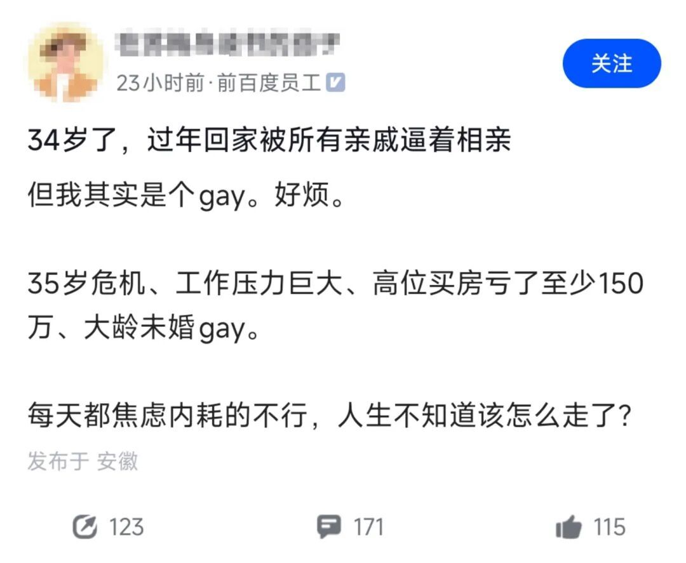

# 前百度员工自爆：自己是个gay，34岁了，过年回家被亲戚逼着相亲，好烦。工作压力大，买房亏了至少150万。大龄未婚gay

藏在心底的秘密最煎熬：不被理解的人生，该如何自处？

  

最磨人的痛苦，从来都是无法言说的秘密，最伤人的委屈，皆是无人分担的煎熬。我们每个人心里，都藏着几句不能说出口的话、几件无法与人分享的事，当所有压力与苦楚只能独自吞咽时，这份难过，会被无限放大。

前阵子看到一位前百度员工的自述，让人格外心疼：34岁的他是同性恋，每逢过年回家，便陷入亲戚轮番催婚、逼相亲的困境，满心烦躁无处诉说；职场上压力缠身，又在高点购置房产，如今亏损至少150万，日复一日的焦虑与内耗，让他彻底迷失了人生的方向。

  

在当下的社会环境里，性少数群体依旧面临着诸多偏见与不理解，多数人只能选择隐藏真实的自己，可性取向从来都不是一种选择，而是客观存在的事实。放眼全球，美国对LGBTQ+群体的包容度相对更高，数据显示，该国约9%的成年人自认属于这一群体，苹果CEO库克、奥斯卡影后朱迪、比利时前首相、法国前巴黎市长等各界名人，都曾坦然公开自己的性取向。在我们身边，也有张国荣这样的公众人物，让更多人看见这个群体的真实模样。

  

我们不必去深究性取向的成因，这是生物学该探讨的命题，更该关注的是身处其中的人，该如何与自己、与世界和解。

  

30多岁的年纪，本该拥有成熟独立的三观与认知，不必被世俗的眼光绑架，更不必被他人的言论裹挟。结婚生子，是社会普遍的生活范式，却从来不是每个人必须完成的“必修课”。按照自己舒服的节奏过完一生，才是对自己最负责的选择。

  

千万不要为了迎合所谓的“正常”，为了应付外界的压力，选择欺骗无辜的女性走入形式婚姻，这不仅是对自己人生的敷衍，更是毁掉了另一个人、两个家庭的幸福。

  

那些不被理解的事，无需强行解释；那些让你窒息的社交，学会主动避开；亲友无法认同，就适当保持距离，减少不必要的内耗。面对父母，尽到赡养的心意即可，不必强行摊牌，老一辈的观念早已根深蒂固，强行沟通只会换来更多争执与伤害。

  

换个角度看，这份与众不同，也未必全是坏事。少了结婚生子的世俗压力，不必为家庭琐事牵绊，自己赚钱自己支配，活得自在又洒脱；不必刻意迎合他人，不会陷入情感的陷阱，也能避开诸多因情爱引发的纷争与麻烦。

  

人生本就没有标准答案，不必给自己套上沉重的枷锁。学会接纳真实的自己，放下无法改变的执念，慢慢走，好好活，忠于内心，便是最好的人生。
