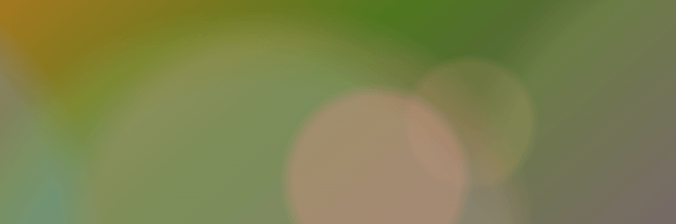

# 【第3654期】不再重置！在 React / Next.js 中实现跨页面“持续进化”的动画效果

前言

介绍了如何在基于 Next.js 的 React 项目中，通过本地存储、种子随机数和 CSS 变量，实现跨页面切换仍能连续播放的高性能动画效果。今日前端早读课文章由 @Andrew Magill 分享，@飘飘编译。

译文从这开始～～

我在自己的网站上看过太多次首页的 hero 动画，以至于那些细微的不完美开始让我抓狂。由于我的网站是用 Next.js 的 SSG（静态站点生成）构建的，每当用户跳转到新页面时，动画都会重置回 “第一天” 的状态 😭。相比单页应用中顺滑的动画和持久化的状态，我的 hero 动画显得卡顿又重复。

[【第3636期】深度解读：React + Next.js打造高性能Web应用的实战经验](https://mp.weixin.qq.com/s?__biz=MjM5MTA1MjAxMQ==&mid=2651278350&idx=1&sn=b0ed516b541595cacb1742bf2aa5aedd&scene=21#wechat_redirect)



网站https://magill.dev/ banner

那更好的做法是什么？对我来说，是把 local storage、本地持久化的种子随机数，以及 CSS 变量 结合在一起。下面就是我是如何把这些东西串起来的。

#### 使用 Local Storage 跟踪样式状态

为了保持一致性，我需要用 local storage 来跟踪随机生成的数值和当前的外观状态。我并没有保存每一帧的数据，而只是存储已经过去的时间长度，以及一些由 seededRandom 辅助函数生成的初始预设（颜色、位置等）。

动画中的每一个径向渐变 “粒子” 都有自己独立的基础色相、尺寸，以及 —— 最关键的 —— 一个负的 baseDelay，用来把它放置到动画时间轴上的正确位置。通过记录动画第一次启动的确切时间，我就可以精确计算出用户首次进入网站以来已经过去了多久。组件会计算 elapsedSeconds，并从动画延迟中减去这段时间。

这些更新我都包在 requestAnimationFrame 里执行。这样既能避免 React 因同步渲染而 “对我发火”，又能确保动画始终保持同步。

[【第3645期】如何在没有源码的情况下重建任意 React 组件](https://mp.weixin.qq.com/s?__biz=MjM5MTA1MjAxMQ==&mid=2651278496&idx=1&sn=c5f31a8bd1651c1426d76f2f4ac462eb&scene=21#wechat_redirect)

#### 从状态变量到样式变量

当 JavaScript 计算出动画此刻应该处于的位置后，就会把这些值传递给 CSS 自定义属性。我使用 useMemo 来保证性能：

```
 const styleVars = useMemo(() => {
   if (!animationState || elapsedMs === null) return {};

   return {
     '--animation-offset-1': `${animationState.offsets.o1}%`,
     '--animation-color-1': `${animationState.colors.c1}%`,
     '--animation-delay': `-${elapsedMs}ms`, // 神奇的“回放”关键
   } as React.CSSProperties;
 }, [animationState, elapsedMs]);
```
接下来就交给 CSS 处理了。通过 `@property` 规则和 keyframes，浏览器负责完成颜色和位移的插值计算。设置一个负的 animation-delay，相当于让浏览器直接把动画 “快进” 到它此刻应该在的位置。

[【第3627期】从媒体查询到样式查询：Chrome 142 如何让 CSS 更懂“数值”](https://mp.weixin.qq.com/s?__biz=MjM5MTA1MjAxMQ==&mid=2651278210&idx=1&sn=64ba5c14880aae308f0e311a22024cc6&scene=21#wechat_redirect)

```
 @property --gradient-angle {
     syntax: '<angle>';
     initial-value: 160deg;
     inherits: false;
 }

 @property --gradient-stop-0-offset {
     syntax: '<percentage>';
     initial-value: 0%;
     inherits: false;
 }

 @property --gradient-stop-1-offset {
     syntax: '<percentage>';
     initial-value: 50%;
     inherits: false;
 }

 .heroAnimation {
     animation: gradient-animation 12s ease-in-out infinite;
     animation-delay: var(--animation-delay, 0ms);
     background: linear-gradient(
         var(--gradient-angle),
         var(--gradient-color-0)
             calc(var(--gradient-stop-0-base, 0%) + var(--gradient-stop-0-offset, 0%)),
         var(--gradient-color-1)
             calc(var(--gradient-stop-1-base, 60%) + var(--gradient-stop-1-offset, 0%))
     );
 }

 @keyframes gradient-animation {
     from {
         --gradient-angle: 160deg;
     }
     to {
         --gradient-angle: 42deg;
     }
 }

 @keyframes particle-drift {
     from {
         transform: translate3d(var(--particle-start, -50vw), 0, 0);
     }
     to {
         transform: translate3d(var(--particle-end, 120vw), 0, 0);
     }
 }
```
#### 性能与打磨

我当然不想把用户的浏览器直接搞崩，所以在视觉复杂度的处理上必须足够聪明。只要持久化动画开始的时间戳和随机种子，用户再次访问时就不会从零开始重播动画 —— 而是通过计算已经过去的时间，在 CSS 中设置一个负的延迟，模拟一个一直在运行的循环。由于状态值是通过种子生成、只计算一次的，背景渲染速度几乎只取决于浏览器读取 local storage 的速度。

[【第421期】使用CSS3 will-change提高页面滚动、动画等渲染性能](https://mp.weixin.qq.com/s?__biz=MjM5MTA1MjAxMQ==&mid=400740327&idx=1&sn=ca31a12e322b53e58fa4a6464e439538&scene=21#wechat_redirect)

借助 will-change、transform 以及由 GPU 驱动的关键帧动画，即使是在老旧的手机上，动画依然能保持丝般顺滑。JavaScript 只在一开始负责 “算数”，而 CSS 在整个会话过程中负责 “艺术表现”。

#### 展望未来

如果我们愿意多花一点心思，其实没必要在静态、好看和高性能动画之间做取舍。通过使用种子随机数和 local storage，我们可以让一个静态站点拥有 “持久化应用” 的灵魂。我网站上的 hero 背景不再只是一个随机循环的动画，而是用户旅程中一个持续演化的组成部分。

无论你是在做个人作品集，还是构建一个复杂的仪表盘，请记住：最好的动画，是尊重用户时间、也尊重浏览器主线程的动画。

可以在这里查看我最新的持久化动画实现：

```
 'use client';

 import React, { useEffect, useState, useMemo } from 'react';
 import styles from './HeroAnimation.module.scss';

 interface HeroAnimationProps {}

 /** Seeded random generator */
 const seededRandom = (seed: number, index: number): number => {
     const x = Math.sin((seed + index) * 12.9898) * 43758.5453;
     return x - Math.floor(x);
 };

 interface ParticlePreset {
     id: string;
     top: number; // percentage (allows -10% to 110%)
     left: number; // percentage
     size: number; // vmin
     hue: number; // degrees
     duration: number; // seconds
     baseDelay: number; // base negative delay before elapsed offset
     colorIdx: number; // palette index
 }

 interface ParticleRender extends ParticlePreset {
     delay: number;
 }

 interface AnimationState {
     startTime: number;
     seed: number;
     gradientOffsets: { c0: number; c1: number; c2: number };
     particles: ParticlePreset[];
 }

 const PARTICLE_COUNT = 20;

 /**
  * Create deterministic presets for every particle so we can hydrate them from localStorage
  * and simply offset their animation delay by the elapsed time on subsequent pageviews.
  */
 const buildParticlePresets = (seed: number): ParticlePreset[] => {
     const presets: ParticlePreset[] = [];
     for (let i = 0; i < PARTICLE_COUNT; i++) {
         const r = (offset: number) => seededRandom(seed, i * 10 + offset);
         const duration = 30 + r(1) * 30;
         const baseDelay = -r(2) * duration;
         presets.push({
             id: `p-${i}`,
             top: r(3) * 90 - 30,
             left: r(4) * 20 - 10,
             size: 10 + r(5) * 70,
             hue: r(6) * 60 - 30,
             duration,
             baseDelay,
             colorIdx: Math.floor(r(7) * 4),
         });
     }
     return presets;
 };

 const HeroAnimation: React.FC<HeroAnimationProps> = () => {
     const [gradientState, setGradientState] = useState<AnimationState | null>(
         null
     );
     const [elapsedMs, setElapsedMs] = useState<number | null>(null);
     const [particles, setParticles] = useState<ParticleRender[]>([]);

     // Hydrate the persisted animation state, compute the elapsed offset, and render particles only once per mount.
     useEffect(() => {
         const storedState = localStorage.getItem('heroAnimationState_v2');
         const now = Date.now();
         let seed: number;
         let currentState: AnimationState;
         let needsPersist = false;

         if (storedState) {
             currentState = JSON.parse(storedState);
             if (!currentState.startTime) {
                 currentState.startTime = now;
                 needsPersist = true;
             }
             seed = currentState.seed;
         } else {
             seed = Math.floor(Math.random() * 1000000);
             currentState = {
                 startTime: now,
                 seed,
                 gradientOffsets: {
                     c0: seededRandom(seed, 37) * 8 - 4,
                     c1: seededRandom(seed, 38) * 10 - 5,
                     c2: seededRandom(seed, 39) * 6 - 3,
                 },
                 particles: [],
             };
             needsPersist = true;
         }

         const presets =
             currentState.particles && currentState.particles.length
                 ? currentState.particles
                 : buildParticlePresets(seed);
         if (!currentState.particles?.length) {
             currentState.particles = presets;
             needsPersist = true;
         }

         if (needsPersist) {
             localStorage.setItem(
                 'heroAnimationState_v2',
                 JSON.stringify(currentState)
             );
         }

         const elapsed = now - currentState.startTime;
         const elapsedSeconds = elapsed / 1000;
         const renderParticles = presets.map((preset) => ({
             ...preset,
             delay: preset.baseDelay - elapsedSeconds,
         }));

         // Delay the render commits until the next frame to avoid synchronous setState warnings.
         const raf = requestAnimationFrame(() => {
             setGradientState(currentState);
             setElapsedMs(elapsed);
             setParticles(renderParticles);
         });
         return () => cancelAnimationFrame(raf);
     }, []);

     // Translate persisted gradient offsets into CSS custom properties and keep the animation aligned to the stored clock.
     const styleVars = useMemo(() => {
         if (!gradientState || elapsedMs === null) return {};
         return {
             '--gradient-c0-offset': `${gradientState.gradientOffsets.c0}%`,
             '--gradient-c1-offset': `${gradientState.gradientOffsets.c1}%`,
             '--gradient-c2-offset': `${gradientState.gradientOffsets.c2}%`,
             '--animation-delay': `-${elapsedMs}ms`,
         } as React.CSSProperties;
     }, [gradientState, elapsedMs]);

     return (
         <div className={`${styles.heroAnimation} heroAnimation`} style={styleVars}>
             {particles.map((p) => (
                 <div
                     key={p.id}
                     className={styles.particle}
                     style={
                         {
                             '--top': `${p.top}%`,
                             '--left': `${p.left}%`,
                             '--size': `${p.size}vmin`,
                             '--hue': `${p.hue}deg`,
                             '--duration': `${p.duration}s`,
                             '--delay': `${p.delay}s`,
                             // Base colors based on the design system/palette roughly matching the previous gradients
                             // We can use a few base HSLs and rotate them
                             '--base-color': getBaseColor(p.colorIdx),
                         } as React.CSSProperties
                     }
                 />
             ))}
         </div>
     );
 };

 function getBaseColor(idx: number): string {
     const colors = [
         'hsl(30 45% 60% / 0.5)',
         'hsl(90 45% 60% / 0.5)',
         'hsl(150 45% 60% / 0.5)',
         'hsl(210 45% 60% / 0.5)',
         'hsl(270 45% 60% / 0.5)',
     ];
     return colors[idx % colors.length];
 }

 export default HeroAnimation;
```
https://github.com/andymagill/dev.magill.next/blob/master/app/components/global/HeroAnimation.tsx

关于本文  
译者：@飘飘  
作者：@Andrew Magill  
原文：https://magill.dev/post/persisting-animation-state-across-page-views-in-Reactjs

这期前端早读课  
对你有帮助，帮” 赞 “一下，  
期待下一期，帮” 在看” 一下。
