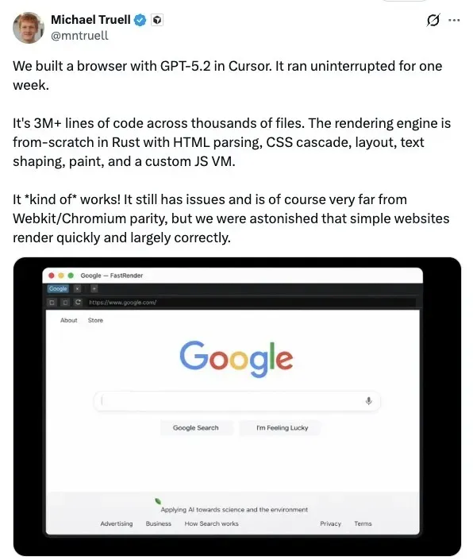
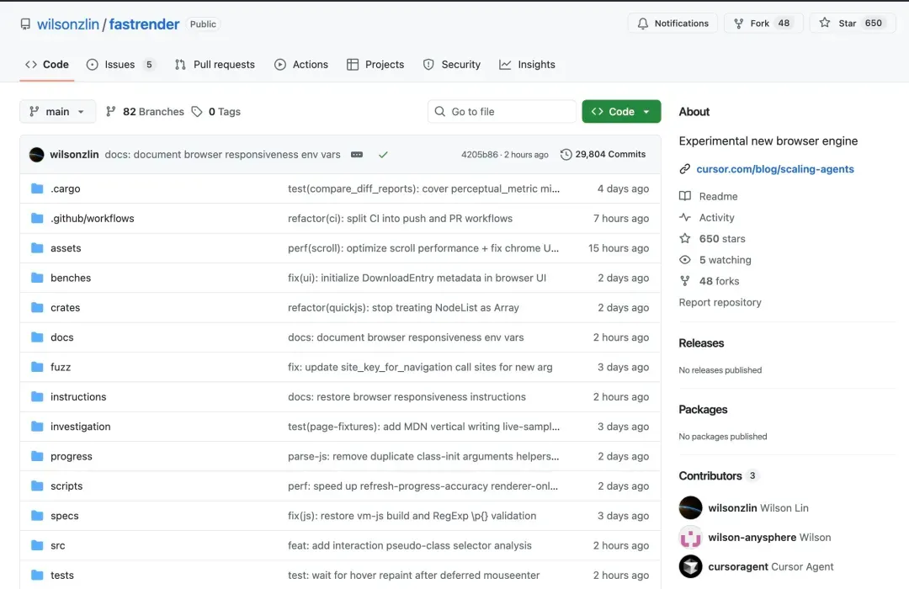
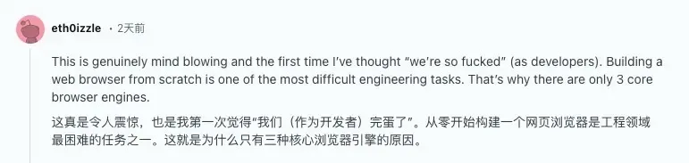
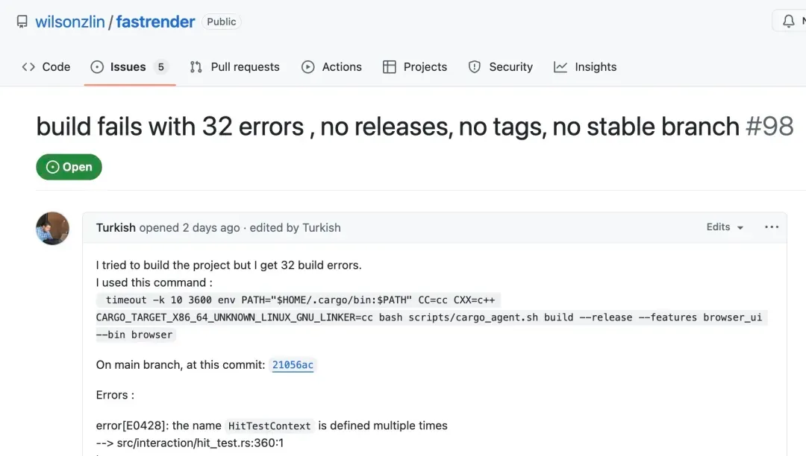
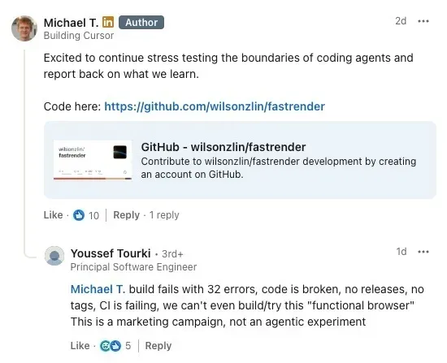
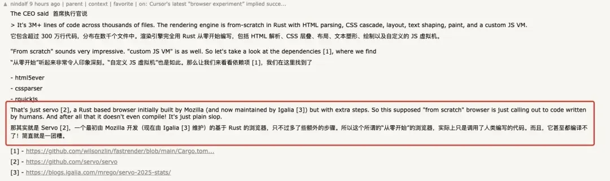
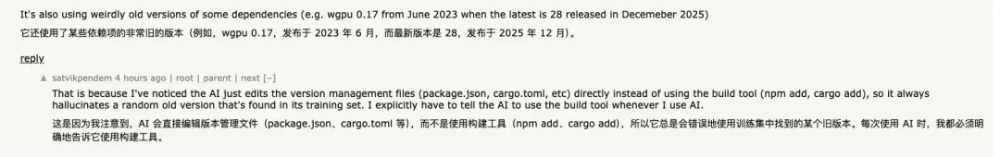
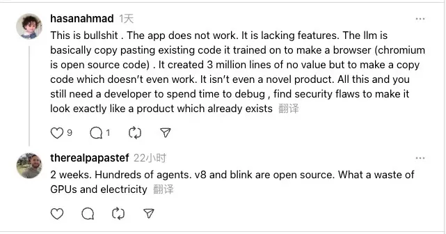

# 烧掉数万亿 Token、数百 Agent 连跑一周：Cursor“从零写浏览器”，结果是拼装人类代码？

整理 | Tina

现在，大模型可以独立写完整整一个浏览器了？

Cursor CEO Michael Truell 最近分享了一项颇为吸睛的实验：他们用 GPT-5.2 让系统连续不间断运行一周，从零构建出一个“可用”的 Web 浏览器。按他的描述，产出规模达到：超过 300 万行代码、横跨数千个文件，全部通过这套 AI 驱动的编程平台生成。

**数百个Agent “从零”**

**写了一个浏览器？**

按照他的说法，这个项目并没有依赖现成的渲染引擎，而是用 Rust 从零实现了一整套渲染引擎，其中包括 HTML 解析、CSS 级联规则、布局计算、文本排版（text shaping）、绘制（paint）流程，甚至还实现了一个自定义的 JavaScript 虚拟机。

Truell 也坦言，这个浏览器目前只是“勉强能用”，距离 WebKit 或 Chromium 等成熟引擎还有很大差距；但团队依然“感到震惊”，因为简单网站在它上面渲染得很快，而且整体效果在很大程度上是正确的。

与此同时，Cursor 还发布了一篇博客文章，题为《Scaling long-running autonomous coding》（扩展长时间运行的自主编程）。文章回顾了一系列实验：让“编程 agent 连续自主运行数周”，目标是“理解在那些通常需要人类团队耗费数月完成的项目中，agentic coding 的能力边界究竟可以被推进到什么程度”。

在这篇文章里，他们重点讲的是多 Agent 如何协同：如何在单个项目上同时运行数百个并发 Agent、如何协调它们的工作，并观察它们写出超过一百万行代码和数万亿个 token 的过程与经验。

Cursor 先承认了单个 Agent 的局限：任务规模一大、依赖一复杂，推进速度就会明显变慢。并行化看似顺理成章，但他们很快发现，难点不在并发，而在协同。

  

  

  

  

  

“学习如何协同：我们最初的方法是让所有 agent 具有同等地位，并通过一个共享文件自行协同。每个 agent 会检查其他 agent 在做什么、认领一个任务并更新自己的状态。为防止两个 agent 抢占同一项任务，我们使用了锁机制。

这一方案在一些有趣的方面失败了：

agent 会持有锁太久，或者干脆忘记释放锁。即使锁机制正常工作，它也会成为瓶颈。二十个 agent 的速度会下降到相当于两三个 agent 的有效吞吐量，大部分时间都花在等待上。

系统非常脆弱：agent 可能在持有锁的情况下失败、尝试获取自己已经持有的锁，或者在完全没有获取锁的情况下更新协调文件。

我们尝试用乐观并发控制来替代锁。agent 可以自由读取状态，但如果自上次读取后状态已经发生变化，则写入会失败。这种方式更简单、也更健壮，但更深层的问题依然存在。

在没有层级结构的情况下，agent 变得非常规避风险。它们会回避困难任务，转而做一些小而安全的修改。没有任何一个 agent 承担起解决难题或端到端实现的责任。结果就是工作长时间在空转，却没有实质性进展。”

为了解决这一问题，Cursor 最终引入了更明确的角色分工，搭建一条职责清晰的流水线：将 Agent 分为规划者和执行者。

  

  

  

  

  

“规划者（Planners） 持续探索代码库并创建任务。他们可以针对特定区域派生子规划者，使规划过程本身也可以并行且递归地展开。

执行者（Workers） 领取任务并专注于把任务完成到底。他们不会与其他执行者协调，也不关心整体大局，只是全力处理自己被分配的任务，完成后再提交变更。

在每个周期结束时，会有一个评审 Agent 判断是否继续，然后下一轮迭代会从干净的初始状态重新开始。这样基本解决了我们的协同问题，并且让我们可以扩展到非常大的项目，而不会让任何单个 Agent 陷入视野过于狭窄的状态。”

在此基础上，Cursor 把这套系统指向一个更具挑战性的目标：从零构建一个浏览器。他们表示，Agent 持续运行了将近一周，在 1,000 个文件中写出了超过 100 万行代码（原文如此，跟 Michael Truell 说的 300 万行不同），并将源码发布在 GitHub 上供外界浏览。

Cursor 进一步宣称：即便代码库规模已经很大，新启动的 agent 仍然能够理解它并取得实质性进展；同时，**成百上千个 worker 并发运行，向同一个分支推送代码，而且几乎没有冲突**。

一场“全民打假”的开始？

这次实验之所以引发强烈反应，很大程度上是因为：Web 浏览器本身就是软件工程里公认的“地狱级”项目。

它难的不只是“写代码”，而是工作量的量级、模块之间的高耦合，以及兼容性这条几乎看不到尽头的长尾。

在 Hacker News 上，有人顺手抛了一个问题：“开发一个浏览器最难的地方是什么？”很快就有人给出一个类比：“说句真心话，这个问题几乎等同于：开发一个操作系统最难的地方是什么？”

因为现代浏览器是千万级代码量的系统，能够运行非常复杂的应用。它包含网络栈、多种解析器、frame 构建与回流（reflow）模块、合成（composite）、渲染（render）与绘制（paint）组件、前端 UI 组件、可扩展框架等等。这里面每一个模块，都必须同时做到：既支持 30 年前的旧内容，也支持复杂得离谱的当代 Web 应用。同时，它还得在高性能、高安全前提下尽可能少占用系统资源，并且往往要跨 Mac、Windows、Linux、Android、iOS 等多个平台运行。

还有人提到，最难的是那张超长的任务清单。浏览器里包含多个高复杂度模块，每一个单拎出来都可能要做很久；更麻烦的是，它们之间还要通过一套相当“啰嗦”的 API 连接起来——很多接口你必须实现，至少也得先把壳子（stub）搭出来，否则系统就会崩。

Cursor 在博客中配了一段视频，并写道：“虽然这看起来像是一张简单的屏幕截图，但从头开始构建一个浏览器是非常困难的。”

然而如果外界自己去尝试编译这个项目，会很快意识到：它离“功能齐全的浏览器”还差得很远，甚至看起来在公开代码状态下，连最基本的构建都很难稳定通过。

从仓库公开信息来看，近期 main 分支的多次 GitHub Actions 运行结果显示失败（其中还包括工作流文件本身的错误）；不少开发者的独立构建尝试也报告了数十个编译错误。与此同时，最近的一些 PR 虽然被合并，但 CI 仍处于失败状态。

更有开发者表示自己回溯 Git 历史，往前翻了约 100 个提交后表示，依然没能找到一个可以“干净编译通过”的版本。

这也引出了一个问题：这些被 Cursor 描述为在代码库中长期并发运行的“agent”，在工程链路上到底做到哪一步？至少从当前公开状态看，它们似乎并没有把“能编译、能检查”当成最基础的收敛目标——因为无论是 cargo build 还是 cargo check，都会立刻暴露出成片的编译错误和大量警告。

而 Cursor 的博客文章除了提供代码仓库链接外，既没有提供可复现的演示，也没有提供任何已知的有效版本（标签 / 发布 / 提交）来验证截图。无论如何，这文章本身给人一种原型功能完备的错觉，却忽略了此类声明应有的基本可复现性特征。

有人在 Michael Truell 的 LinkedIn 上直接把结果抛了回去：“构建直接失败，报了 32 个错误，代码本身就是坏的；没有任何 release、没有 tag，CI 也在持续失败，我们甚至连这个所谓‘可用的浏览器’都没法编译、没法试跑。这更像是一场营销活动，而不是一次真正的 agentic 实验。”Michael Truell 至今没有回复。

目前唯一一个在社交平台上明确分享“复现成功”的人，是前浏览器开发者 Oliver Medhurst。他表示自己花了大约两个小时修复编译错误和漏洞，才把项目跑起来。至于性能，他的评价也很直接：有些页面加载要整整一分钟，“不算好”。

还有一个更敏感的追问也随之出现：“所以这真的是从零开始写的吗？”他给出的回应更像一句反转预告：“剧透：不是。”

更多网友通过翻看仓库依赖发现，这个项目直接引入了 Servo （一个最初由 Mozilla 开发的基于 Rust 的浏览器）项目的 HTML 与 CSS 解析器（html parser、css parser），以及 QuickJS 的 Rust 绑定（rquickjs），并非所有关键组件都是自行实现。

再加上 selectors、resvg、wgpu、tiny-skia 等一系列成熟库，这个“浏览器实验”更像是直接调用了人类编写的代码，而不是“从零开始”的一整套渲染与执行引擎。

更搞笑的是，Cursor 这里用的还是一个发布于 2023 年 6 月的 wgpu 0.17 这种非常旧的老版本，而当前最新版本已经是 28（发布于 2025 年 12 月）。大概因为大模型写代码时往往会直接改版本管理文件（如 package.json、Cargo.toml），而不是通过 npm add、cargo add 这类构建工具来引入依赖。

这也不怪网友骂他们：

“这简直是胡扯。应用根本跑不起来，功能也缺得厉害。LLM 更像是在把它训练过的现成代码拼起来做个浏览器——毕竟 Chromium 本来就是开源的。最后堆出了 300 万行‘看起来很多’但没有价值的代码，结果还不能用，更谈不上什么新产品。折腾到最后，你还是得让开发者花大量时间去调试、排查安全漏洞，才能把它打磨得像一个早就存在的成熟产品。”

“两周时间、数百个 agent，V8 和 Blink 又都是开源的。说到底，这就是在浪费 GPU 和电力。”

最后值得一提的是，这个实验还暴露出一个不容忽视的问题：成本。

有人翻回 Cursor 的原帖指出，他们还在跑类似实验，比如一个 Excel 克隆项目（https://github.com/wilson-anysphere/formula）。GitHub Actions 的概览数据很夸张：累计触发了 16 万多次 workflow 运行，但成功的只有 247 次——失败的主要原因不是代码本身，而是超出了支出上限。

当然，Agent 并不在乎预算；但在真实的软件工程里，可复现的构建、可持续的成本、可验证的产出，才决定一个系统最终能不能被信任、被维护、被继续推进。

参考链接：

https://cursor.com/cn/blog/scaling-agents

https://news.ycombinator.com/item?id=46646777

https://www.reddit.com/r/singularity/comments/1qd541a/ceo\_of\_cursor\_said\_they\_coordinated\_hundreds\_of/

https://www.linkedin.com/posts/activity-7417328860045959169-PFuT/

https://xcancel.com/CanadaHonk

声明：本文为 InfoQ 整理，不代表平台观点，未经许可禁止转载。

今日好文推荐

[IDE消亡之年？Steve Yegge两句狠话：2026年还用IDE就不行，每天烧500–1000美元Token才合理](https://mp.weixin.qq.com/s?__biz=MjM5MDE0Mjc4MA==&mid=2651271969&idx=1&sn=5fde427047dff93e3aef7c6b8c2a0e26&scene=21&poc_token=HP5qcGmj8sEm6HrF4CZGdguIZyExvzRY2QOWRmrq#wechat_redirect)

[“商业的HTTP”来了：谷歌CEO劈柴官宣 UCP，Agent 直接“剁手”下单，将倒逼淘宝京东“拆家式重构”？](https://mp.weixin.qq.com/s?__biz=MjM5MDE0Mjc4MA==&mid=2651271898&idx=1&sn=6753dbc11ed5934a736dafe888109979&scene=21&poc_token=HBBrcGmjIaX1-DoQMk7edw3fm_i63Ibkvi-RZdv3#wechat_redirect)

[估值1亿的"死了么"APP有多好抄？5分钟AI就能复刻，去年有人一下午做出原型](https://mp.weixin.qq.com/s?__biz=MjM5MDE0Mjc4MA==&mid=2651271757&idx=1&sn=3691c371759ebb129fc5c64335dde7aa&scene=21#wechat_redirect)

[Anthropic深夜放出王炸！白领饭碗要被AI砸了？网友：不支持Linux，差评](https://mp.weixin.qq.com/s?__biz=MjM5MDE0Mjc4MA==&mid=2651271670&idx=1&sn=fe9ef22ad86bf22684e14c4fdd657e0a&scene=21#wechat_redirect)

会议推荐

InfoQ 2026 全年会议规划已上线！从 AI Infra 到 Agentic AI，从 AI 工程化到产业落地，从技术前沿到行业应用，全面覆盖 AI 与软件开发核心赛道！集结全球技术先锋，拆解真实生产案例、深挖技术与产业落地痛点，探索前沿领域、聚焦产业赋能，获取实战落地方案与前瞻产业洞察，高效实现技术价值转化。把握行业变革关键节点，抢占 2026 智能升级发展先机！

