# 【早阅】告别 Next.js 困惑：Tanstack Start 全栈应用开发终极指南

Tanstack Start 是一个全新的框架，旨在解决 Next.js 的诸多恼人问题。在本视频中，将向您展示如何使用 Tanstack Start 创建一个完整的全栈项目，并解释它与 Next.js 的区别。

#### 引言：为何选择 Tanstack Start

对于那些对 Next.js 中不断变化的缓存机制和指令使用感到厌倦的开发者而言，Tanstack Start 提供了一个替代方案。本教程将通过构建一个完整的待办事项列表项目，全面覆盖 Tanstack Start 的所有核心功能，包括高级特性。该项目涵盖了完整的数据库支持、搜索参数处理、动态参数编辑以及删除功能。更重要的是，项目区分了存储在服务器数据库中的数据和专门存储在客户端的状态，详细展示了客户端与服务器的工作流程。

[【早阅】TanStack Start 入门探索](https://mp.weixin.qq.com/s?__biz=MjM5MTA1MjAxMQ==&mid=2651277560&idx=1&sn=536d959afc333f3bb2500182d3600469&scene=21#wechat_redirect)

##### 项目构建的全面覆盖

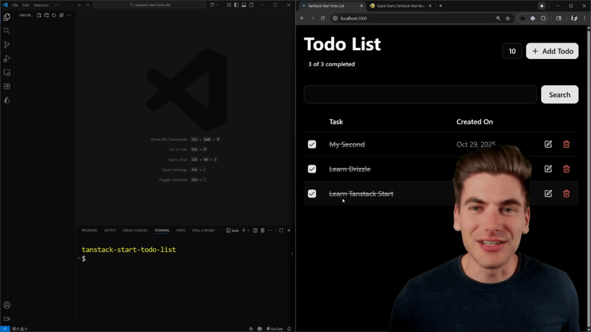

尽管项目界面看似是一个简单的待办事项列表，但它实际上涵盖了 Tanstack Start 的所有关键功能。教程不仅会提供创建项目的代码，还会逐行解释每行代码的含义以及需要理解的重要概念，以使用户能够自信地开始构建基于 Tanstack Start 的项目。

#### 项目设置与工具选择

创建 Tanstack Start 项目的最便捷方式是使用命令行工具：`npm create @tanstack/start@latest`。该命令将使用最新版本，并允许用户命名项目，选择 CSS 预处理器（本例中选择 Tailwind CSS）以及 Linter（选择 ESLint）。特别值得称赞的是，它提供了丰富的附加组件选项，涵盖了开发中常见的需求。

- Drizzle：用于数据库集成。
- Shad CN：用于 UI 组件库。
- T3 Environment Variables（可选，但推荐）。
- Tanstack Form（可选）。

##### 理解生成的文件结构

生成的代码结构与 Vite 或 Next.js 应用相似，包含配置文件。其中 `cta.json` 是 Tanstack Start 的特定配置文件，记录了项目创建时选择的附加组件和包管理器等信息。核心逻辑位于 `source` 目录下。首先关注 `router.tsx` 文件，其中引用了 `route tree.gen`，这是一个根据 `routes` 文件夹中定义的路由动态生成的 TypeScript 文件，它为整个应用提供了出色的类型安全保障。

- 运行 npm run dev 启动开发服务器。
- 服务器启动后，`route tree.gen` 文件会被填充，消除初始的 TypeScript 错误。
- 如果启动后仍有错误，可通过控制台重启 TypeScript 服务器解决。

#### 数据库集成与 Drizzle 配置

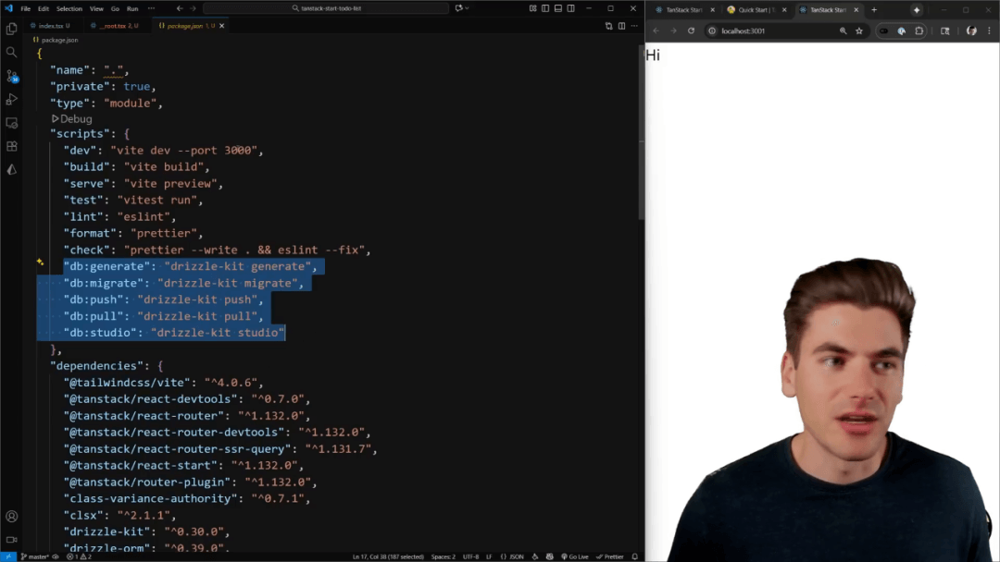

在理解了路由系统后，下一步是配置数据库。项目使用 Drizzle ORM 配合 PostgreSQL。Drizzle 配置文件（`db/index.ts`）负责连接数据库 URL，该 URL 存储在环境文件中。Drizzle 提供了方便的 CLI 命令，如 `generate`、`migrate`、`push` 和 `studio`，用于管理数据库迁移和模式操作。

[【早阅】使用Zustand和Tanstack Query简化数据获取](https://mp.weixin.qq.com/s?__biz=MjM5MTA1MjAxMQ==&mid=2651272007&idx=2&sn=0e26148fd532661c1eaedf974422de36&scene=21#wechat_redirect)

##### 定义待办事项的 Schema

在 `schema.ts` 文件中定义了待办事项表结构，包含 UUID 类型的 ID、名称（文本）、完成状态（布尔值）以及创建和更新时间戳。虽然配置中存在 ESLint 排序警告，但该警告不影响应用的功能性，因此可以暂时忽略。

- 运行 `npm run db migrate` 创建数据库迁移（如果 Postgres 正在运行）。
- 由于数据库未运行，需要使用 Docker Compose 启动 PostgreSQL 实例。
- 配置 `.env` 文件中的数据库连接字符串，确保匹配 Docker 端口和名称（如 `todo_test`）。
- 运行 docker compose up -d 启动数据库服务。
- 使用 npm run db push 直接推送模式更改到数据库。

> Docker 的使用极大地简化了本地数据库的设置过程，使得开发者能够快速进入开发阶段。

#### 第一个路由与数据加载器

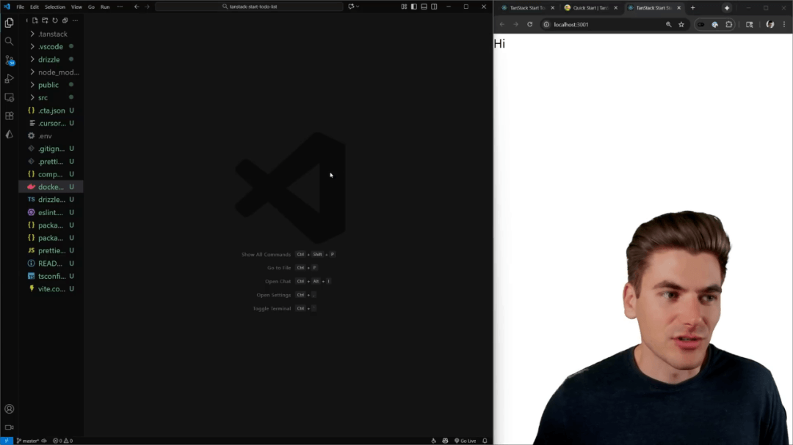

路由定义位于 `routes` 文件夹中，`index.tsx` 对应根路径 `/`。Tanstack Start 使用 `createFileRoute` 结合路径匹配来确保类型安全。当创建新文件夹或文件时，相关的类型代码会自动生成，无需手动配置扩展名，这是开发体验的一大亮点。

[【第3243期】告别繁琐的数据校验：用JSON Schema简化你的代码](https://mp.weixin.qq.com/s?__biz=MjM5MTA1MjAxMQ==&mid=2651270380&idx=1&sn=83a581f92bbb812cdc8bb3bd725ad97b&scene=21#wechat_redirect)

##### Loader 函数的工作原理

每个路由可以配置一个 `loader` 函数，用于异步加载数据。此函数不仅在服务器上运行，在客户端导航到新页面时也会被调用以获取数据。通过 `route.useLoaderData()` 可以安全地访问 Loader 返回的数据，并且该数据是完全类型安全的。然而，如果 Loader 中直接包含服务器端代码，例如数据库连接逻辑，则会导致客户端执行失败。

| 操作 | 结果 |
| --- | --- |
| 在 Loader 中返回 {name: 'test'} | 组件中通过 route.useLoaderData() 访问到 name 属性 |
| 修改 Loader 代码后保存 | 页面需要手动刷新才能看到数据变化，客户端导航不会自动触发 |

#### 服务器端代码的隔离

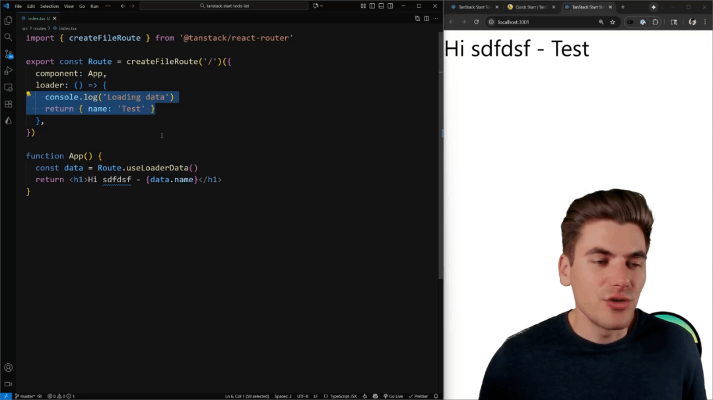

将数据库查询代码直接放入 Loader 中会引发问题，因为 Loader 既在服务器运行也可能在客户端运行，而客户端环境不具备访问 PostgreSQL 库的能力，从而抛出运行时错误。为了解决这一核心问题，必须使用服务器函数来封装任何需要服务器环境才能执行的操作。

> Tanstack Start, 一切在 loader 中运行，既在客户端也在服务器上运行。

##### 使用 Server Function 获取数据

`create server function` 允许从客户端调用，但代码实际在服务器上执行，类似于 Next.js 中的 Server Actions，但它同样适用于数据获取（GET）和数据修改（POST）。通过将数据库查询逻辑封装到 `create server function` 中，客户端只需发起一个 Fetch 请求到该函数，服务器执行查询并将结果返回，从而避免了客户端环境的错误。

- create server function: 90% 的时间使用，可用于 GET/POST，自动处理客户端的 Fetch 请求。
- create server only function: 仅在服务器运行，客户端调用会抛出错误。
- create client function: 仅在客户端运行，服务器调用会抛出错误。
- create isomorphic function: 允许在服务器和客户端执行不同的代码逻辑。

#### 主页布局与数据展示

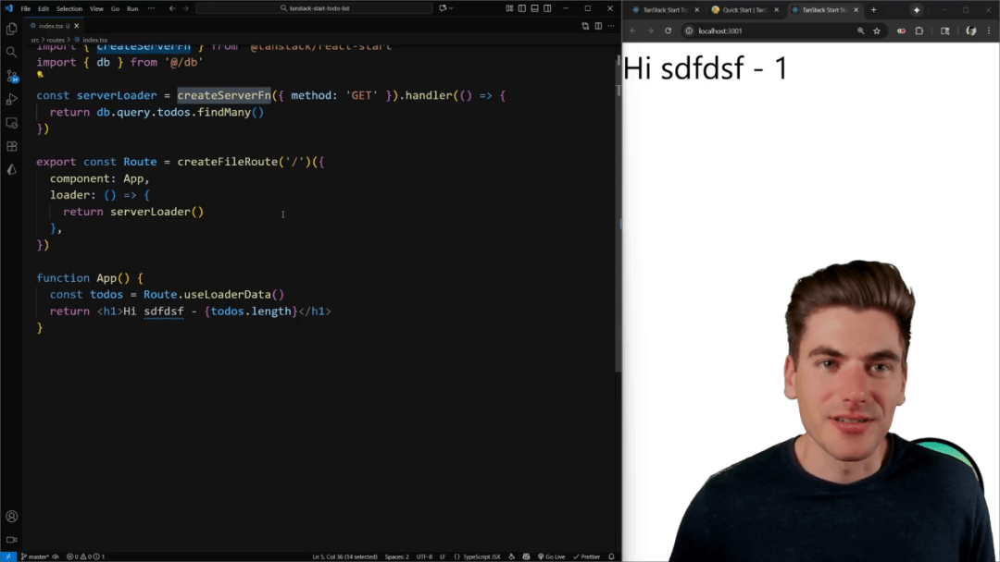

主页布局通过 Tailwind CSS 类进行样式设置，包括设置最小高度、容器居中和间距。布局的头部区域用于展示待办事项的总数和已完成数量。这些统计数据需要从服务器函数获取的待办事项列表中计算得出，例如通过过滤已完成的待办事项并获取其长度。

##### 安装 UI 组件与状态显示

为了美化界面，需要安装 Shad CN 组件，如 `badge`、`button` 和 `table`。安装完成后，可以利用 `badge` 组件显示完成状态的计数。页面右侧添加了用于导航到新待办事项创建页面的按钮，路由路径为 `/todos/new`。动态路由的创建需要新建文件夹结构，例如 `routes/todos/new/index.tsx`。

- 文件夹结构：`routes/todos/new/index.tsx` 对应 `/todos/new`。
- 文件命名：`routes/todos/new.tsx` 效果相同。
- 点语法：`routes/todos/new.tsx` 也可以使用点语法（如 `todos.new.tsx`）来定义路由。

#### 新建待办事项表单实现

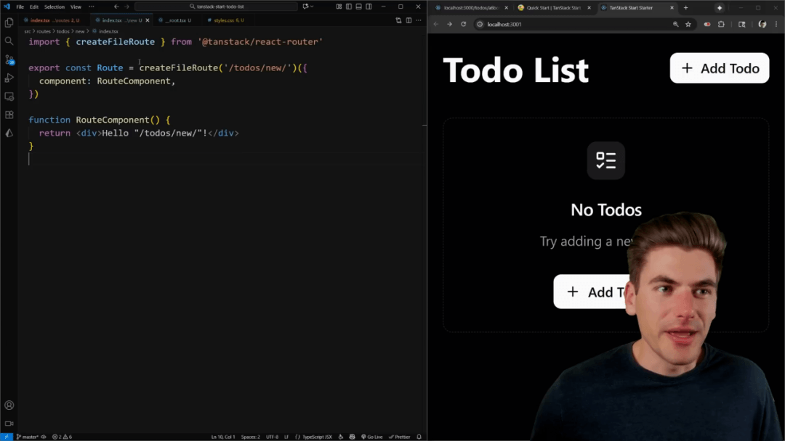

新建待办事项的页面主要由一个卡片和待办事项表单组件构成。由于项目重点在于框架本身，表单逻辑将从头构建，不依赖 React Hook Form 或 Tanstack Form。表单需要一个输入框（使用 Shad CN 的 `input` 组件）和一个提交按钮。

##### 客户端与服务器代码的边界

与 Next.js 不同，Tanstack Start 默认没有 `use client` 或 `use server` 指令。所有代码都运行在客户端和服务器上，除非明确指示其运行范围。这要求开发者必须管理代码的执行环境，例如使用 `create server function` 来处理数据库插入操作。

| 步骤 | 关键技术 |
| --- | --- |
| 定义提交操作 | 使用 create server function (POST 方法) 封装数据库插入逻辑 |
| 输入验证 | 使用 Zod 库定义输入验证器，确保数据结构正确 |
| 处理客户端调用 | 在客户端的 handle submit 中，必须使用 use server function 包装服务器函数以便正确处理 Fetch 请求和重定向 |

- 设置加载状态 (`isLoading`) 以禁用按钮并在等待服务器响应时提供反馈。
- 服务器函数执行数据库插入，并将 `isComplete` 字段设为 false。
- 成功后，使用 `throw redirect` 将用户重定向回主页。

#### 待办事项表格组件实现

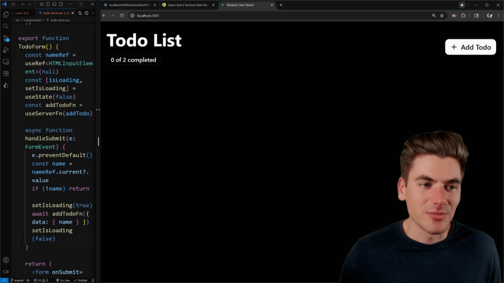

在主页的下方，需要渲染一个表格来展示所有待办事项。这涉及到创建 `tableHeader` 和 `tableBody`。表头包含复选框列、任务名称列、创建日期列以及操作列（用于编辑和删除）。表格的行数据通过映射（map）从 Loader 获取的待办事项数组生成，每个条目渲染一个自定义的 `to-do table row` 组件。

##### 行组件的类型安全与样式

在 `to-do table row` 组件中，利用 Shad CN 的 `checkbox` 组件来显示和控制完成状态。任务名称的样式会根据 `isComplete` 状态动态变化：如果已完成，文本将应用 `text-muted-foreground` 和 `line-through` 效果。创建日期使用 `Intl.DateTimeFormat` 进行格式化，以提供用户友好的日期展示。

- 编辑按钮链接到动态路由 `/todos/${ID}/edit`，参数通过 `params` 选项安全传递。
- 删除按钮是一个普通按钮，后续将使用 Action 模式处理。
- 动态路由参数使用 `$` 符号（如 `$ID`）定义，与 Next.js 的 `:` 符号不同。

##### 编辑待办事项表单逻辑

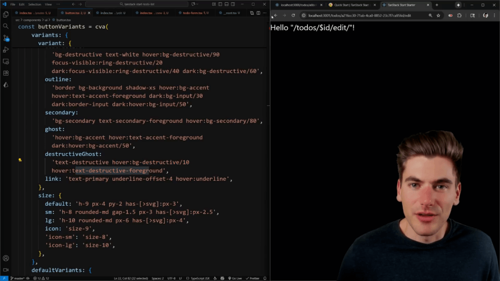

编辑页面（`/todos/$ID/edit`）的代码结构与新建页面高度相似，但需要加载现有待办事项的数据作为默认值。这要求在编辑路由上设置一个新的 Loader，该 Loader 必须是一个 `create server function`，方法为 GET，并接收 URL 参数中的 ID。

##### 加载现有数据与参数传递

Loader 函数通过传入的 ID 参数查询数据库，获取特定的待办事项记录。如果记录不存在，必须显式地抛出 `throw new NotFound()` 错误，这是 Tanstack Start 强制要求明确处理未找到情况的方式。获取到的数据随后被传递给表单组件，用于设置输入框的默认值。

- 表单组件接收可选的 `to-do` 对象。
- 如果 `to-do` 存在，按钮文本显示 “Update”；否则显示 “Add”。
- 创建新的 `update to-do` 服务器函数，接收 ID 和 Name，执行数据库 UPDATE 操作。
- 在客户端的提交处理中，根据 `to-do` 是否存在来调用添加或更新函数。

#### 客户端更新与删除操作

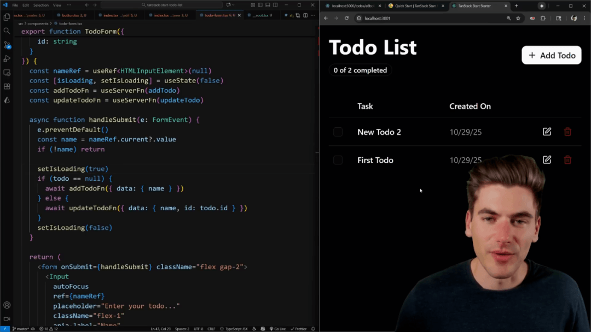

虽然之前的操作都是服务器驱动的，但现在需要实现更快的客户端更新，例如删除和切换复选框状态。对于删除操作，推荐使用自定义的 `action button` 组件，它能自动处理加载和错误状态。该组件需要一个返回 Promise 的 `action` 函数。

##### 实现基于 Action 的删除

删除逻辑也需要封装在 `create server function` 中（使用 POST 方法），它接收待删除项的 ID，并在数据库中执行 DELETE 操作。为了在客户端立即看到删除效果，必须在服务器函数执行完毕后调用 `router.invalidate()` 来强制刷新依赖该数据的路由数据。

- 客户端调用包装了 `use server function` 的删除函数。
- 服务器函数执行 DB 删除并返回 `{ error: false }`。
- 函数调用后，使用 `router.invalidate()` 刷新数据，UI 自动更新。

#### 乐观更新与即时反馈

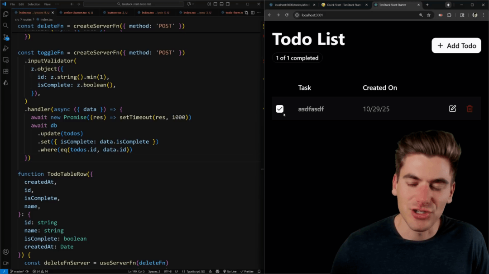

当点击复选框切换完成状态时，如果等待服务器响应（约 1 秒的延迟），用户体验会受到影响。为解决此问题，应采用乐观更新策略。这涉及在客户端本地状态中立即更新复选框的 `checked` 状态，同时将服务器调用包装在 `start transition` 中。

##### 利用 State 实现即时 UI 响应

通过引入一个本地状态变量（如 `isCurrentComplete`）来反映复选框的即时状态，可以确保 UI 响应迅速。当用户点击时，本地状态立即切换，提供了即时反馈。服务器端更新（Toggle 函数）随后异步执行，并在完成后通过 `router.invalidate()` 确保所有相关组件（包括表格行样式）最终同步。

> 这个客户端状态的更新确保了复选框的即时变化，而其他依赖服务器数据的 UI 部分则会延迟一秒刷新。

#### 纯客户端组件的渲染

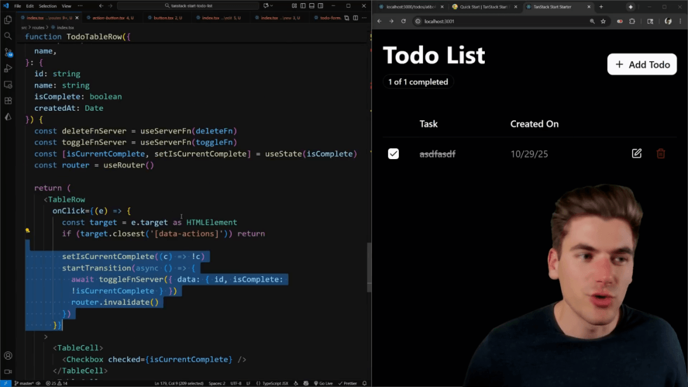

对于完全不依赖服务器渲染，而是专注于客户端交互（如使用 `localStorage`）的组件，直接在标准组件中调用会因服务器尝试渲染 `localStorage` 而失败。为了隔离这种纯客户端逻辑，应使用 `client-only` 包装器。

##### 使用 Client-Only 隔离 Local Storage

创建一个名为 `local count button` 的组件，用于在本地存储中保存和更新一个计数器。当尝试直接在组件初始化时读取 `localStorage` 时，服务器端渲染会报错。通过将整个组件逻辑包裹在 \`\` 标签内，可以确保该代码块仅在浏览器环境中执行。

- 服务器端渲染时，该组件及其内容完全不被渲染，避免了 `localStorage` 未定义的错误。
- 客户端接收到 HTML 后，该组件才会被挂载和执行。
- 可以提供一个 `fallback` 属性，用于在客户端组件加载期间短暂显示的内容。

#### 早读洞察

1、Tanstack Start 初始化流程：使用 npm create 命令创建项目，可集成 Tailwind CSS、Drizzle ORM 和 Shad CN 等流行工具，简化初始配置。

2、基于文件系统的路由结构：路由定义依赖于 `routes` 文件夹结构，动态参数使用美元符号（$）表示，并自动生成类型安全的路由树。

3、Loader 函数的执行环境：页面加载器（loader）函数在客户端和服务器上都会运行，直接在其中执行数据库查询会导致客户端错误。

4、服务器函数处理后端逻辑：必须使用 `create server function` 封装数据库操作，该函数在客户端调用时自动转换为 Fetch 请求，实现服务器执行。

5、处理表单提交与重定向：表单提交使用 POST 类型的服务器函数，配合 Zod 进行输入验证，并通过抛出 `throw redirect` 来触发页面跳转。

6、客户端操作后的 UI 刷新：对于删除等操作，调用 `router.invalidate()` 是刷新依赖数据的必要步骤，确保 UI 状态与服务器同步。

7、客户端代码隔离的重要性：使用 `client-only` 包装器可以确保依赖于浏览器环境（如 `localStorage`）的代码仅在客户端渲染，避免服务器端错误。

原文：https://www.youtube.com/watch?v=KsHbs5RMVYU

这期前端早读课  
对你有帮助，帮” 赞 “一下，  
期待下一期，帮” 在看” 一下。
