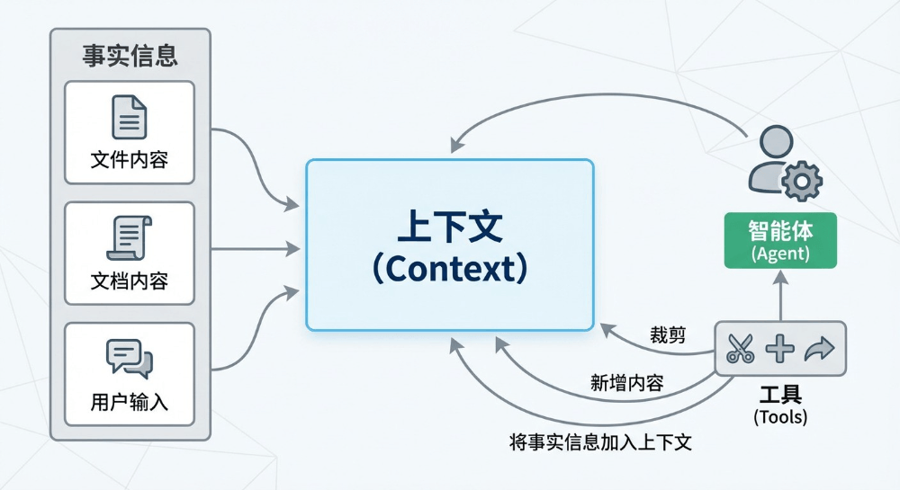
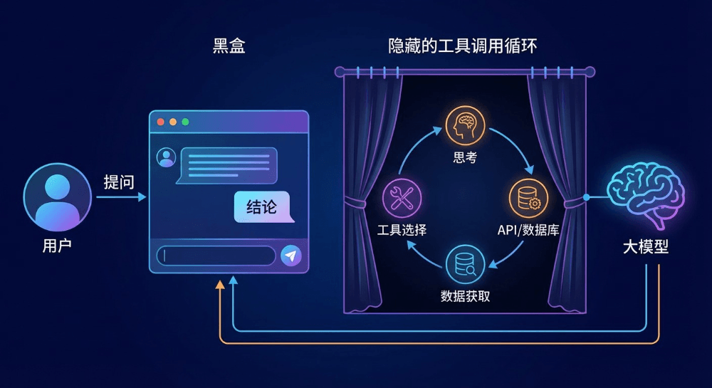

# Agentic Coding场景下基于职责分离的上下文管理思路分享


  

  

  

本文提出了一种在 **Agentic Coding 场景下基于“职责分离”思想的上下文管理新思路**：将工具调用解耦为 **“行为”（如 `open_file`）和“影响”（如 IDE 中实时更新的文件内容）**，通过结构化、模块化（如 `<ide>` 块）、动态组装的上下文设计，替代传统将大量原始数据（如完整文件内容）直接塞入上下文的做法；同时引入“行为-影响分离”“记忆/遗忘机制”“事实与行为记忆区分”“延迟卸载”等策略，系统性缓解长上下文导致的注意力稀释、信息过载、内容过期与性能退化等问题，提升 Agent 在复杂编码任务中的稳定性、可维护性与上下文利用效率。该思路虽源于 coding 场景，但具备跨任务复用潜力。  

  


引⾔

  



  

本⽂主要是S1尝试进⾏模型为主的⾃动化编码过程中，遇到了⻓任务下上下⽂的爆炸以及短任务中注意⼒的分散问题，尝试了模型压缩、FIFO、多agent上下⽂隔离等各种策略后，在摸索过程中逐渐演变出的的⼀个设计思路，核⼼思想是⼯具的职责分离。

  

下⽂会基于语⾔模型的原理、特点以及在实践过程中遇到的问题，从⼯程中职责分离的⻆度出发，尝试⼀种新的上下⽂管理的思路，通过将⼯具分为⾏为和影响，通过结构化上下⽂的动态管理来尝试解决上下⽂中的各类问题，虽然是在coding场景下的尝试，但思路也许也可以被复⽤到其他类型的场景中。

  


什么是上下⽂

  

⼤型语⾔模型（LLM）本质上是⼀个基于已有 token 序列预测下⼀个 token 的概率系统。当接收到⼀段⽂本时，模型将其转换为 token 序列，通过神经⽹络计算后输出下⼀个 token 的概率分布，并将该 token 追加到序列末尾，循环往复，直⾄⽣成结束符。

  

在⼀次请求中，“我们”输⼊给模型的完整内容即为上下⽂（Context）。简单来说，上下⽂就是模型“看到”的、⽤于理解当前语义或预测下⼀个词的所有前置信息。

在⼀个典型的 Agent 应⽤中，上下⽂通常包含以下四类内容：

1. ⽤户输⼊（User Input）
2. ⼯具调⽤与返回（Tool Calls & Responses）
3. 历史对话（Conversation History）
4. ⼯具定义（包括 MCP 等元信息）

  

对⽤户⽽⾔，可控部分仅限于“⽤户输⼊”；⽽对 Agent 开发者来说，其余三部分才是可设计、可优化的核⼼——这正是上下⽂⼯程（Context Engineering） 的核⼼任务：在正确的时间，以正确的结构，向模型传递正确的信息，使其做出最恰当的响应或决策。

  


  

token的多次⽣成循环是发⽣在模型内部的，在这次请求中“我们”输⼊的完整内容就是上下文。简单来说，上下⽂就是模型“看到”的、⽤于帮助它预测下⼀个词或理解当前语义的前⾯的⼀段⽂字。

在⼀个典型的agent应⽤中，上下⽂由下⾯的部分组成：

1. ⽤户输⼊
2. ⼯具调⽤
3. 历史对话
4. ⼯具的定义（包括mcp）

。

对⽤户来说能够掌握的部分只有“⽤户输⼊”，对于agent的开发者来说则是除了“⽤户输⼊”以外的所有内容，上下⽂⼯程指的就是agent开发者在软件开发过程中对上下⽂中包含的内容的组装。

上下⽂⼯程关注的是：如何把正确的信息，在正确的时间，以正确的结构，传递给模型，使其能做出最恰当的响应或决策。

  

#### **▐**  **上**下⽂⼯程的核⼼⼯作

  


| 活动 | 说明 |
| --- | --- |
| 上下⽂设计（Context Design） | 规划上下⽂应包含哪些元素（如系统提示、对话历史⼯具输出记忆⽚段等）。 |
| 上下⽂组装（Context Assembly） | 在运⾏时动态拼接过滤排序相关信息，形成最终输⼊。 |
| 上下⽂压缩（Context Compression） | 在有限 token 窗⼝内，通过摘要、选择性保留、向量检索等⽅式精简冗余信息。 |
| 上下⽂缓存与管理（Context Management） | 维护短期对话状态和⻓期记忆，⽀持跨轮次⼀致性。 |
| 上下⽂评估与优化（Context Optimization） | 通过 A/B 测试、⼈⼯评估或⾃动指标，迭代改进上下⽂结构。 |


  

  

模型本质上是⼀个么得感情的计算机器，⽤户输⼊是模型被动感知环境的⽅式，⽽⼯具则是模型主动感知和影响环境的⼿段。基于语⾔模型的原理，我们知道模型的输出取决于输⼊和模型的固有参数，对应⽤层开发来说模型的固有参数⽆法调整，能控制的只有输⼊内容。同时我们知道模型的参数维度是固定的，因此模型能感知到的特征是有限的，当⽤户的输⼊过多时能明显感觉到模型似乎在“变笨”。

  

这种现象通常被称为“上下⽂⻓度增加导致性能下降”或“⻓上下⽂退化”（long-context degradation），是当前⼤语⾔模型（LLM）在处理超⻓输⼊时常⻅的⼀种局限性。具体表现为：

注意⼒稀释

随着输⼊⽂本变⻓，模型的注意⼒机制需要在更多 token 之间分配注意⼒权重。关键信息可能被⼤量⽆关或冗余内容“稀释”，导致模型难以聚焦于真正重要的部分，从⽽影响推理、问答或摘要等任务的准确性。

位置编码失效或失真

⼤多数模型使⽤位置编码（如 RoPE、ALiBi 或绝对位置嵌⼊）来感知 token 的顺序。当输⼊远超训练时的最⼤上下⽂⻓度（例如训练时最⼤为 4K，但推理时输⼊ 32K tokens），位置编码可能⽆法准确表示远距离 token 的相对关系，造成时序混乱，进⽽影响理解。

信息过载与噪声⼲扰

输⼊内容越多，越可能包含重复、⽭盾或⽆关的信息。模型缺乏有效的信息筛选机制，容易被噪声⼲扰，甚⾄“迷失”在冗⻓⽂本中，导致输出变得模糊、不相关或逻辑混乱——看起来像是“变笨了”。

训练\-推理不匹配

模型在训练阶段很少⻅到极⻓的上下⽂样本，因此对⻓⽂本的泛化能⼒有限。即使通过外推技术（如 YaRN、NTK-aware scaling）扩展上下⽂窗⼝，其在⻓上下⽂下的表现仍可能显著弱于短上下⽂。

计算资源限制带来的近似处理  

为应对⻓上下⽂带来的计算开销（如注意⼒复杂度为 O(n²)），⼀些系统会采⽤滑动窗⼝、稀疏注意⼒或缓存截断等策略，这些近似⽅法可能⽆意中丢弃关键信息，进⼀步降低模型表。

  

  



  

LLM 本质是 token 预测器，仅能输出⽂本。要使其成为⽣产⼒⼯具，需通过⼯具调⽤机制扩展其能⼒：模型输出结构化指令 → 程序解析并执⾏ API → 将结果作为新上下⽂返回。

。

若将 LLM ⽐作⼤脑，⼯具就是眼睛、⼿、脚；若⽐作⼈类，⼯具就是电脑、书本。所有输⼊——⽤户指令、⼯具定义、调⽤记录、系统提示——本质上都是上下⽂的⼀部分。

  

在单轮 Agent 场景中，上下⽂膨胀主要来⾃：

- ⼯具调⽤返回⼤量数据（如读取整个⽂件）
- ⽤户上传⻓⽂档

开发者虽⽆法控制⽤户输⼊，但可优化⼯具的上下⽂表达⽅式。⼯具上下⽂分为两类：

- 静态定义：⼯具功能描述（编码时确定）
- 动态交互：调⽤参数与返回结果（运⾏时⽣成）

本⽂并不讨论⼯具定义的⽅式，⽽是直接讨论会导致上下⽂快速增⻓的动态交互部分。

  

#### **▐**  **⼯**具实现的思路和问题

  

在coding场景中，最经典的⼯具就是read\_file和write\_file，即⽂件读写⼯具。

在提供read\_file⼯具时，最简单的⽅式就是直接读取并返回完整的⽂件内容，为⽅便起⻅我们叫这个⼯具read\_full\_file。

> 需要注意的是部分⽼项⽬或不规范项⽬中可能会存在编码不⼀致的问题，例如utf8和gbk混⽤的情况，如果未使⽤准确的编码读取⽂件内容可能导致注释、⾮英⽂常量⽆法被模型识别导致⽆法正确理解“业务含义”（代码逻辑之外的信息）。在java项⽬中推荐这两个库 juniversalchardet 和 cpdetector 来通过部分字节推测⽂件编码以避免此类问题。
> 
> 当然最佳实践是通过改造来完成项⽬编码的统⼀，最佳实践是统⼀使⽤utf-8编码。

```code-snippet__js
String readFullFile(String path){
  //这里去读取文件内容，然后return出去
}
```
> ⚠注意：⼯具的返回值也是上下⽂或者说提示词的⼀部分

  

read\_full\_file有⼀个显⽽易⻅的问题：

- “完整的⽂件可能很⼤”导致上下⽂快速膨胀。  

此外还有⼀些和模型的特点相关的问题：

- 在找不到路径时需要明确告知模型 "xx路径不存在"，⽽不能告知模型“”，否则模型可能会陷⼊⼯具调⽤的⽆限循环（qwen系列⽐较明显）。
- 模型输⼊的path不⼀定准确，可能输⼊的是类的限定名、⽂件名；或是缺失部分路径、缺失⽂件后缀等。

对于path不准确的问题，可以基于⼀个简单的思路来进⾏处理，即先搜索在读，通过关键词匹配对path进⾏搜索，如果能定位到唯⼀的⽂件则读取此⽂件，否则明确告知模型现在有多个相似的⽂件，需要模型重新再⽣成⼀次⼯具调⽤。

在read⼯具和write⼯具混⽤的情况下，read\_full\_file还会出现⼀个新的问题：

> 我们先不关注write⼯具的具体实现，只需要知道write后⽂件内容肯定发⽣了变化

- 同⼀份⽂件内容在编辑后已经失效了，需要重新读取⽂件内容，⽽历史⼯具调⽤的respone和新的response存在⼤量重复，如果是多次编辑则会导致上下⽂快速膨胀。

这是因为我们将⽂件内容放在⼯具调⽤的返回值中，发送给模型的消息类似于下⾯的格式：

```code-snippet__js
tool_call:read_full_file filePath
tool_response:filePath.content //第一次读取
tool_call:write_file filePath xxxx
tool_response: 更新成功
tool_call: read_full_file filePath
tool_response:filePath.content //第二次读取
```
  

为什么模型需要读取多次或者说为什么我们希望模型读取多次？

在使⽤ai coding⼯具时，我们有时会看到模型输出“让我看看是否已经完成了所有变更”，因为模型在进⾏write时能够感知到的只是进⾏了这个⾏为，⽽并没有看到这个⾏为的“影响”。

> 在coding场景中，“影响”指的是修改后代码的内容。

为了解决read\_full\_file ⼯具的⻓上下⽂问题，可以引⼊按块读取⼯具read\_block\_file，即模型在调⽤⼯具时可以选择读取的⾏的数量，在理想情况下，模型可以只读取部分内容：

```code-snippet__js
String readBlockFile(String path,int startLine,int lineCount){
  //这里去读取文件内容，然后return出去
}
```
  

但这个⼯具同样也存在其他问题

- 模型并不知道需要的内容在哪，可能还是会多次调⽤块读取⼯具最后把整个⽂件都读取，这反⽽导致了和模型的更多次交互（增加了成本）。
- 模型读取块的时候可能忽略了后续代码的影响，导致思路错误。

> 输⼊的token也是会计费的，⽤块⼯具读取完整的⽂件内容⽐直接读取完整的⽂件内容会增加多次重复上下⽂的调⽤，导致成本的上升。

在最坏情况下（需要的逻辑在⽂件末尾）⽐read\_full\_file花费更多的成本，且上下⽂更多（因为还有⼯具调⽤），并且和write⼯具联合使⽤时的问题仍然存在。

  

为了解决write⼯具联合使⽤时的问题，我试图引⼊“按需卸载”的策略，即在发现write⼯具后判断⽂件内容已经变更时就去掉历史调⽤中的read⼯具的返回值，于是我将⼯具划分为两个类型，即读和写，当读写在操作同⼀个实体（这⾥指⽂件）时，如果有写操作则卸载掉上次的读操作，但这导致模型的幻觉现象变得更加严重，深⼊分析了模型的输出后，我发现并不能实时卸载，应该延迟⼀段“时间”（⼀些读写操作）后再卸载，否则模型很难感知到上次的⾏为，容易出现重复操作。简单来说就是保持最近的⼏次操作，例如50次。

> 在aone copilot中使⽤了类似的思路，⼤约只会保留最近250次的操作内容，可以右键打开 devtools来查看交互的对话内容。

  

但是这个思路只能解决read、write⽂件的⻓上下⽂问题，难以推⼴到grep、getDependency等⼯具上，并且在⼯程上实现不够优雅。

暂且记下这些问题，回过头来先看write⼯具，write⼯具⾄少需要2种

1. 块替换
2. 完整覆写

```code-snippet__js
String replace(String path,String search,String replace){
  //找到search块并替换为replace
}
String write(String path,String content){
  //直接覆盖path的内容，如果不存在则创建一个文件
}
```
  

write⼯具的主要问题是⼯具调⽤内容较多，相⽐read⼯具，write只需要确保内部替换逻辑是准确的，且在出现问题时能够准确反馈问题可以让模型重新推理即可，但在实际测试中和模型及框架有关的两个点需要注意：

1. 模型⼏乎不会产出\\r符号，因此如果项⽬是在windows下操作的需要注意\\r符号。
2. 模型在输出\\t时容易多⼀次转义，例如参数需要为\\t，但模型输出\\\\t（这应该是通过json格式约束模型输出⼯具调⽤导致的问题）。

write⼯具中也有path参数，因此也需要类似read⼯具的路径推测能⼒来降低模型进⾏⼯具调⽤失败的概率。

其他的读⼯具都可以参考read\_file的问题，即信息过期、冗余等问题。

  

1. 完整读 的缺陷：
  
  上下⽂爆炸：⼤⽂件直接塞⼊上下⽂。
  
  路径模糊：模型可能传⼊类名、缺后缀等，需⽀持模糊匹配。  
  
  内容过期：write 后未刷新 read 内容，导致历史响应冗余。
2. 部分读 的局限：
  
  模型不知关键代码位置，可能多次调⽤，反⽽增加成本。  
  
  与 write 联⽤时仍存在重复内容问题。
  
  最坏情况下（需读末尾）⽐全读更耗 token。
3. “按需卸载”策略的陷阱：
  
  早期尝试在 write 后⽴即移除旧 read 响应，结果加剧幻觉——模型因缺乏⾏为反馈⽽重复操作。实践表明，应延迟卸载（例如保留最近 50–250 次操作），让模型充分感知⾏为影响。

  

  

回过头来思考⼈在coding场景下的⾏为，当⼈在进⾏编码时，⼀直在观察ide中打开的代码⽂件，通过键盘对代码⽂件进⾏编辑（光标位置），当需要切换编辑的位置时，将光标移动到新的位置，随后开始⼀段新的输⼊。

  

通过拟态来优化⼯具的设计思路，当⼈在进⾏编码时⼀直在观察的是IDE的界⾯，同时通过⿏标键盘在和这个界⾯中的元素进⾏交互，屏幕是有限的，所以我们观察到的内容也是有限的，这和我们期望的agent的上下⽂是“固定”的⾮常类似。

  

当模型试图进⾏⼀次⼯具调⽤时，本质上是为了“观察”或“影响”环境，也可以说是为了“读”和 “写”环境，这是模型主导的“⾏为”，环境则是agent的具体业务需要的信息，例如在coding场景中可以把代码⽂件、⽂档等视为“环境”。当⼯具调⽤结束时，将⼯具返回的内容组装到上下⽂中就实现了让模型观察环境或是了解造成的影响。

  

在现有思路下⼯具包含了两个职责

1. ⾏为
2. 影响的反馈

以read\_file为例，实际上这个⼯具的⽬的是“获取⽂件内容”并发送给模型，⾏为是获取指定⽂件的内容，影响是在上下⽂中增加⽂本的内容，最终发送给模型，使得模型看起来像是阅读了代码似的。

⽽当⼈在阅读⽂件时，实际上是进⾏了⼀次“打开⽂件”的⾏为，然后造成了IDE现在显示我们“打开⽂件”的内容，所以我们（语⾔模型）可以通过“看”屏幕来阅读⽂件内容。

  

基于这个思路，我在system prompt中增加了⼀个固定存在但内容“实时”更新的块，这个块存储模型看到的事实，同时不再有读⽂件的⼯具，⽽是变成了open\_file和close\_file两个操作，当模型调⽤open\_file⼯具时，是进⾏了⼀次“⾏为”，⽽⼯具的影响是“⾏为的结果”以及“IDE中显示⽂件内容”。

> 实时更新是指每次发送给模型前进⾏更新

```code-snippet__js
String openFile(String path){
  //如果成功在ide中记录path被打开，返回已经成功打开文件
  //如果失败原因是什么
}
```
  

每次组装发送给模型的内容时，重新⽣成IDE的内容，IDE中包括“⽂件内容”。

参考这个思路，我们可以将“⽬录”、“搜索”、“引⽤关系”、“变更清单”、“TODOLIST”等⼯具都视为IDE中的模块，并提供“⾏为⼯具”来调整这些块的内容。

同时甚⾄可以将这些块的展示/隐藏也全权交给模型决策，即由模型⾃主管理。  

例如

1. 我们现在打开的⽂件较多，可以在上下⽂中增加“警告信息”，让模型将不重要的⽂件进⾏关闭。
2. 打开的某个⽂件较⼤，让模型聚焦到某个块
3. 打开的⽬录已经使⽤完毕了（搜索过程），模型⾃主的关闭⽬录
4. 打开的⽂件已经不需要再使⽤了，模型⾃主的关闭此⽂件
5. 等等

  

但⼈和模型还是有本质上的区别，抛开逻辑能⼒的差异，最重要的是“记忆”，⼈可以“记住”刚刚打开的⽂件，即使现在关闭了，⼤概也能记得内容并基于“记忆”中的内容来对当前打开的⽂件进⾏操作，⽽LM模型我们知道它是没有记忆的，之所以有“记忆”的假象，只是因为在上下⽂中包含了完整的信息。

为了解决这个问题，我们可以给ide⼀个专⻔的“记忆”模块。

  

  

说到记忆，我们的根本⽬的是让模型“记住”那些“需要”的信息，并且基于这些信息给出准确的“判断”，最佳⽅式是把所有的“⾏为”和“影响”都放在上下⽂中，只要模型⾜够“聪明”就⼀定能做出最准确的判断，但我们知道语⾔模型的上下⽂是有限的，且基于语⾔模型的原理我们知道上下⽂中的内容不能过多，否则会导致模型“性能”下降。

  

当⼈在阅读了⽂件后，可以直接关闭或切换到其他⽂件进⾏后续⼯作，这是因为⼈记住了⽂件中的“关键”内容⽽⾮记住了完整的⽂件内容。

  

我们则需要⼿动在上下⽂中增加“关键信息”以便让模型“记住”关键信息，在上下⽂充⾜的情况下，⾸选保留完整的⽂件内容，随着模型的逐步深⼊，上下⽂也开始捉襟⻅肘了，此时在系统提示词的引导下，模型会开始试图关闭或⼯程上主动出发关闭⽂件时，需要对即将关闭的⽂件进⾏⼀次关键信息提取，然后将关键信息记录到⼀个较⼩的备忘录中，以实现让模型仍然记得刚刚关闭的⽂件中的关键信息，我们仍然可以借助⼀个subagent来进⾏关键信息提取，⽽如何判断⽂件的关键信息则由主agent给出，当主agent打开⼀个⽂件时，需要同时给出此操作的⽬的，让subagent基于“⽬的”进⾏关键信息提取。

  

随着探索的继续深⼊，备忘录的⼤⼩也到达了上限，我们需要从上下⽂中真正的删除内容，最佳⽅式仍然是让模型⾃主管理哪些部分需要被移除，哪些部分需要保留，但也可以使⽤简单的先进先出或者策略。

  

同时因为⾏为和影响的分离，我们可以针对每个部分的特点来单独设计压缩、裁剪、合并等⾏为，更加⾼效的利⽤上下⽂来释放模型的能⼒。

  

#### **▐**  **事**实和⾏为

  

在“记忆”中有⼀部分⾮常特殊的内容，即⼯具调⽤的记录，这是告知模型“已经做过”的内 容。但有些模型的训练过程中会专⻔对⼯具调⽤进⾏训练（⽀持functioncalling的模型），因⽽导致了⼀些特殊的规则，例如：

1. function call 和function response需要成对出现
2. unction call 和function response需要使⽤特殊格式传递给模型

例如下⾯⼀个询问天⽓的简单示例

```code-snippet__js
user:今天天气怎么样
assistant:function_call getDate
agent:function_response 2025-12-22
assistant:function_call getWether 2025-12-22
agent:function_response 晴天
assistant:今天是2025-12-22，天气睛
```
  

在⼀些instruct模型中，如果不使⽤这种形式，模型可能会出现⽆限循环调⽤⽅法。

因此在agent应⽤中，需要将“记忆”划分为两部分：事实记忆和⾏为记忆。

⾏为记忆使⽤function call/response 的形式在上下⽂中体现，⽽事实记忆则通过诸如打开的⽂件内容、操作过的⽂件列表、diff内容、备忘录、todo等形式。

通过上述⽅式组织上下⽂可以使得上下⽂保持在⼀定⼤⼩内，既能够充分利⽤上下⽂窗⼝，也可以避免上下⽂快速膨胀导致的性能快速下降。

  

#### **▐**  **传**播和继承

  

按照上述思路，上下⽂被划分成⼀些固定的块，例如diff、路径、备忘录、todo等，我们可以通过xml将这些块进⾏区分，组织成⼀个结构化的上下⽂。

```code-snippet__js
<ide>
<open_file>文件路径</open_file>
<todo>待办</todo>
<note_book>备忘录</note_book>
</ide>

```
> ⚠在使⽤chat和模型进⾏交互时，需要将ide内容放⼊system prompt，否则容易被模型遗忘。

  

在上⽂的思路下模型的⾏为和影响被拆分，且每个部分也被⾃然的拆分，因此我们可以针对每个任务的特点来组装上下⽂信息，充分利⽤有限的上下⽂。⽽“影响”天然就是上⼀次⼯作的结果和过程的直观展现，新的⼯作可以基于上⼀轮的“影响”继续进⾏。

  

在⾯向multi agent或是sub agent时，“影响”被继承，并转向另⼀个维度的⼯作，例如deep search收集知识的过程中可以被“评估者”直接评估知识是否收集完全、代码⽣成时则可以直接利⽤deep search收集的知识进⾏⼯作。在多轮对话中“⾏为”和“影响”均可以被继承，模型可以⽆缝的接受⽤户新的输⼊后开始新的⼯作。

  


结语

  

在我看来上下⽂⼯程是⼀个复杂且不断发展的⼤模型下的⼯程产物，本质上是由于语⾔模型能⼒的不⾜⽽出现的⼀种⼯程上的妥协，随着语⾔模型能⼒的增强，或许在未来的某⼀天我们可以直接依赖模型的能⼒⽽不再需要复杂的上下⽂⼯程，但是以⼯程应⽤的视⻆来看，资源的⾼效利⽤、性能的极致优化永远是⼯程师的追求。

  


团队介绍

  

本文作者时兮，来自淘天集团-物流解决方案&电子面单团队。一支专注于商家寄件与电子面单业务研发的技术团队。依托多元业务场景，我们持续探索与迭代技术能力，长期投入稳定性建设，为数百万商家提供稳定可靠的寄件与物流体验，为数亿包裹安全高效流转保驾护航。

  

  

  

**¤** **拓展阅读** **¤**

  

[3DXR技术](https://mp.weixin.qq.com/mp/appmsgalbum?__biz=MzAxNDEwNjk5OQ==&action=getalbum&album_id=2565944923443904512#wechat_redirect) | [终端技术](https://mp.weixin.qq.com/mp/appmsgalbum?__biz=MzAxNDEwNjk5OQ==&action=getalbum&album_id=1533906991218294785#wechat_redirect) | [音视频技术](https://mp.weixin.qq.com/mp/appmsgalbum?__biz=MzAxNDEwNjk5OQ==&action=getalbum&album_id=1592015847500414978#wechat_redirect)

[服务端技术](https://mp.weixin.qq.com/mp/appmsgalbum?__biz=MzAxNDEwNjk5OQ==&action=getalbum&album_id=1539610690070642689#wechat_redirect) | [技术质量](https://mp.weixin.qq.com/mp/appmsgalbum?__biz=MzAxNDEwNjk5OQ==&action=getalbum&album_id=2565883875634397185#wechat_redirect) | [数据算法](https://mp.weixin.qq.com/mp/appmsgalbum?__biz=MzAxNDEwNjk5OQ==&action=getalbum&album_id=1522425612282494977#wechat_redirect)
