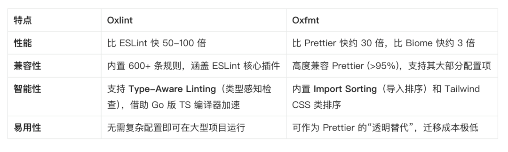
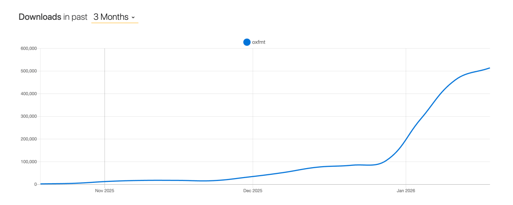
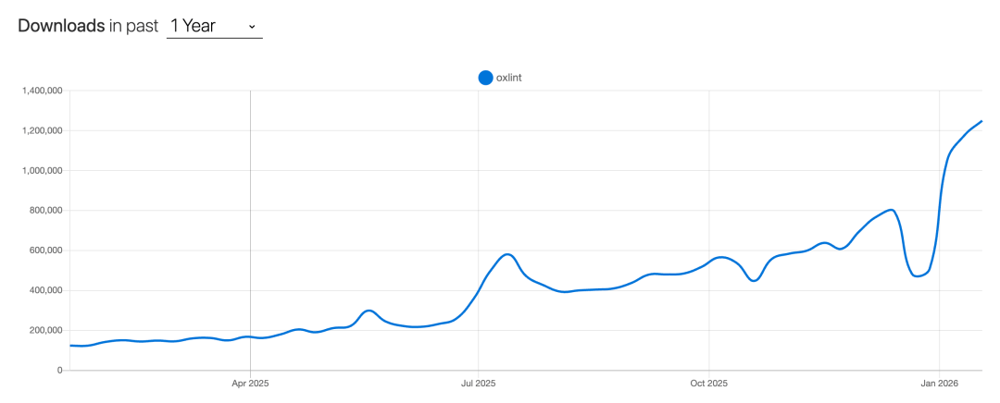

# 尤雨溪公司出品，这两个新工具突然就爆了！

最近在看前端工具链的变化时，有两个名字出现的频率明显高了起来：**oxfmt** 和 **oxlint**。

它们都出自尤雨溪创办的 **VoidZero**，也是 **Oxc 工具链**里的核心组件。

真正引人注意的，是它们在 **npm 周下载量**上的增长速度：

- **oxfmt**：目前大约 **51 万/周**，从发布到这个量级，只用了 **两个月左右**

- **oxlint**：周下载量已经接近 **125 万**，整个过程也不到 **一年**

这这个曲线已经很难用个人尝鲜来解释了，更像是工程团队在规模化引入后才会出现的走势。

## oxfmt：不是换 formatter，而是性能跃迁

Prettier 在小项目里几乎没感觉，但一到 monorepo、超大仓库或 CI 场景，问题就会被无限放大：

- format 一次几十秒
- 提交前 hook 明显卡顿
- CI 里格式化阶段拖慢整条流水线

oxfmt 解决的并不是规则之争，而是**执行效率**。

根据官方数据，在**无缓存、首次运行**的情况下，oxfmt 的格式化速度约为 **Prettier 的 30 倍**，也明显快于 Biome。

更关键的是，它并没有另起炉灶：

- 行为高度对齐 Prettier（大多数项目可直接替换）
- 只做样式格式化，不引入语义判断
- 基于 Rust 实现，性能和内存表现更稳定
- 内置 import 排序、Tailwind 类排序等常用能力

替换成本极低、收益又足够直接，这也是 oxfmt 能在短时间内快速扩散的核心原因。

## oxlint：正面解决 ESLint 的结构性瓶颈

如果说 oxfmt 是体验优化，那 **oxlint 瞄准的就是 ESLint 的根本问题**。

官方给出的数据非常直观：在相同代码规模下，oxlint 相比 ESLint 的整体性能提升可达到 **数十倍量级**。在多线程模式下，原本需要几十秒的 lint 流程，可能被压缩到 **1 秒以内**。

原因也很清楚：

- Rust 实现，更适合高性能工具链
- 统一 AST 和解析流程，避免重复计算
- 原生并行执行，而不是 Node.js 的单线程模型

更重要的是，它并没有试图“推翻生态”：

- 规则语义对齐 ESLint
- 支持常见 ESLint 注释
- 允许渐进迁移，而不是一次性重构

这也是 oxlint 能在一年内，把周下载量拉到百万级的根本原因。

## 这不是两个工具，而是一条路线

把视角拉高来看，oxfmt 和 oxlint 并不是孤立产品，而是 VoidZero 非常明确的一条方向：**用 Rust 重构前端工具链的底层基础设施。**

不是做新框架，不是造新 DSL，而是从 lint、format 这些“每天都在跑、每天都在耗时间”的环节下手。

当性能差距来到 **30×、50× 甚至更高** 这个级别时，问题已经不再是“值不值得迁移”，而只是“什么时候迁移”。

## 写在最后

在今天这个时间点上：

- **oxlint** 已经是可用于生产的 ESLint 替代方案
- **oxfmt** 仍在快速演进，但趋势已经非常明确

你可能现在还没用，但很快就会发现：

**不是你选了它，而是你进的项目已经在用它。**

这，才是真正意义上的「爆了」。

  

---

  

- 我是 ssh，工作 6 年+，阿里云、字节跳动 Web infra 一线拼杀出来的资深前端工程师 + 面试官，非常熟悉大厂的面试套路，Vue、React 以及前端工程化领域深入浅出的文章帮助无数人进入了大厂。
- 欢迎`长按图片加 ssh 为好友`，我会第一时间和你分享前端行业趋势，学习途径等等。2025 陪你一起度过！
- 
- 关注公众号，发送消息：
  
  指南，获取高级前端、算法**学习路线**，是我自己一路走来的实践。
  
  简历，获取大厂**简历编写指南**，是我看了上百份简历后总结的心血。
  
  面经，获取大厂**面试题**，集结社区优质面经，助你攀登高峰

因为微信公众号修改规则，如果不标星或点在看，你可能会收不到我公众号文章的推送，请大家将本**公众号星标**，看完文章后记得**点下赞**或者**在看**，谢谢各位！
