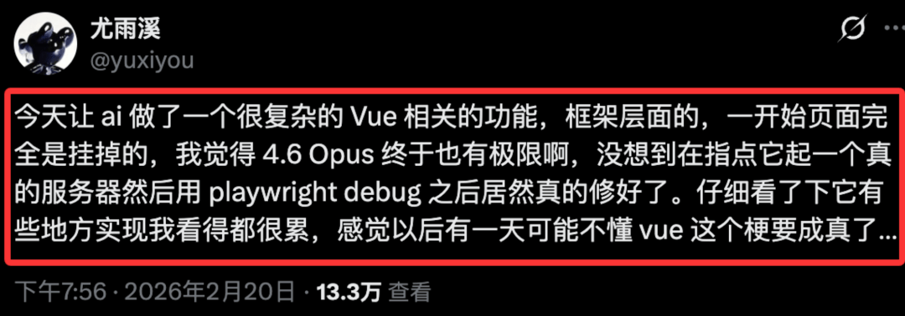

# 尤雨溪坦言：我确实不懂Vue

2026年2月20日，Vue创始人尤雨溪在社交平台分享了一段自己与AI协作开发的真实经历，瞬间在前端圈刷屏，甚至让那个流传多年的老梗——**“尤雨溪不懂Vue”**，差点从玩笑变成现实。

据尤雨溪描述，他在使用Claude Opus 4.6开发一个**复杂的框架级Vue功能**时，直接让AI生成了初始代码。可没想到，这段代码一跑就崩，页面直接彻底挂掉。

面对AI写出的“问题代码”，尤雨溪并没有放弃，而是一步步引导AI搭建真实的服务环境，再配合Playwright进行自动化调试，最终才把问题彻底修复。

他在分享中坦言，AI的某些实现思路和代码逻辑**复杂到“看着都累”**，并顺势自嘲：社区里天天玩的“尤雨溪不懂Vue”的梗，这下好像真的要应验了。

这段经历一出，立刻在开发者社区引发大量讨论，评论区画风格外欢乐：

有人玩梗玩到飞起： “传下去，AI太强，Vue作者即将看不懂Vue。”

也有人看完反而松了一口气： “连尤雨溪都被AI绕晕，普通人还有什么好焦虑的？”

更有网友脑洞大开，给出了细思极恐的解读： “AI是不是故意把代码写得特别复杂？就是为了让人类产生依赖，慢慢把运维、开发全都丢给AI，最后一步步接管系统，等到时机成熟，直接把人类程序员彻底替代。”

而很多人不知道的是，**“尤雨溪不懂Vue”**其实是前端社区一个流传多年的善意老梗。 它并不是真的质疑作者的能力，反而是开发者们对尤雨溪的一种认可和亲近式调侃——毕竟能写出Vue这种级别的框架，本身就是前端领域的顶级水准。

这次尤雨溪亲自下场和AI协作、debug、吐槽代码，也让不少人看清一个现实： **AI再强，也只是工具。 真正决定代码质量、解决复杂问题的，依然是人的思路、经验和判断力。**
