# 谷歌Chrome觉醒！Gemini 3全面接管，38亿用户一夜进入Agent时代

### 

转自：新智元

谷歌终于不再沉睡！

就在刚刚，谷歌正式官宣或将改写互联网历史的重磅更新——

所有桌面端Chrome浏览器，正式接入Gemini 3。

  

这意味着，全球38亿用户手中的浏览器，一夜之间从一个单纯的网页查看工具，进化为了一个全能的AGI入口。

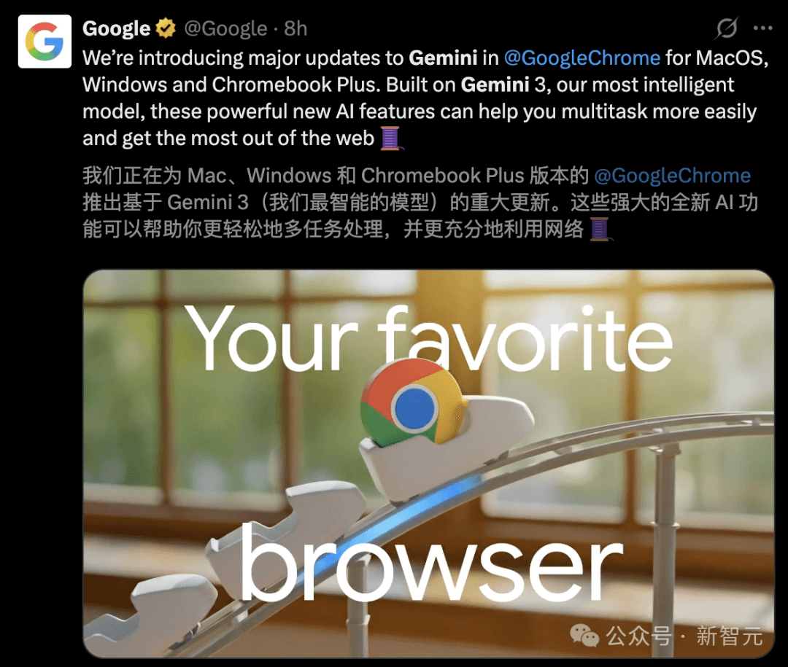

此次更新最大的亮点，在于彻底改变了人与信息的交互方式。

Gemini 3不再是一个需要单独访问的网页，而是直接「住」进了 Chrome里。

得益于Gemini 3强大的多模态理解能力，Chrome现在可以像人类一样「看懂」网页，并执行复杂的操作。

想办个千禧风派对？

只要一句话，「自动浏览」功能就能扫遍全网找同款，自动比价、自动领券、甚至直接加购，全程不用你操心预算。

更绝的，是处理那些让人头大的繁琐流程。

比如复杂的旅行规划，它能瞬间调动Gmail、地图、日历这套「谷歌全家桶」，把订酒店、查机票、同步日程安排得明明白白。

以前需要在几十个标签页里反复横跳的崩溃感，彻底成为了历史。

如果你是搞设计的，或者只是想修个图，Chrome现在内置的Nano Banana模型更是让人直呼「魔法」。

不用下载图片，也不用打开PS，直接在网页侧边栏输入一句提示词，图片立刻按你的想法大变样。

这简直是把生产力工具直接焊死在了浏览器里。

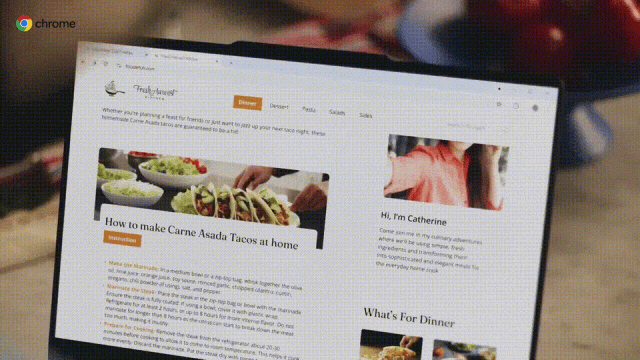

虽然市场上Perplexity Comet和OpenAI Atlas最近风头正劲，但谷歌这波「回马枪」实在太狠。

毕竟，Chrome拥有全球最庞大的38亿用户底座。

当最好的AI体验变成了浏览器的「出厂设置」，用户还需要去下载别的应用吗？

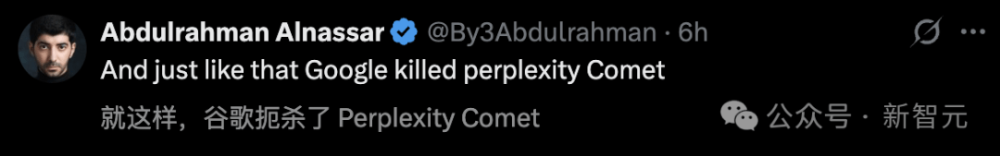

难怪网友们纷纷感慨：「沉睡的巨人，已完全苏醒」。

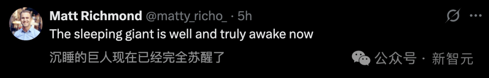

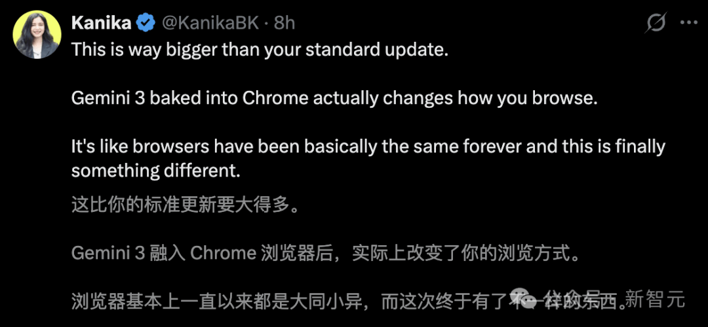

目前，MacOS、Windows和Chromebook Plus上的Chrome，已全部上线新功能。

不过，自动浏览功能仅限Google AI Pro和Ultra订阅美国用户使用。

##   

**浏览器？不，这是你的AI管家**

##   

在全球浏览器市场中，谷歌以超38亿用户量，稳坐世界头把交椅。

但不得不承认，AI这波浪潮实属给谷歌统治地位，带来很大的冲击。「AI原生」浏览器的崛起，让其存量市场正被快速蚕食。

尤其是，过去一年，Perplexity Comet异军突起，凭借颠覆性AI搜索体验，吸引大量用户。

紧接着，OpenAI也入局，正式发布了内嵌ChatGPT的浏览器Atlas。

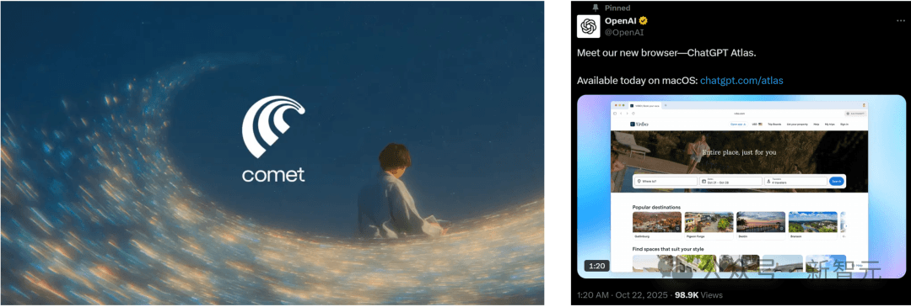

这一次，Gemini 3深入植入谷歌Chrome后，或将重塑未来的流量入口。

Gemini 3的实力众所周知，通过全新的侧边栏体验，人们可以在网页多任务处理时，更加得心应手。

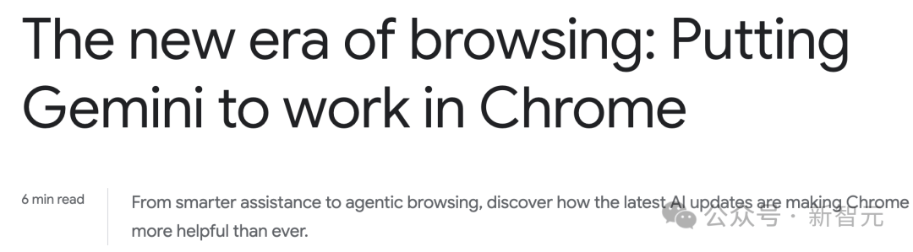

不仅如此，谷歌还将旗下爆款「全家桶」与AI深度集成，全新「自动浏览」功能便可帮你处理复杂的多步工作流。

未来，个人智能（Personal Intelligence）即将上线，更懂你，更智能。

如今，谷歌Chrome完成了「回炉重塑」，进化为一个真正的全能助手。

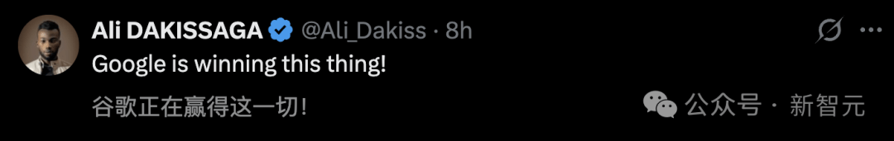

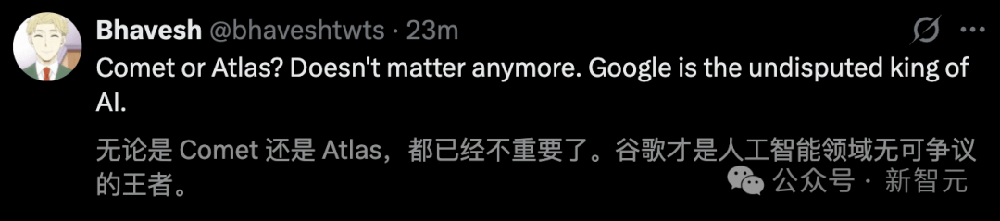

人类与浏览器的交互范式，正经历一场彻头彻尾的重构。

  

**全新侧边栏，随时待命**

##   

全新升级后的侧边栏，无论你切换到哪个标签页，Gemini都能随时待命。

这能帮你省去来回切换的麻烦，实现无缝的多任务处理。

你可以一边在主窗口忙工作，一边在侧边栏处理其他事务——

· 有人用它在「标签页丛林」里对比不同选项； 

· 有人用它汇总各站点的产品评价； 

· 还有人在乱成一团的日历里快速找空档。

  

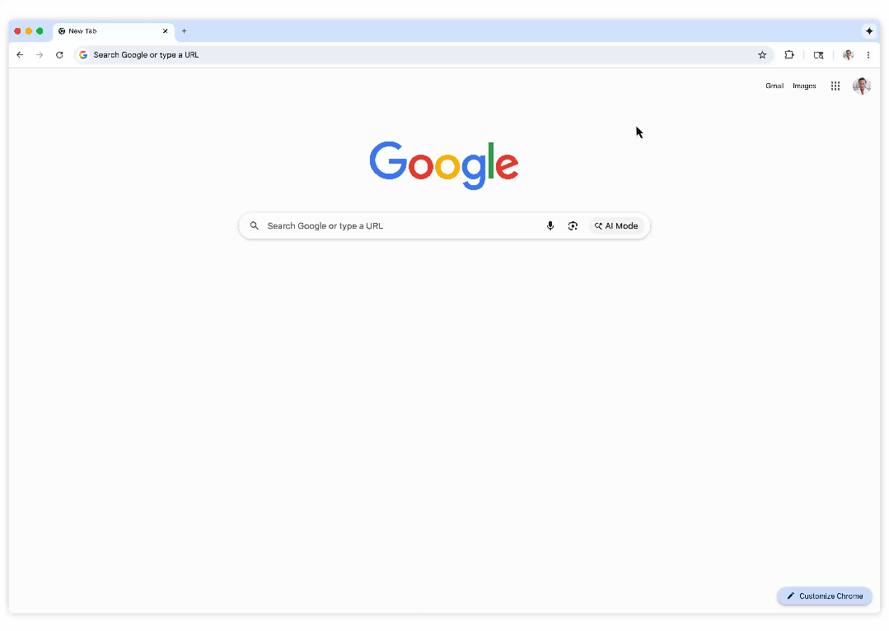

##   

##   

**自动浏览，人类双手解放**

##   

这次最重磅的升级，当属自动浏览能力了。

无论是对比不同日期的酒店和机票价格帮你精准「捡漏」，还是预约挂号、填写那些长得要命的在线表格、收集报税文件、找装修报价、查账单、报销费用，甚至帮驾照续期等等，它都不在话下。

只要你授权，它甚至能调用Google密码管理器帮你搞定需要登录的任务。

- 理解创意愿景：帮你搜寻极其冷门的派对装饰并直接入仓。 
- 新一代智能体能力：自动浏览可以从PDF里提取信息帮你填表。 
- 最佳周末推荐：根据你的酒店和航班标准，帮你挑出最合适的出游周末。 
- 找房小能手：根据你的要求筛选并推荐最合适的公寓。

此外，Chrome还支持谷歌与行业大咖们共同制定的开放标准通用商务协议（UCP），确保AI智能体在Chrome里的购物流程变得如丝般顺滑。

##   

**Nano Banana入驻，随地大小修图**

##   

Nano Banana的创意能力，也直接内嵌到了Chrome里。

对于创作者而言，这意味着「下载图片-打开PS-修改-保存-上传」的旧工作流彻底作古。

现在，你只需要在网页上选中图片，在侧边栏输入一段**提示词**，Gemini就能调用Nano Banana实时对图片进行重构或修改。

不用离开当前标签页，不用安装任何插件，网页本身就变成了一个强大的图像工作站。

##   

**「全家桶」互联，搞定一切**

##   

Perplexity和OpenAI最大的短板，正是谷歌最深的护城河——生态。

Chrome版Gemini 3打通了Connected Apps（连接应用）。它可以无缝调用Gmail、Google Maps、YouTube、Google Flights等自家服务。

这种深度集成让办事效率突飞猛进。

比如，你要去参加会议，Gemini能帮你翻出那封陈年活动邮件，结合Google航班的信息给出出行建议，最后再帮你草拟一封告知同事到达时间的邮件。

##   

  

**个人智能：更懂你、更主动**

##   

Gemini App里备受欢迎的「个人智能」，也会在未来几个月登陆Chrome。

当然，掌控权始终在你手里：你可以自行选择是否加入，并随时连接或断开应用。

Chrome会记住以往的对话背景，针对你的全网搜索提供「量身定制」的答案；你也可以预设特定指令。

有了「个人智能」，Chrome不再只是一个工具，而是一个懂你、能主动提供帮助的贴心搭档。

**安全与隐私**

###   

为了安全起见，谷歌不仅加入了全新的防御机制来抵御新型网络威胁，而且自动浏览在执行「买单」或「发动态」等敏感操作前，**一定会暂停并明确请求你的确认**。

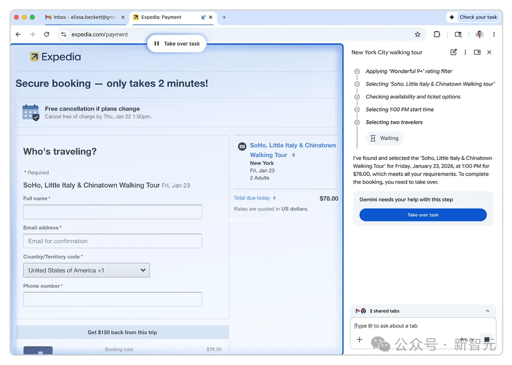

如今，当Gemini 3的顶级模型能力，遇上Chrome 38亿的庞大用户基数，再加上谷歌无孔不入的生态服务，这场浏览器之战似乎在开始前就已经结束了。

对于普通用户来说，从今天起，你的浏览器不再只是一个浏览器，它是你的秘书、你的买手、你的设计师。

可以说，一个由AI驱动的全新浏览时代，已经开启。
