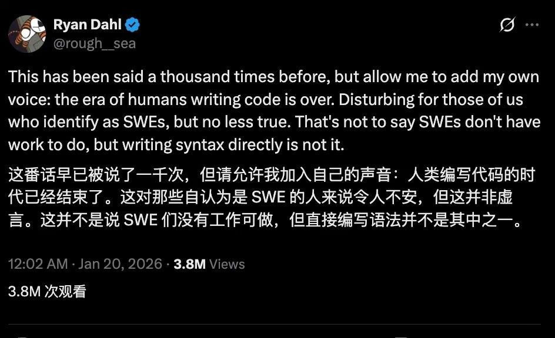

# 😨震惊！NodeJS之父直言：人类编写代码的时代结束了😭

作为一个天天跟代码死磕的程序员，刷到 Ryan Dahl 这条推文的时候，我直接虎躯一震。💣  
  
他说：“人类手写代码的时代已经结束了。”  
  
我第一反应是：这不是在搞我心态吗？  
毕竟我靠这个吃饭都好几年了。  
  
但他紧接着又补了一句，让我松了口气：  
“不是说程序员要失业了，只是以后不用再抠那些基础语法了。”  
  
说白了，以后我们的活儿变了：😡  
• 以前是我自己从 0 到 1 敲代码  
• 现在是我告诉 AI 要做什么，然后负责检查 AI 写的东西对不对  
• 核心变成了定义问题、框住边界、验证结果  
  
这波发言直接在技术圈炸了，380 万的浏览量，评论区全是同行在吵：  
有人觉得这是解放双手的进步，有人觉得这是程序员职业的降级。  
  
说真的，我现在也有点懵，你怎么看？

广东,1月22日 09:05,

