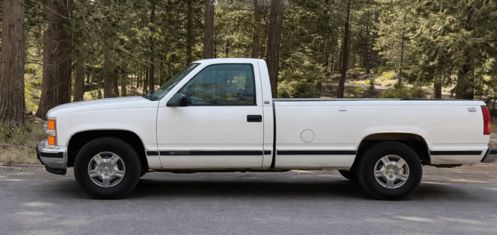

# 20 年 IT 老兵转行“收废品”！200+ 场面试无果

> 转自：CSDN（ID：CSDNnews）

在硅谷，程序员曾经是最不需要为生计发愁的一群人——但对 Roman 来说，这个时代已经结束了。

Roman 的油管 ID 叫“旧金山的程序员”。过去十多年，他一直生活、工作在旧金山，是一名标准意义上的资深程序员：写过多种编程语言、在硅谷大厂待过、GitHub 上有多个千星仓库、有技术积累，也有体面的履历。

他原本以为，哪怕行业放缓，至少“体面地活着”不该是个问题。但现实给了他完全相反的答案。

  

半年 200 多场面试，工作却“消失了”

对 Roman 来说，过去大半年的求职经历，堪称一场无休止的噩梦。他直言：

“说实话，情况已经很明显了：在旧金山、在湾区，乃至整个美国，程序员的工作基本已经‘没了’。”

从 2025 年下半年开始，Roman 为了找到一份靠谱的工作，马不停蹄跑遍各大公司，前前后后参加了 200–300 场面试，涵盖 Python、Java、系统设计、算法题。最极端的一周，他连续参加了 13 场面试。

然而，即便他在面试中能一路通关到最后，得到的却永远是五花八门的拒绝理由：“不好意思，我们暂不录用”，“技术通过了，但我们现在不招人”。

在他的感受里，旧金山的招聘市场并不是“竞争激烈”，而是岗位本身正在消失。面试仍然存在，但招聘不再发生，大量流程更像是“占位”、“建候选池”，甚至只是招聘人员完成 KPI 的手段。

最终，他只找到了一份薪资直接腰斩的工作，收入比上一份工作下滑了 40% 以上，连在旧金山的基本生活都撑不住——而出于家庭和现实原因，他短期内无法离开旧金山。为了维持生活，他每天不得不从存款中拿出 100 美元，用来支付房租、交通和最基本的生活开销。

更让他感到绝望的是，自己的遭遇还并非个例：

● 他认识的一个 PhD 博士，一年只工作了 5 个月便再度失业；

● 还有个程序员朋友，整整一年也没找到任何工作；

● 硅谷的裁员消息更是从未间断，2 万、5 万、10 万，各大科技公司的裁员数字不断刷新。

有人在评论区质疑他：“既然你一周能有这么多面试，说明工作还是有的。”

对此，Roman 的回应非常直白：在美国，这叫 Nothing Burger——看起来像东西，其实什么都没有，“面试不能交房租，不能买食物，也不能替你向房东解释‘我这周面了 13 场’。”

在这种环境下，“继续死等一份 IT 工作”在 Roman 看来，已经变成了一种消耗生命的行为。

  

手握“黄金履历”也没用？从“等招聘”到转行“找活路”

或许有人会问，是不是 Roman 的能力不够？答案恰恰相反，这位 20 年的 IT 老兵，手握的是一份足以让多数程序员羡慕的黄金履历。

早在 2005 年，他就拿下了微软认证应用程序开发专家证书，精通 C#、Python、Java 等多种编程语言，就连当下热门的 Go 语言，他都有高星 GitHub 项目；他的 GitHub 账号坐拥多个千星仓库，Stack Overflow 积分亮眼，还出版过纸质技术书籍，手握专属专利，多次登上技术会议的分享舞台。

在硅谷深耕的十几年里，他先后供职于思科、亚特兰大、SAP 等知名企业，甚至拿到过 Facebook 的 Offer，只因不愿牺牲工作生活平衡，也看透了大厂频繁裁员的现状，才选择放弃。

可就是这样一份履历，在当下的硅谷，却连一份能让他收支平衡的工作都换不来。Roman 坦言，事已至此，这已经不是个人能力的问题了，而是整个就业市场的全面崩塌。

在连续几个月的拉扯之后，Roman 做了一个决定：不再把命运全都押在招聘市场上。他选择了一条硅谷程序员几乎不会考虑的路——没有继续做自己擅长的软件开发，而是一头扎进了废品回收行业，说白了，就是帮个人和公司拉垃圾、收废品，拉到垃圾场赚取服务费。

在 Roman 看来，这不是无奈的选择，而是当下硅谷最实际的求生之道。

  

创业突发“抓马”：凑钱买小卡车，老车半路自燃

他的创业之路，是从一辆二手雪佛兰小卡车开始的，而起步的过程，全程充满了“抓马”的意外。原本计划拿出 5000 美元购置创业用车，可积蓄紧张的他，只能先变卖物品凑了 500 美元当定金，剩下的钱只能等回款到账。

就在他赶往看车的当天，雪上加霜的事发生了：他那辆陪伴多年的 Volkswagen 小巴突然自燃。虽然火势不大，但车辆被迫停用、修车又让他多了一笔意外开销，而这辆车原本已经被他挂出准备出售。“就像它意识到我要卖掉它一样。”Roman 在视频里这样形容。

在一连串混乱之后，Roman 把目光投向了一辆 1997–1998 年的雪佛兰皮卡。跑了13 万多英里，车况良好，发动机声音稳定，最关键的是——货箱够大，完全符合 Roman 的创业需求。

他跑去银行，亲自取出 5000 美元现金，完成交易。从那一刻开始，他正式拥有了一辆属于自己的卡车：从硅谷程序员到废品回收员，他的职业新旅程，就从这辆创业“战车”开始了。

  

废品回收业务正式上线，求网友支招还征名

如今的 Roman，正式给自己定位为 “南旧金山的废品回收大王”，核心业务涵盖各类垃圾、废品的清理和运输：不管是个人家中堆积的闲置杂物、公司的废旧物资，还是路边被丢弃的圣诞树，只要是需要清理的“破烂”，都是他的业务对象。

按他的说法，这是一个在旧金山长期存在、需求稳定、现金流清晰的行业。它不需要面试，不需要 HR，不需要等待审批。只要你肯干，钱就不会“消失”。

为了把这份“新事业”做好，Roman 也做足了准备。他坦言，以前那些常规的广告推广方式现在根本不管用，所以计划打造一波病毒式营销，还公开向网友征集创意——不管是卡车上的创意装饰，还是公司的名字，都欢迎大家在评论区留言，他还会在后续视频中分享自己的营销思路。

不仅如此，Roman 还迫不及待地公布了自己的创业业务电话：650 6501337。同时，他也向旧金山的网友发出了“求助”：急需第一批废品回收客户，只要拍下需要清理的废品照片发给他，这位拥有 20 年 IT 经验的资深程序员，会亲自开着卡车上门装货。

就连行业内的小门道，他也毫不避讳，直言如果有人知道旧金山哪里有废弃的铜线，也可以在评论区告诉他——这份坦率，让他的创业之路多了几分真实和可爱。

  

一边运垃圾，一边还在面试

值得注意的是，Roman 并没有立刻“彻底离开 IT”。

在提车、筹备创业的同时，他的日历里仍然排着面试。那种感觉他形容得很形象：就像驴子前面吊着一根胡萝卜——明知道够不着，但它一直在那儿，而且这根胡萝卜，他已经追了一年。

目前他的手上，还同时运作着多个软件项目：自研的软件正在做冷启动的邮件营销，他还计划花费 3000 美元，在 2026 年的行业展会上租下展位，带着自己开发的程序去试试水，看看能不能谈成合作、卖出软件。

只是 Roman 也清醒地认识到，软件赛道如今也卷得厉害，能不能赚到钱还是未知数。相比之下，废品回收是他当下最核心的创业方向，那辆二手小卡车，承载着他在硅谷活下去的全部希望。

在分享了自己的经历后，Roman 还抛出了三个扎心的问题，不仅是对自己现状的拷问，更是戳中了整个硅谷乃至美国科技行业的痛点：

● 为什么一个经历了 200 场面试的程序员，连“月光但不亏钱”的工作都找不到？

● 当旧金山的程序员耗尽积蓄后，他们会去哪里？

● 官方数据中说“经济一切健康、失业率正常”，那现实中的失业者算什么？

Roman 说，自己从 IT 行业的退出，会是一个循序渐进的过程，他会继续做目前的低薪工作，同时慢慢把精力转移到废品回收业务上。但至于这门生意能不能成功、能赚多少钱、是否只是过渡，目前他也无法给出答案。

但他唯一能确定的是：继续盲目等待招聘市场回暖，比运垃圾更危险。
