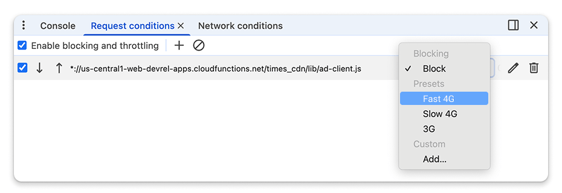
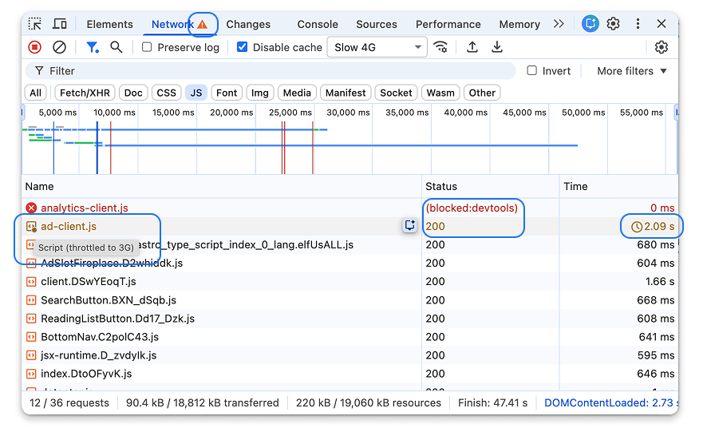
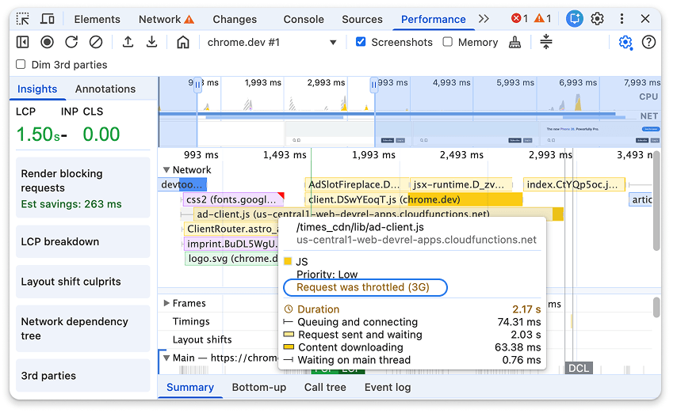

# Chrome 终于可以限制单个网络请求了！

```js_darkmode__1
点击上方 程序员成长指北，关注公众号
回复1，加入高级Node交流群
```
> 测试网站在网络缓慢时的表现一直是性能优化的重要部分。

以前，Chrome DevTools 允许您为**整个会话全局限制网络条件（影响所有请求）**，或完全屏蔽特定请求。不过，在不减慢整个网页速度的情况下，很难测试应用如何处理特定的慢速资源，例如延迟过高的第三方 API 或在慢速连接上加载的大型图片。

这种节流是应用于整个网络的, 这就意味着：

- 所有请求 —— HTML、CSS、JS、图片、字体、API 等 —— 都会一起被减慢。
- 你无法单独隔离某个缓慢的资源。
- 调试诸如“如果只有这个 API 慢会怎样？”这种真实场景问题非常困难。

在现实中，并不是所有资源都会同时变慢，有时仅仅是某个第三方脚本、图片或后端 API 出现慢速问题。

## 有哪些新特性？

从 Chrome 145 开始，开发者工具现在支持**单独请求节流**。给开发者提供了更细粒度的控制。

这意味着你可以：

- 让单次 API 调用变慢
- 只对图片、字体或第三方脚本进行节流
- 对某个 URL 或整个域名应用网络条件
- 保持页面其他部分的加载速度不受影响

此功能将以前位于“网络请求屏蔽”抽屉中的功能移至新的、更全面的请求条件抽屉中。通过**单独请求节流**可仅减慢所请求的资源的速度，而不会减慢整个网站的速度，因此更加精准，并可更快地进行调试。

## 在 DevTools 中如何使用

### 限制或屏蔽请求

使用这个功能很简单，打开 Chrome DevTools → 网络（Network）标签页，重新加载页面以捕获网络请求， 然后右键点击任意一个请求，选择 “Throttle request（节流请求）”。 选择要节流的是：

- 该特定请求
- 同一域名下的所有请求

应用现有的预设（例如 Slow 3G），或定义自定义网络条件。 一旦应用，节流的请求在网络面板中会有明显标记，这样你可以轻松看到哪些请求受到了影响。具体也可看视频操作：

> 注意： 修改请求时，“网络”面板标签页上会显示警告图标。将鼠标悬停在此图标上时，系统会提醒您“请求受到限制”。网络轨道中的性能面板中也会显示相同的注释。

### 请求条件抽屉

在新的**请求条件**抽屉式菜单中，您可以控制哪些请求会受到影响以及减速的程度。



您可以通过选择标准预设（例如“慢速 3G”）或您自己的自定义配置文件来自定义节流设置，并使用通配符 (\*) 编辑网址模式，以将这些条件应用于特定的动态资源或请求组。

如果请求与多个模式匹配，开发者工具会应用找到的第一条规则。您可以使用抽屉中的箭头按钮将高优先级规则移至列表顶部，从而控制此优先级。

## 了解哪些请求会被限制或阻止

务必要区分自然缓慢的请求和被开发者工具人为限制的请求。当您重新加载页面时，系统会应用新的节流规则。您可以在“网络”面板中轻松找到受影响的请求：

- 被屏蔽的请求以红色显示，状态列中的状态为 (blocked:devtools)。
- 受到限制的请求会以黄色或金色显示，并且“时间”列中会显示时钟图标。您可以将鼠标悬停在该图标上，查看具体应用了哪种网络状况。此信息也会显示在“时间”子面板中。



限制请求可能会影响网页的性能。在记录性能配置文件时，您可以将鼠标悬停在“网络”轨道中的请求上，以查看详细说明所应用的网络条件的提示。



Node 社群
