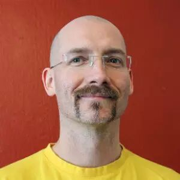
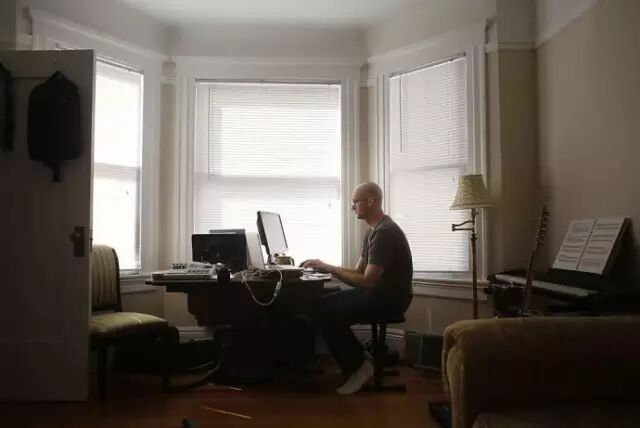
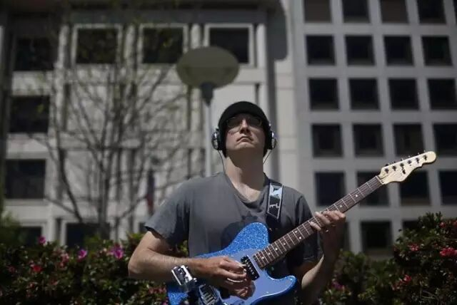

# 程序员如何保持身体健康？

看到[那个程序员猝死的新闻](https://mp.weixin.qq.com/s?__biz=MzAxODE2MjM1MA==&mid=2651623934&idx=1&sn=150f3bed2490cae0d96ce79c1a88a71d&scene=21#wechat_redirect)后，重新推一下这篇文章，接近一万字。大家可以先收藏，有空再细看。

【导读】：本文要讨论的健康问题，其实并不仅仅限于程序员，其他那些需要长期坐在电脑前的工作，比如：网络编辑、网站管理员、IT 从业人员等，也会面临同样的健康问题。除了指出这些健康问题，本文还给出了相应建议。

Zed Shaw：程序员、吉他手、作家，《笨方法学 Python》的作者。 

（Zed Shaw ）

我发现很多程序员都认为敲代码对他们的身体健康貌似没什么影响。我真的非常希望，大家能对程序员面临的健康问题引起重视并从中获益，至少不要像我和其他一些人一样，身体犯了毛病才去后悔。这个话题我应该不会写到我的书里，因为要展开的话内容太多。但是我会在这里写一个“简短版”。你可以对号入座看看自己的情况，也可以参考一下我引用的的那些资料。

### 我的背景和专业

我曾经当过兵，并练习过多种武术。最近，我不太痴迷于那些“硬武术”了，但是对于瑜伽，冥想等这些简单的身体活动还是很喜欢的。我的身体非常健美，并且能做到保持，这要感谢我长期以来养成的习惯。首先我还是快速列举一下我学过的武术项目吧：忍术、合气道（一种日本武术技艺——译者注）、柔道、巴西柔术、泰拳、翼宗拳、卡泼卫勒（一种巴西自卫术——译者注）、菲律宾魔杖术，上述的这些武术并不是按照系统训练一样连续学习的。而我一直坚持训练的武术只有泰拳，大约持续了6年。其他的大概也就是各自学了个一到两年的样子。

我去过很多地方，也从中学到了很多东西。并且，我在军队服役的时候，大约有连续两年的时间，我的身体受到了严格的考验。如果我记得没错的话，在军队里的训练每次会持续2到4小时，除此之外别无他事。以至于后来，即使处于休假状态，我也会保持体重，敏捷性和身体力量。我可能没法告诉你该怎么减肥。因为我生来就不需要减肥。所以在参考我的建议时，你一定要结合自身的情况。在了解我的身体状况以后，随着年龄的增长，我开始在身体柔韧性上下功夫。游泳、舞蹈以及一切避免直接身体冲撞的运动都是我推荐的。我尤其推荐普拉提，瑜伽，这些运动往往被众人认为很难，但实际上并不是如此。我还对我的手下了很多功夫，一会儿我就会说这个事情。

写了这么多，是为了让读者了解我的能力。但是更重要的是，在做到我上面说的这些的同时，我还是一个职业程序员。在我从军队退役以后，我平均每天学习 8~16 小时。此外我还弹吉他，并且我避免了腕管综合征和重复性劳动损伤的危害。我希望我在健康方面的经验能够帮助你恢复或者维持你的健康。

# 程序员面临的普遍问题

程序员是一种在劳损方面欺骗性很强的职业，部分因为是这个职业看上去只是坐在那里，什么体力也没有消耗，并且很多程序员对他们的身体情况也毫不重视。不过你真的应该留意一下健康问题，因为如果你身体非常棒，那么在心理方面你也会非常和谐，进而你就可以把精力放在更重要的事情上。否则你还要去担心那些恼人的健康问题，这是非常不爽的。

很显然，“注意饮食”、”多去户外”、”注意运动”这些老生常谈的东西肯定是正确的。所以这里我不跟你谈吃、运动或者练武术能保持健康什么的。如果你对运动或者武术感兴趣，你可以去找专业的教练来指导你。

我真正想说的是，因自身职业原因，程序员可能面临的那些健康问题。这些问题的成因都非常简单明显，稍加注意根本就不会发生，不过程序员们却并没意识到这一点。

- 因重复性劳损导致的手腕疼痛
- 因长期盯着滚动的屏幕造成的眼部问题
- 因为坐姿不对（尤其是背部太低或者肩膀太高）造成的背部问题
- 因为该去厕所的时候不去造成的肠道和泌尿系统问题
- 因为喝水不够或者喝了太多咖啡而造成的脱水问题
- 因为久坐而造成的痔疮或者前列腺问题。是的，我也面临这个问题。
- 因为接触阳光不足造成的缺乏维生素D
- 因熬夜或者喝太多咖啡造成的睡眠失调
- 因缺乏伸展而造成的身体僵硬或酸痛

我也曾经在一段时间内面临过上述的各种健康问题，因为我的程序员工作，弹吉他以及不太科学的举重锻炼。后来我解决了大多数的健康问题，并保证以后不会再犯，只有少数几个问题需要周期性地解决。也许你觉得这些健康问题很愚蠢，不过相信我，即使你没有，很多程序员也会面临这些问题的困扰。

__

_（Zed Shaw ）_

# 主要原因：

总的来说，这些健康问题的成因可以归结为对于编程的“着魔”。如果你想要成为优秀的程序员，就像我想要的那样，你就要排除其他一切干扰去掌握编程技术。这样即使你编程10个小时也不会想到要去洗澡，你也不会按时吃饭，这些行为模式都源自于你对“成为真正程序员”的疯狂信仰。

实际情况是，真正的程序员其实和啥子没什么区别。你不按时吃饭，甚至连定期啪啪啪都做不到。你跑两步就开始喘。你的体内器官出现问题，但却并不是因为疾病。说实话，为了成为一个优秀程序员而把自己弄垮，可不是什么值得的事情。

所以，当你了解到我是如何解决这些健康问题的时候，记住最重要的是要在生活和编程、工作之间保持平衡。相信我，如果你能放松心态保持健康，你在编程方面甚至能做到更好。

# 手腕疼痛

这个问题大概是我最常见的一个健康问题。因为我既是程序员又是吉他手，我经常弹吉他并且弹奏的时间很长。从22岁我成为程序员开始，我就周期性地遭受手腕疼痛的困扰。不过我通过合气道练习来有效地治疗手腕疼痛。

如你所知，合气道技术中有很多神奇的手腕练习动作，比如拉伸、撕扯、反向关节技等等，能让你的手腕变得既强壮又柔韧。

我就是通过这些练习来修复关节错位和疼痛问题，并且靠这种练习做到了长时间编程且不造成手腕劳损。我唯一一次遇到问题是因为我换了个新键盘，新键盘的按键布局非常怪异，所以造成我打字以后手腕很疼。但是通过一周的手腕练习以后，我的手腕就又变得很强壮了，问题迎刃而解。

当然，如果你现在患有严重的腕管综合症或者其他类型的重复性劳损症，在尝试自主练习恢复之前还是要咨询一下医生。如果你已经开始自我恢复练习了，那么注意要慢慢来，不要伤到自己。拉伸动作太大造成伤害就不好了，拉伸只要做到“稍微不适”的程度即可。如果你真的把自己拉伤了，那么就不要这么做了。

其实每次拉伸对你来说就是一种“放松”。这很难用语言解释，你把关节强制掰到某个位置，其实是让关节能够到达这个位置然后放松，或者说是能让你关节的活动范围更多一点点。

下面就向你解释了在你久坐打字之前如何去开展这些练习：

1. 首先，你要做一下热身，把你的双手放在身体前部，然后快速地做抓空气的动作，重复20次，越快越好。然后抖抖手腕放松一下，接着转动你的手腕，正向和反向各10次。
2. 挑一个你最擅长的练习模式作为开始，然后用中等速度做5-10组。
3. 继续做其余的练习，每做完一个练习就抖抖手和胳膊，转动手腕，让关节重新复位。因为这些练习都是涉及到关节的，所以每组做完了以后让关节复位很重要。
4. 一定不要给你的手腕施加太大的压力。练习就做到刚刚让关节感觉到变化并放松即可。传说中的“练得越狠收获越大”只会让你受伤。

每次你开始打字之前都要做运动，每天都要坚持，不过中途随时可以停下来。这些运动不会占据你很多时间，一开始可能有点不适，但是很快你的手腕就开始适应这种“复位”锻炼了，然后你的感觉就会好很多。

有件事情要再强调一次：**开始锻炼之前先咨询医生**。擅自开始进行锻炼是存在风险的，所以如果你自己把自己弄伤了可不要怪我没提醒你啊。这些练习在千年的武术套路中已经不断加以实践了，所以我知道它们是安全的，不过“安全”这个概念因人而异。如果你做得不对，真的可能会伤到自己。所以先跟你的医生谈谈，然后再考虑开始练习的事情。

## 吉他手的情况更糟：

如果说程序员都会因为职业原因而患上腕管综合症的话，那么吉他手和贝斯手的情况就更加糟糕了。对很多人来说，一些大腕音乐家声称自己“每天练琴8小时”，“每天练琴16小时”，这让人感到神秘。因为这种负荷的练习会让这些大牌吉他手严重损伤自己的健康，甚至可能让他们以后永远都没法再弹琴了。

（Zed Shaw ）

吉他对你的手来说真是要求很高的乐器，所以你的手只要有一点点疼痛就能让你弹不了吉他。我是在学校里明白这个道理的，当然我当时是个白痴什么都不懂，我相信我的导师告诉我的话，每天弹8小时。我就照着字面的意思，每天连续弹8小时，结果是一个月下来，我的手快废了。

我的大拇指长出故此，其他的手指也基本没法看了。我的手腕僵硬，手指也不能灵活运动了。我当时就是不听劝告，其实任何新事物都应该循序渐进的，就像健身一样。

我花了一年半的时间来恢复，其间做了如下的事情：

1. 找了一把合适的吉他，不伤手的。“什么吉他都一样，没区别”这种观念简直是屁话。你需要找一把不会伤你手的吉他。
2. 做上一节提到的各种联系，尤其是针对手指部分的。
3. 通过一套练习来慢慢增加我的手指和大拇指的力量以及柔韧性。
4. 坚持专注于用更放松的方式来演奏，这样我的按弦动作就会更轻。
5. 注意手腕弯曲程度，避免受伤。
6. 改变演奏姿势，使得我在快速的演奏中不用紧握吉他，让我的按弦手的大拇指在琴颈背后的位置更加舒服。
7. 调整吉他的高度，使得肩膀和手在拿吉他演奏时更加舒适。
8. 坚持站立演奏，尽量减少坐着演奏的时间，因为坐着演奏的姿势很奇怪。如果一定要坐着演奏，那么要经常更换坐姿。

做出这些调整后，去年我的手终于感觉好了很多，然后恢复了，不过为了不让我自己再受伤，我也有不少损失。我是个老家伙了，这些保护措施对我来说很重要，但是也意味着那些可能伤到手的事情，我再也不能做了。

我的手就是我的生命，这意味着拳击、卡泼卫勒，还有那些其他我感兴趣的武术都不能再做了。我可不能让我的手浪费在击打沙袋这种活动上。

# 眼疲劳：

我想这对我来说并不是什么大问题，但是读者则需要时刻注意自己的视力。我年轻的时候视力测验是20分满分，但是这么多年来盯着电脑让我的视力有了“些许下降”。我有一副轻度视力矫正眼睛，这些天我一直戴着，哪怕有时候我不需要很仔细看东西的时候我也戴着。对于我来说，世界稍微有一点模糊都是很烦人的。

早年的时候，大家还整天在用CRT显示器，老显示器的闪烁废了很多人的视力。那时候也有液晶显示器，但是对字体的渲染效果非常糟糕。感谢苹果的专利（我觉得是苹果的专利）让电脑能够在液晶显示器上正常渲染字体。当然还是有很多人认为苹果的字体渲染看上去有点“模糊”，如果是这样的话，那只能说你没能体验到我对字体渲染改进的欣喜。

我的情况是，我每天花两小时时间，完全不看电脑。取而代之的是我用这些时间来做一些完全不用眼的事情，比如弹吉他，或者出去散个步什么的。这些事情我一次可能做不满2小时，但是我保证我每天离开电脑至少达到2小时。

这种做法对缓解头疼很有效。程序员经常抱怨说屋子里的灯光是导致头疼的原因，但实际上，错误的字体，屏幕上糟糕的字体，喝水不够以及长时间坐在电脑前面不运动，才是导致头疼的真正原因。

如果真的在意灯光的因素，那么与其去做一些极端的事情（有的程序员真的把办公室里的所有灯都关了），还不如调整一下屋里的采光，以及把你的桌面主题调节成适合显示器型号和屋内光线的模式。合理调配屋内的光线，显示器亮度，显示质量，字体以及桌面主题颜色，会让你的感觉好很多。

但最重要的是，一定要按时休息。

# 背部问题：

我真的非常幸运，大部分的时间里我的背部都很健康。甚至是在我久坐在椅子的那部分时间里，我的背部都很强壮而且柔韧性很好。

对我来说，问题在于背的上半部，脖颈以及肩膀。我习惯支起键盘，促使我的身体坐直。实际上在我开始打字的时候我注意到我并没有坐得很直，所以我需要迫使自己改正。

现在看来，对椅子的选择很重要，我比较推荐 Aeron 办公椅，板凳或者长凳那种。我现在很喜欢我的40美元的钢琴凳，我练习钢琴的时候就用它。凳子没有靠背，所以我必须让自己坐直，这就会用到我的核心肌肉（腹肌和背部肌肉）。

我的肩膀一直比较紧张。在我注意力很集中的时候，我的肩膀处于缩紧的状态，导致我的整个上背部产生疼痛，并通过神经一直向上传导到我的脖子和头。如果我练习吉他的时间过长，这个问题会变得非常严重。

然后我找到的最有用的办法是上肢伸展运动和俯卧撑。上肢运动的做法是，抓住门框，然后把一直手臂或者两只手臂朝一个不同的方向拉。如果你的手臂僵硬，你可以尝试如下的动作：

1. 用一直手抓住门框，手掌面向自己，然后把肩部往外拉，这样就可以拉伸你的胸部以及你肩部的前侧。
2. 用一只手抓住门框，让你的手臂与身体交叉（请自行脑补姿势——译者注），保持手掌朝向身体（某种反向的姿势），然后拉动肩膀，使得肩膀的背侧得到拉伸。
3. 双手从前方拉住位于头上的门框，然后离门稍微远一些，使得你的身体能够向下倾斜，并能做出拉动手臂和向后的动作。

如果做了这组动作，并且完成肩部扭动和身体放松，你的感觉就会好很多。这套动作也可以在你每天上班之前和手腕练习一起做。

另一种有效的锻炼方法就是做俯卧撑。但是我在开始工作之前是不会做俯卧撑的，因为这个运动太消耗体力，对工作不利。我是在晚上睡觉之前做10个俯卧撑。只要10个就足够锻炼你的胸部，背部，手腕和颈部了。做的时候不要太快，慢慢做，要注意保持身体平衡。

# 脱水：

这个问题很简单，但是我自己却常常犯。我每天要喝一吨咖啡，为此我必须要喝很多水来平衡喝咖啡的脱水效应。如果不这么做的话，可能就会造成头疼，或者其他什么问题。脱水的问题在于，如果感觉不到不舒服，你就不会引起重视，但是一旦感觉到了不舒服，往往问题已经很严重了。

我的建议是，并且我已经在这么做了，无论你喝什么饮料（只要不是水），喝一瓶饮料就喝同样量的一瓶水来平衡。我还建议你少喝碳酸饮料。这些碳酸饮料里面放了很多恶心的假糖，只会让你变胖和得糖尿病，并且对缓解脱水一点帮助都没有。能喝点儿黑咖啡当然是好的，但是记得也要喝些水来平衡。

# 肠道和泌尿系统问题：

好吧，这个话题要是细说就太恶心了，所以我就不细说了。但是我要强调的是：

该上厕所的时候就赶快去！别憋着。

你可能不相信这个建议多重要，我在年轻的时候经常听人这么跟我讲。因为我像“真正的程序员”一样，在编程的时候不喜欢被打断，所以我一般能憋多久就憋多久。但是这么做的坏处是，因为肠蠕动的原因，一会儿你就失去了上厕所的感觉了，但是你的便便累积了下来。

这最终会导致便秘，并影响你的健康。对于泌尿系统来说，憋尿的危害也许没有便秘那么大，但是也会造成尿道感染或者其他一些你意想不到的毛病。

所以如果你已经深受憋着不上厕所的危害，那么你要做的就是多吃点儿纤维片，然后请两天假待在家里，因为你会经常跑厕所的。

然后，当你有感觉时，赶快去！我跟你说，也许你在上厕所的时候能想出什么值好几百万的点子呢。

# 痔疮和前列腺的问题：

如果你该上厕所的时候憋着不去，那么还可能造成的一个问题就是你可能会得痔疮。是的，这个词儿听上去很恶心，我保证我以后不再提这么恶心的东西了。但是，很多程序员对这个问题羞于启齿，那么就让我来跟你们说明这个事情吧。下列不好的习惯其实我做过一次到两次：

1. 久坐
2. 搬运重物，但没有使用合适的工具
3. 该去上厕所的时候不去
4. 不想上厕所的时候强迫自己上厕所
5. 最糟糕的是：长时间坐在马桶上看书 （补注：长时间坐马桶玩手机更要注意）

我跟你们说，最后一个才是真正的大杀器。如果不是必要，那么就不要在马桶上久坐。因为这样会让你身体的重量和肠道的重量都施加到你的直肠上了，要知道你的直肠本身就很有压力了。很恶心是不。而且此时你的血管是处于不自然状态的，血压会上升，所以会导致痔疮。

这些事情不但听上去恶心，而且潜在的危险也很大。是的，你很可能会因此得痔疮，严重的话会造成各种出血现象。如果得了痔疮，那么请立刻去看医生。如果需要手术，那么马上就做。我虽然没得过痔疮，但是也就差一点儿而已。有一年的时间，我在减体重，工作环境是仓库，而且我长时间编程，并且不及时去上厕所。

是的，我那个时候很傻。所以不要再犯我以前犯过的错误了。确保做到以下三件事情，这样能让你的屁股周边保持健康：

1. 多吃蔬菜，如果你不爱吃蔬菜，至少要吃点儿纤维片；
2. 该去厕所就去厕所，别憋着；
3. 不要给自己太大的压力。

在这些方面不注意的话，你可能会得前列腺方面的疾病，这类疾病多少都和久坐有关。所以能站起来走走就起来走走，多休息休息，就能解决这类问题。如果你发现你尿液里有血，那么说明问题比较严重了，应该马上去看医生。如果你尿频，也应该去看医生。

# 缺乏维生素D：

维生素D是一种奇怪的东西。你晒会儿太阳就能得到维生素D，而且不用晒多长时间。根据阳光的强度，大约晒太阳5-30分钟即可。这同时依赖于你体内的钙含量以及磷酸盐的缺乏程度。如果你饮食规律，并且不常吃像薯片这样的垃圾食品的话，那么问题不会很大。

有的时候，你可能会情绪低落，牙齿不好，身上哪儿都疼（例如胳膊上的骨头疼），肌肉紧张等等，总的来说就是身体不爽。这个时候你可以选择去看医生，不过可能出去晒个30分钟的太阳也能解决问题。

实际上，我认为这些问题可能是硅谷这些创业公司提供的饮食服务造成的。因为有了这些，你就会长期待在办公室里，根本不愁没有吃的。然后办公室里面的灯光又比较暗，所以阳光很强的时候你也不愿意外出。再加上可能存在的不良的睡眠习惯，你很可能就缺乏维生素D了，而且还毫不自知。

所以你要做的就是，不要去贪中午公司给提供的饮食，出门去买食物，顺便走走路，晒晒太阳，这种方式给你带来的好处可比你想象的要大。而且，外面的食物也不错哦。

我住在温哥华和西雅图的时候，有轻微的维生素D不足的情况。因为这两个地方一年四季没几天能看见太阳，对我来说简直太糟糕了。有些人能忍受这种气候，但是对于我这种从小在热带海岛气候长大的人来说，这种气候简直就像是谋杀。

所以，如果你能晒到太阳，那就快去晒吧。

# 睡眠紊乱：

我的睡眠习惯一直都不是很固定，总的来说要根据季节和我在的区域来决定。在有些地方我就习惯于在晚上做事，晚睡晚起。后来我搬到旧金山以后，我就养成了早起的习惯，晚上也不熬夜了，所以最近一段时间我感觉健康多了。

不过有的时候，我也不知道为什么，我就是觉得在晚上或者天快亮的时候做事比较有效率，无论是写代码还是做音乐都是如此。我认为很可能是因为我的大脑在这些时候比较累，所以反而比较放松。还有一个可能的原因就是这些时间比较安静，所以我就能坚持做我要做的事情，减少干扰。

无论采用什么方式，早起而晚睡这件事情对睡眠肯定是不利的。我发现随着年龄的增大，我更倾向于早起了。我觉得我在一天中清醒的时间越来越长。如果我睡得特别晚，或者喝大了的话，第二天起来都会头疼。

如果你有睡眠方面的问题，那么我有一个非常简单的冥想法推荐，我自己用这个方法有几年的时间了，能够帮助你解决问题。这需要一点耐心，但是非常有效，而且见效很快。

首先，选一个你能买得起的最贵的床。2000美元的床基本就是刚起步的水平。我花了2200美元去买了一个Tempur-Pedic的床。真是物有所值啊。

现在你有了很好的床了，然后你就可以开始练习如何让自己睡着了。下面就是一个如何让自我催眠的好办法：

1. 关掉屋里所有的灯，让一切静音
2. 平躺，把手放在你身上舒服的位置，或放在身侧
3. 慢速深呼吸并吐气，并想象你能看见你呼吸的气流
4. 一旦你开始成功想象自己的呼吸，然后开始想象你能看透窗户，窗外是大片开阔的星空
5. 呼吸中，想象你自己漂浮起来，慢慢穿过窗户，然后飘入到星空当中，
6. 让这种状态持续，让周围的环境飘入你的床前，再飘出，直到一切都消失

这样，你大概在步骤4或者5的时候就能睡着了，如果还没有的话，那么让自己继续飘着融入环境直到你睡着了为止。

如果你患有严重失眠的话，那么上面的方法就不适合你了，尽快去看医生吧，或者你可以疯狂健身1到2小时。健身绝对能够帮助你入睡。

# 身体僵硬和柔韧性问题：

如果你长期觉得身体“僵硬”或者在运动方面不够理想，那么很可能需要做一些日常拉伸运动来改善。最好的办法是一周做一次瑜伽，然后平时再做一些其他的练习。如果你做不到这一点，那么就按照一些书上介绍的基本的拉伸知识来做吧，图书馆或者书店里都有这类书的。只需要最简单的那种书就可以，并不需要搞得太复杂。

我觉得如果你能在晚上睡觉前做 5-6 组比较大幅度的伸展运动，就会对你放松身体有很大帮助，你也能在健康和自我感觉方面得到很大的改善。

身体上的拉伸也能放松你的精神，做一做瑜伽，或者做30分钟拉伸运动，再去洗个晨澡，是帮助自己提升创造力，促进大脑运动的好办法。如果还能结合冥想一起锻炼，那么你会发现你的精神适应能力会得到显著的改善，并能做到很多以前做不到的事情。

我不清楚其中的原理，但放松自己的精神，确实有助于提升创造性以及激发创意。

# 千里之行，始于足下：

本文可能对于一个人来说包含了太多的内容，说真心话是希望您的身体完全健康，一条都不用参照的。不过如果您没有这些问题，我还是建议您可以尝试一下这些方法，出于预防的目的。如果你已经决定开始尝试，那么您需要采用一种简单的“编码热身”的方法，就像你在写代码之前做的那样。

下面的这些事情，是我在我写代码，弹吉他之前，或者身体僵硬需要运动之前做的：

1. 转动所有关节，手腕，手臂，脖子，背部以及胯部，每个关节画几个小圈，正向5次，反向5次
2. 做少量几组腕部练习，每组间抖手腕放松
3. 把手臂伸向头部上方进行拉伸，举得越高越好，然后向后拉伸，拉伸越大越好，然后在身体前方做手臂交叉拉伸
4. 最后，用手做头部的拉伸，把头拉向右、左、前、后，动作要小心，幅度要小。

如果你能做到这些，那么你就可以避免很多程序员面临的健康问题。因为编程并不是什么重体力活，所以很多健康问题其实是可以自己避免的，而你要做的就是做上述的那些练习。

不过，如果你有特定的健康问题，那么你需要咨询你的理疗师，如果理疗师说没什么大碍，你也可以听听其他人的建议。我在这里所说的一切方法都是不是什么极端或者古怪的东西，都是些基本的运动练习，也符合常识，所以对于医生来说，这些做法应该是没问题的。不过我可不想被人起诉说是在让人误入歧途，所以我强调过了，一切要先问问再做。

希望这篇文章的内容对你有用，如果没有用的话，那么记住我的建议是要先问问医生再做，以免你被我误导。如果幸运的话，你可能并不存在任何健康问题，但是在我看来，基本上每个程序员都多多少少地有我提到的各种问题。

所以，一定要自己保重身体。
