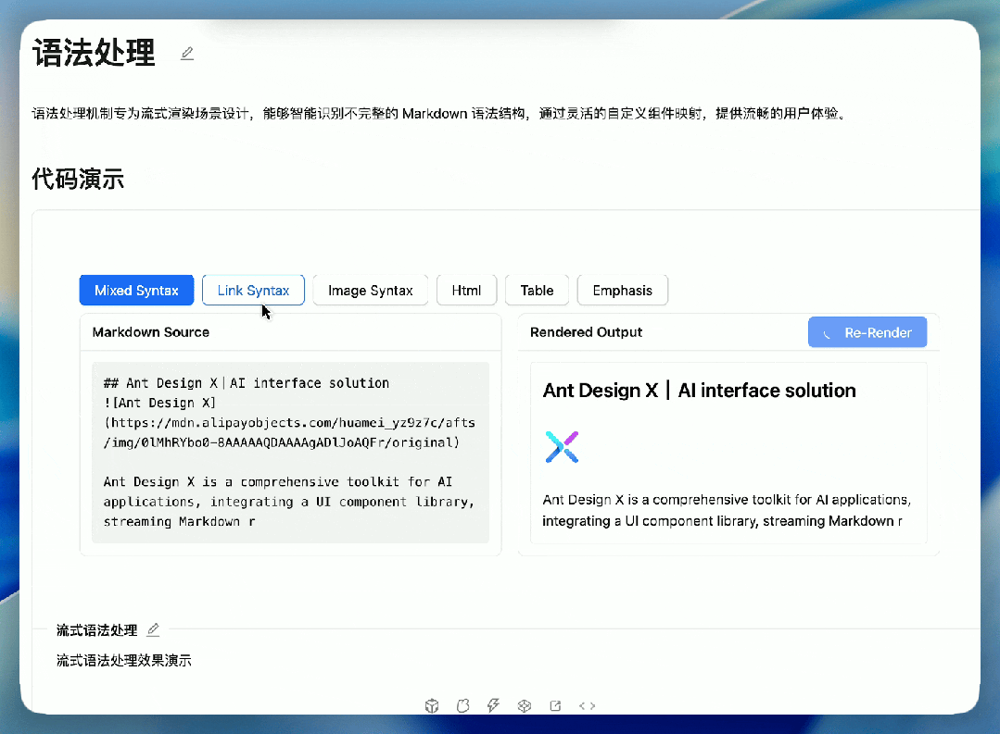
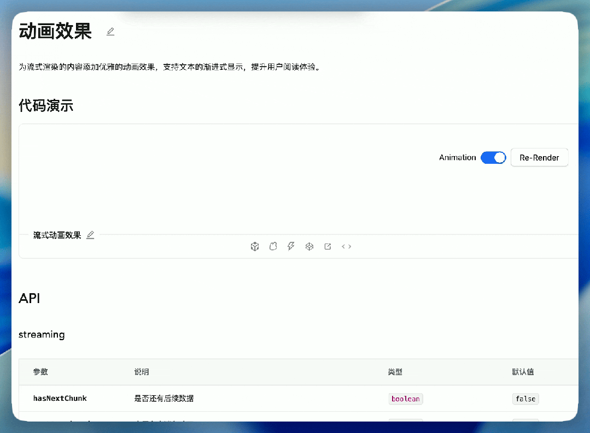
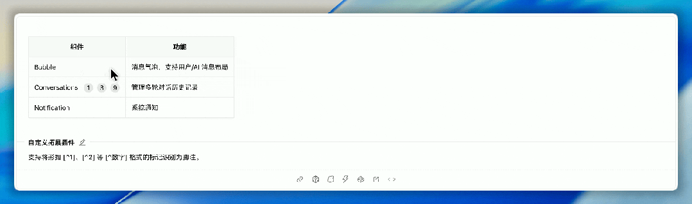
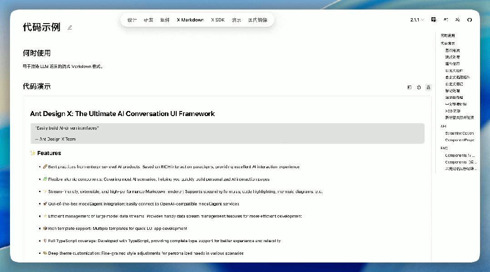
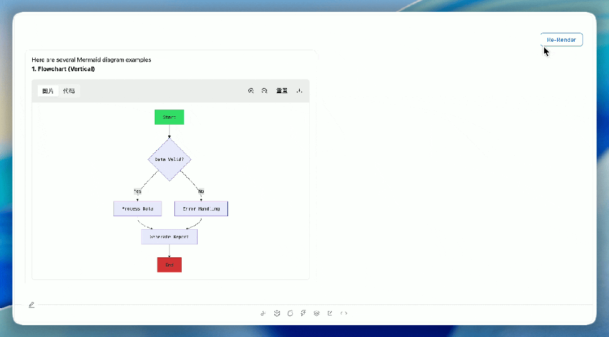
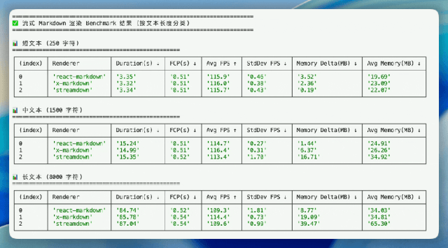

# Ant Design 发布 Markdown 渲染器 X-Markdown

Markdown\[1\] 因轻量级、对 LLM 友好\[2\] 等特性被广泛使用。现有 Markdown 渲染器存在性能差、公式/Mermaid 等插件兼容性差、流式不友好等痛点。

X-Markdown 是专为 **AI 流式对话**打造的 Markdown 渲染器，是 Ant Design\[3\] 官方解决方案。`npm i @ant-design/x-markdown`——即可获得一套**高性能、流式友好、插件开箱即用；并支持通过拓展 Markdown 元素实现丰富的生成式表达效果**的渲染方案。

- 官网地址：https://x.ant.design/x-markdowns/introduce-cn
- GitHub 地址：https://github.com/ant-design/x


# 核心特性一览

## ✨ 流式友好，专为 AI 打字机式输出优化

- 通过**缓存与智能补全**机制，对流式返回的不完整 Token 实现无闪烁的增量追加渲染。
- 渲染过程**零闪烁、无回流**，保障丝滑用户体验；
- 兼容全量渲染，无缝切换使用场景。





## 🎨 极致可定制

- 支持**自定义组件替换任意 Markdown 元素**（如用 `<CustomH2>` 替代 `## 标题`）；
- 提供**主题系统**，轻松适配暗色/亮色模式或品牌风格；
- 插件化架构，灵活扩展功能。





## 🔐 默认安全，杜绝 XSS 风险

- 不使用`dangerouslySetInnerHTML`，从根本上规避 XSS 攻击；
- 所有 HTML 输出均通过 `DOMPurify` 进行安全过滤。

## 🔌 丰富插件生态

开箱即用支持：

- **LaTeX 数学公式**（基于 KaTeX）
- **代码高亮**（集成 highlight.js）
- **Mermaid 图表**（流程图、时序图、甘特图等）
- 自定义插件机制，满足业务专属需求



## ⚡ 高性能 & 轻量级

- 基于 `marked` 构建，继承其高性能与标准兼容性；
- **低延迟编译器**，无需长时间缓存或阻塞主线程；
- 体积轻量，却完整支持 CommonMark 与 GitHub Flavored Markdown（GFM）。



> ### 实验环境
> 
> - **硬件平台**：Apple M3 Pro（18GB 内存），macOS 15.5
> - **测试框架**：Playwright\[4\] 自动化测试工具
> - **测试方法**：对每款渲染器执行 5 次独立渲染任务，取关键指标均值以降低随机波动影响
> - **测试内容**：包含表格、LaTeX 公式、代码块等常见结构的 Markdown 文本，按文本长度分为三类：
> 
> - 短文本（250 字符）
> - 中文本（1,500 字符）
> - 长文本（8,000 字符）

> ### 实验结论
> 
> 1. **X-Markdown 在平均帧率（Avg FPS）方面表现最优**，尤其在中长文本场景下显著领先于其他方案，表明其具备更强的**渲染流畅性与响应能力**。
> 2. **FCP 时间基本持平**，说明各方案在首次内容呈现速度上差异较小，用户体验启动感知相近。
> 3. **内存效率对比明显**：
> 
> - X-Markdown 的内存增量控制优于 streamdown，在长文本场景下仅增加约 19MB，而 streamdown 达到 39MB；
> - 表明 X-Markdown 在资源管理上更具优势，适合长时间运行或高负载 AI 应用场景。
> 
> 5. **稳定性表现优异**：X-Markdown 的帧率标准差普遍低于竞品，说明其渲染过程更稳定，抗抖动能力强。


# 快速上手示例

```
import React from 'react';
import { XMarkdown } from '@ant-design/x-markdown';

const content = `Hello World，欢迎使用 **XMarkdown**！`;

const App = () => <XMarkdown content={content} />;

export default App;
```
更多使用方式\[5\]


# 开源共建，赋能 AI 应用生态

X-Markdown 现正式开源，诚邀社区共建：

- **开发者**：体验、反馈、提交 Issue 或 PR；
- **企业团队**：将 X-Markdown 应用于实际项目，推动标准落地；
- **AI 应用构建者**：用它解决 Markdown 渲染性能与体验瓶颈。


# 加入我们

如果你正在开发 React 或 Ant Design 生态下的 AI 应用，  
如果你正面临 Markdown 渲染的性能、安全或交互难题，  
**X-Markdown 或许正是你需要的那一块拼图。**

🌟 欢迎 Star、Fork、提交 Issue 与 PR！  
💬 有任何疑问？欢迎在 GitHub Discussions\[6\] 提问。

让我们一起，为 **AI + 富文本** 的未来，打造更流畅、更强大、更安全的内容呈现方式！

- 官网文档：https://x.ant.design/x-markdowns/introduce-cn
- GitHub 仓库：https://github.com/ant-design/x
- 开源协议：MIT License

### 参考资料

\[1\] 

Markdown: _https://developer.webex.com/blog/boosting-ai-performance-the-power-of-llm-friendly-content-in-markdown_

\[2\] 

LLM 友好: _https://community.openai.com/t/markdown-is-15-more-token-efficient-than-json/841742/6_

\[3\] 

Ant Design: _https://x.ant.design/x-markdowns/introduce-cn/_

\[4\] 

Playwright: _https://www.npmjs.com/package/@playwright/experimental-ct-react_

\[5\] 

更多使用方式: _https://x.ant.design/x-markdowns/introduce-cn_

\[6\] 

GitHub Discussions: _https://github.com/ant-design/x/discussions_
