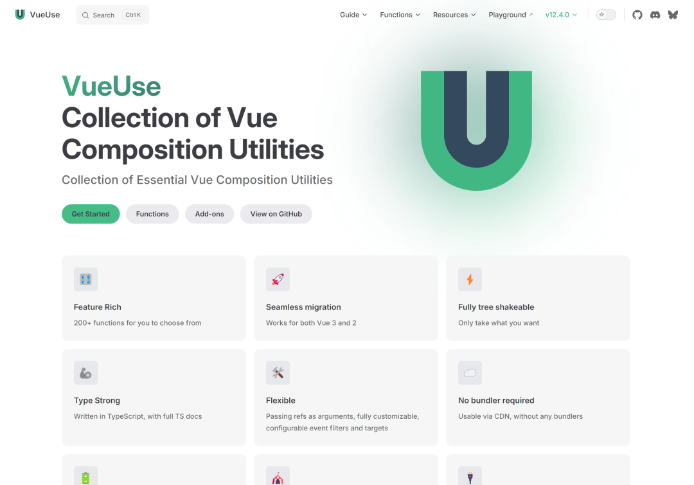
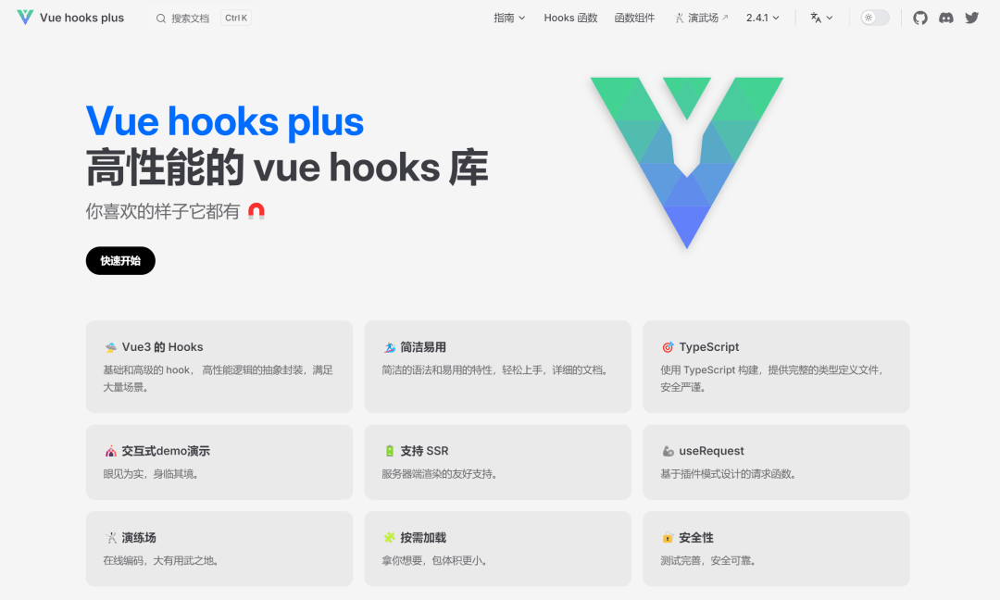
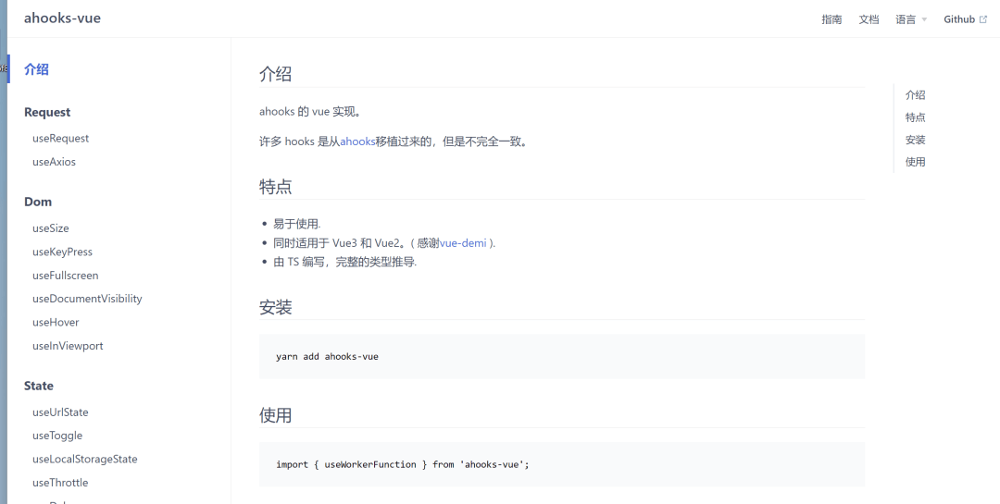
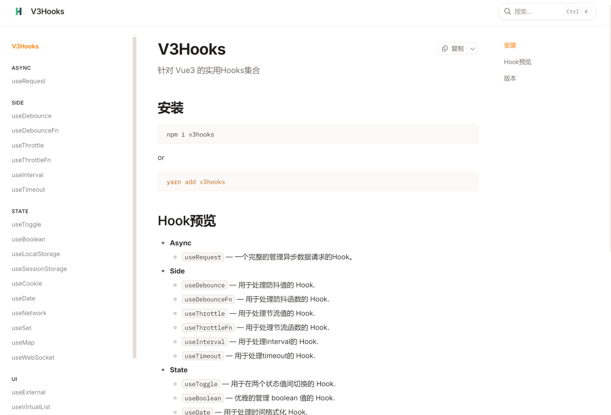
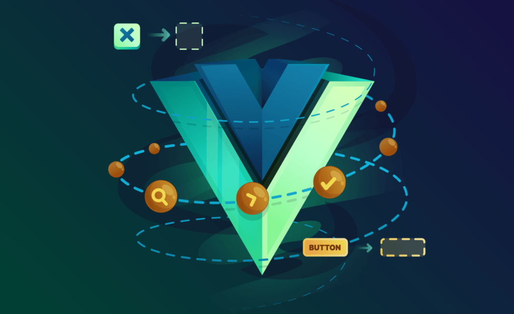

# 效率封神！Vue3这4个高性能Hooks库，直接抄作业

## 🛠️ VueUse：200+官方级工具



### 定位

**一站式工具型Hooks神器**，将浏览器API、DOM监听、动画控制、传感器调用等高频能力，封装成开箱即用的响应式函数。

### 明星能力


| 类别 | 典型 Hook | 一句话卖点 |
| --- | --- | --- |
| 性能防抖 | useDebounce / useThrottle | 输入框防抖500ms，零手写冗余代码 |
| 本地存储 | useLocalStorage / useSessionStorage | 读写自动同步，页面刷新状态不丢失 |
| 剪切板 | useClipboard | 一键复制，权限状态自动监听 |
| 标题/页签 | useTitle / useFavicon | 路由切换，标题图标自动更新 |
| 尺寸监听 | useResizeObserver / useElementSize | 元素尺寸变化，秒级触发回调 |
| 暗色模式 | useDark / useToggle | 一键切换主题，自动持久化到本地 |
| 传感器 | useMouse / useBattery / useGeolocation | 鼠标、电量、定位信息，随手就来 |


### 体积 & 生态

- 完美支持**Tree-shaking**，只打包用到的函数，零冗余
- 全TS编写，Nuxt3官方推荐，社区活跃度天花板
- 2025年8月周下载量≈60万，GitHub星标21.7k+

## 🚀 Vue Hooks Plus：中后台请求王者



### 定位

**业务级Hooks解决方案**，主打「请求→状态→缓存→同步」全链路覆盖，附赠40+日常开发助手，中后台项目直接封神。

### 王牌Hook：useRequest

一条Hook集成10+请求策略，省下200行手写代码，配置看这张表就够了：


| 能力 | 一行配置搞定 |
| --- | --- |
| 防抖/节流 | debounceWait: 500 |
| 轮询请求 | pollingInterval: 3000 |
| 错误重试 | retryCount: 3 |
| 缓存+SWR | cacheKey: 'userList' |
| 分页/滚动加载 | loadMore: true |
| 并行请求 | fetchKey: id |
| 窗口聚焦刷新 | refreshOnWindowFocus: true |


### 2025新增插件体系

- **全局请求状态**：顶部进度条、全屏Loading自动联动，不用手动写状态
- **同源跨窗口广播**：A标签页修改数据，B标签页实时同步，零后端成本
- **自定义中间件**：像Axios拦截器一样，给请求加前置/后置逻辑

### 其他实用Hook

`useWebSocket` / `useVirtualList` / `useForm` / `usePermission` 等47个工具，全TS零配置，拿来就用。

### 体积 & 生态

- 核心包gzip压缩后＜25kB，Tree-shaking友好
- 官网提供交互式Demo，改代码实时预览效果
- 2025年9月周下载量≈12万，GitHub星标2k+，迭代速度拉满

## 🧬 ahooks-vue：React转Vue无痛衔接



### 定位

阿里**React版ahooks官方移植**的Vue3版本，完美继承原生命脉，React开发者切换技术栈，几乎零学习成本。

### 核心能力（AntD玩家狂喜）


| 类别 | 典型 Hook | 一句话卖点 |
| --- | --- | --- |
| 数据请求 | useRequest | 功能对标Vue Hooks Plus，gzip压缩后＜8kB |
| 倒计时 | useCountDown | 一行代码实现，自带暂停/继续/重置功能 |
| 表单校验 | useForm | 基于reactive轻量封装，无需额外校验库 |
| 剪贴板 | useClipboard | 原生API调用，无冗余polyfill |
| 标题/图标 | useTitle / useFavicon | 极简实现，小项目首选 |
| 防抖节流 | useDebounce / useThrottle | 源码仅30行，想改就改超灵活 |


### 体积 & 生态

- 45+ Hooks，整体gzip＜20kB，支持全量/按需引入
- **零外部依赖**，小程序、微前端、嵌入式项目都能跑
- 源码逻辑透明，社区PR基本当日响应

### 适用场景

- React团队迁移Vue3，想保留原有开发心智
- AntD Vue项目，追求生态一致性
- 喜欢轻量可控，能直接改源码的开发者

## 🎈 V3Hooks：极致轻量化，小项目的福音



### 定位

**零依赖轻量化Hooks库**，主打原生Vue3风格，拒绝过度封装，体积做到极致，适合对包大小敏感的场景。

### 核心能力（够用就好）


| 类别 | 典型 Hook | 一句话卖点 |
| --- | --- | --- |
| 数据请求 | useRequest | 功能对标Vue Hooks Plus，但 gzip < 8 kB |
| 倒计时 | useCountDown | 一行搞定倒计时，自带暂停/继续/重置 |
| 表单校验 | useForm | 基于reactive的轻量校验，无额外校验库 |
| 剪贴板 | useClipboard | 原生 Clipboard API，无 polyfill |
| 标题/图标 | useTitle / useFavicon | 极简实现，适合小项目 |
| 防抖节流 | useDebounce / useThrottle | 源码 30 行，想改就改 |


### 体积 & 生态

- 45+ Hooks，整体gzip压缩后＜20kB，堪称业界最小
- **零依赖**，可运行于任意场景（小程序、微前端、嵌入式 PC）
- 源码行数少、逻辑透明，社区PR当日响应

### 适用场景

- 对包体积极度敏感（小程序、微前端子应用）
- 想“手写Axios也能用Hooks”，拒绝重型封装
- 喜欢源码级可控，直接copy单个Hook到项目

## 📊 2025四库横评对比表


| 维度 | VueUse | Vue Hooks Plus | ahooks-vue | V3Hooks |
| --- | --- | --- | --- | --- |
| 核心赛道 | 浏览器API、DOM、动画 | 请求/状态/缓存 | React迁移、AntD生态 | 轻量、原生、Vue味 |
| Hook数量 | 200+ | 47+（持续新增） | 50+ | 45+ |
| 包体积 | 按需＜1kB/个 | 核心＜25kB | 按需中等 | 整体＜20kB |
| 外部依赖 | 少量 | 仅Vue | 仅Vue | 0依赖 |
| 插件/中间件 | ❌ | ✅（跨Tab、全局状态） | ❌ | ❌ |
| 学习曲线 | 低 | 中（useRequest配置多） | 低（React背景友好） | 低 |
| 社区活跃度 | 最高 | 快速上升 | 阿里官方、稳定 | 社区、轻量 |
| 最佳场景 | 通用工具 | 中后台、数据请求 | AntD项目、React迁移 | 小项目、体积敏感 |


## 🎯 实战搭配建议（2025版）


| 场景 | 命令行一句 | 理由 |
| --- | --- | --- |
| 中后台管理系统 | npm i vue-hooks-plus | useRequest一条龙，插件带进度条 |
| React团队切Vue | npm i ahooks-vue | 保留useRequest、useAntdTable心智 |
| 小程序 / 微前端 | npm i v3hooks | 零依赖，整体＜20kB |
| 通用项目底座 | npm i vueuse vue-hooks-plus | 工具+请求全覆盖，剩余按需 |
| 我全都要 | npm i vueuse vue-hooks-plus ahooks-vue v3hooks + unplugin-auto-import | 自动按需，想用谁就用谁 |


## 💡 安装小贴士（告别手动import）

```
# 安装自动导入插件
npm i -D unplugin-auto-import
```
```
// vite.config.ts 配置
AutoImports([
  'vue',
  '@vueuse/core',
  'vue-hooks-plus',
  'ahooks-vue',
  'v3hooks'
])
```
最后附上官方地址，自取不谢：

- VueUse 官网：https://vueuse.org/
- Vue Hooks Plus 官网：https://inhiblabcore.github.io/vue-hooks-plus/zh/
- ahooks-vue 官网：https://namepain.github.io/ahooks-vue/zh/
- V3Hooks 官网：https://github.com/yanzhandong/v3hooks

## 结语

我是林三心，一个待过**小型toG型外包公司、大型外包公司、小公司、潜力型创业公司、大公司**的作死型前端选手



我建了一些**前端学习群**，如果大家想进群交流前端知识，可以关注我，回复**加群**


