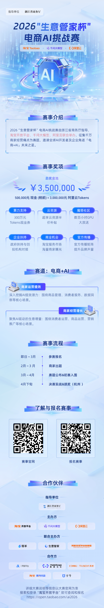

# 首届淘宝电商AI挑战赛来了！设350万赛事奖项和千万扶持资源

  

AI 正在重塑电商经营，也已成为商家重构增长的现实选项。“电商+AI”领域还有哪些未被发掘和满足的场景与需求，如何通过工具进化帮助商家持续降本增效？

  

近期，由浙江省商务厅指导，淘宝开放平台、千问大模型、阿里云联合举办的2026“生意管家杯”电商AI挑战赛正式开放报名通道（点击底部阅读原文报名）。

  

大赛以“工具进化 生态共赢 商业新生”为主题，提供“350万赛事奖项+千万扶持资源”，面向全国淘天电商人征集经营难题，并向全球AI开发者及优秀企业广发英雄帖，通过“商家出题+线上报名+专家评审+线下实战”的方式征集优秀电商AI解决方案。

  

电商AI挑战赛组委会介绍，大赛分为经营提效及商家经营增长两个赛道。前者主要围绕商品管理、消费者服务、数据洞察等核心场景；后者主要围绕消费者运营、商品运营、营销推广等核心场景。 大赛的赛题将在 3 月份结合商家出题的结果同步给进入决赛圈的选手，并在 4 月下旬在阿里巴巴总部（杭州）进行实战对决。届时，由淘天、千问大模型等背景的产品技术专家、行业运营专家和知名媒体人等组成的专家评审团，将聚焦AI产品市场前景、技术能力、创新性和产品实战效果等维度，选拔出“电商+AI”的未来之星。 

  

值得一提的是，淘宝为获奖团队准备了 350万的总奖金池以及价值千万的附加权益与资源。如 300 万元 Tokens 代金券、100-300小时魔搭社区免费GPU时长和阿里云折扣资源、50 万的赛事奖金等。获奖机构的AI产品还可以优先入驻淘宝服务市场，直面千万电商人。此外，主办方还将为获奖者对接业内大咖、创投机构、政府和产业扶持资源，助力AI电商项目获得更多资源，共同服务淘天商家。 

  

据悉，这是淘宝首次联合生态伙伴，与全球开发者共同探索AI与电商的融合之路，“电商未来在AI。AI电商是一道开放性题目，淘宝希望通过这次比赛，推动电商AI向‘工具进化、生态共赢、商业新生’发展。相信随着优质电商AI产品的持续落地，电商人在运营提效和经营增长上会迎来越来越多的可喜变化。”组委会相关负责人表示。

  

  

点击阅读原文报名

⬇️
